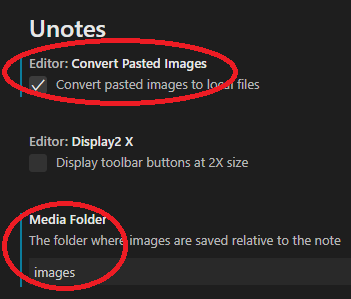

# ExaCC Workshop

## Workshop development

The bin directory is in repository [eccWorkshop](https://gitlab.osc-cloud.com/akwok/eccworkshop).

### Labs/Practices development
1. Please use template.md as the template for new labs.
2. For those using vi/vim, you may want to:
   - set shiftwidth=3 to move code block to line up with bullet.
   - set expandtab before copy/paste command output to replace tab with spaces so the MDwiki or MD plug-ins that use [Prism](https://prismjs.com/plugins/normalize-whitespace/) for [code block](https://github.com/simov/markdown-viewer/issues/120) to render it properly.
     ```
     set shiftwidth=3 softtabstop=3 ai expandtab
     OR
     set ic ai et sts=3 sw=3 ts=3
     ```
   - **Note:** the above doesn't work/support on vim extension for VS.
3. You can use UNOTE extension for WYSIWYG editing of MD file. It is most useful for copy/paste image. The following is a few usage notes for UNOTE:
    - Rename the generated image name to more representative to your lab, e.g. dbList.png.
    - Make sure check Convert pasted images to local files
    - Set Media folder to images that is where we store all images for the labs. You can make subfolder for your lab if you want.
        
    - You can also add that in the VS studio JSON settings:
        ```JSON
        "unotes.mediaFolder": "images",
        "unotes.editor.convertPastedImages": true,
        ```
4. Make sure you have exactly one blank line before image to enable auto-resizing of image to fit screen as follow:
    ```
    1. my bullet.

       
    ```


### Labs/Practices rendering/viewing

1. The lab in MD format is render using HTML5/JavaScript [MDwiki](http://dynalon.github.io/mdwiki/#!index.md) and runs 100% on the client.
   * you need to run bin/rmTab.sh file.md to convert tab to space otherwise MDwiki will render a tab with 4 spaces instead of 8.
3. Workshop material can be view using any browser to the following URL:
   1. On OSC WAN, http://osc-ws-download.us.osc.oracle.com/ecc/
   2. On Oracle WAN, http://osc-ws-download.us.oracle.com/ecc/
   3. You can add Markdown Viewer extension to [Firefox](https://addons.mozilla.org/en-US/firefox/addon/markdown-viewer-chrome/?src=search) or [Chrome browser ](https://chrome.google.com/webstore/detail/markdown-viewer/ckkdlimhmcjmikdlpkmbgfkaikojcbjk?hl=en) to render MD.
        - you will need to Enable allowed all on the Markdown Viewer option for firefox.
        - In addition for Chrome, you need to "Allow File Access URLs" in "More tools", extensions, Markdown Viewer's details.
        - You can load the index.md file directly.

Alternatively, we can deploy a Python web server as follow:
1. Install python3
2. Create python virtual environment
3. Start the virtual environment
3. Install Markdown, Bottle (web server), and pymdown-extensions package
5. Start the mdWeb.py to server MD files.

The following are the basic command to run as root
```
yum -y install python36
pip3 install --upgrade pip
pip3 --version
python3 --version
yum -y install git
pip3 install markdown
pip3 install bottle
pip3 install git+https://github.com/facelessuser/pymdown-extensions.git
```

The following is the commands run as normal user or root to start the web server
```
python3 mdWeb.py
```

### Content import and publishing

1. To convert presentations in PowerPoint to MD:
    ```
    cd lessons
    ../../ecc/bin/shortNamePath.cmd ~/Oracle\ Content\ -\ Accounts/Oracle\ Content/OSC_Santa_Clara\ \(Steven\ Terry\)/Workshops/ ExaCC\ Gen2/adbPresos/ | sed -e 's/\(.\):/\/\L\1/' -e 's/\\/\//g' -e 's/ /\\ /g'
    ../../ecc/bin/ppt2MdNotes.sh "/c/Program Files/Microsoft Office/root/Office16/POWERPNT.EXE" /c/Users/alber/ORACLE~1/ORACLE~1/LOLSON~1/WORKSH~1/EXACCG~1/ADBPRE~1/*.pptx
    ```
    - You may need to File Option, trust center Enable all macros, trust access to VBA project object model
5. You can use bin/updEccWs.sh to pull/publish content to other web site using crontab.
5. To import, extract and merge lab material, NOTE: odt file need MS Word to saveas to docx
    * copy the original file to workshop/org
    * cd ecc/org
    * ../bin/docx2md.sh ../../org/YOUR\_FILEName.docx
    * cd ..
    * bin/splitMD.sh org/YOUR\_FILEName.md
6. The following command line to compare the difference between 2 MarkDown (MD) files for importing:
    ```
    diff -Bwd <(sed -e 's/\[//g' -e 's/]//g' -e 's/(#[^)]*)//g' -e 's/[-#*\\]//g' -e 's/<[^>]*>//g' INTRO_TO_EXADATA_EM13c_02122020.md) <(sed -e 's/\[//g' -e 's/]//g'  -e 's/(#[^)]*)//g'  -e 's/[-#*\\]//g' -e 's/<[^>]*>//g' ../../org/INTRO_TO_EXADATA_EM13c_02122020.md) |more
    ```
8. Replace non-ASCII character and code snip
   ```
   vim `grep '[^ -~]' *md`
   /[^ -~]
   vim `grep -l snip *.md`
   ```

### Visual Basic Macro development MS Office
The file with extension (.bas) are the visual basic programs. The following is how to update them.
1. The macro use the git bash environment variable PWD to determine the current directory in the format of C:/path/file. You can set PWD=C:/Downloads/tmp for cmd.exe if you want to run it in normal Win CMD prompt. The following is an example on how to run the saveasMdNotes macro in git bash with MS Office 2019
    ```
    /c/Program\ Files/Microsoft\ Office/root/Office16/POWERPNT.EXE //M ~/Downloads/test.pptx saveasMdNotes
    ```
    - Note: the 2 slashes (/) are needed to escape git bash path name conversion.
1. To enable this for all PPT doc, open blank PPT
    ```
    /c/Program\ Files/Microsoft\ Office/root/Office16/POWERPNT.EXE //B&
    ```
1. If updating an add-in, you should remove the old one first as follow:
    - File, option, add-in, PowerPoint Add-in, Go, Remove old add-in
1. Developer tab, Visual basic or Alt-F11, then import (ctrl-M) the module, expand and open the module, Debug, Compile Project to check for error then SaveAs PowerPoint add-in.
    - If you make update to the code, you should export and replace the module in GitLab
1. Note: Most macro execute Application.Quit to exit PPT after saving so you may want to comment that out if you are debugging it and remember to uncomment it before save as add-in.
1. File, option, add-in, PowerPoint Add-in, Go, Add New, Select the saved Add-in from above, close, exit PowerPoint without saving
