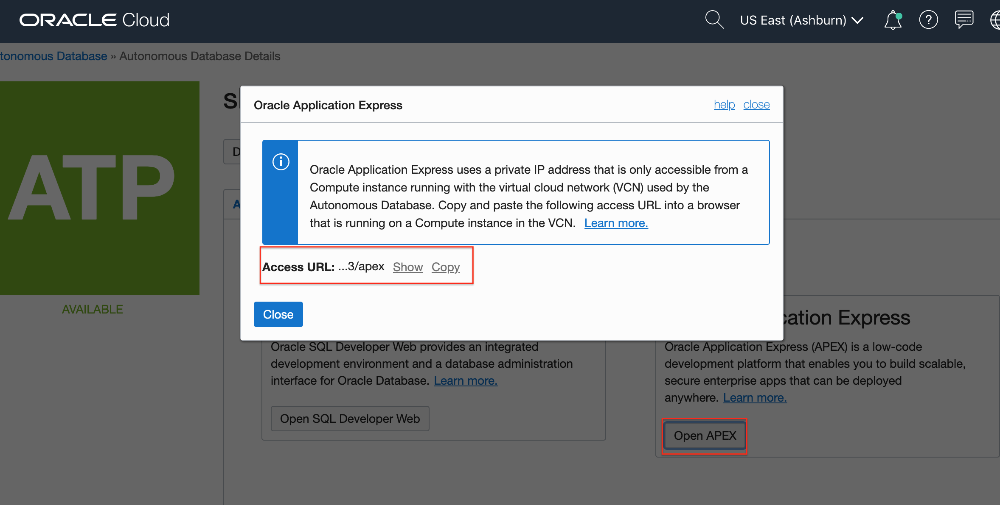
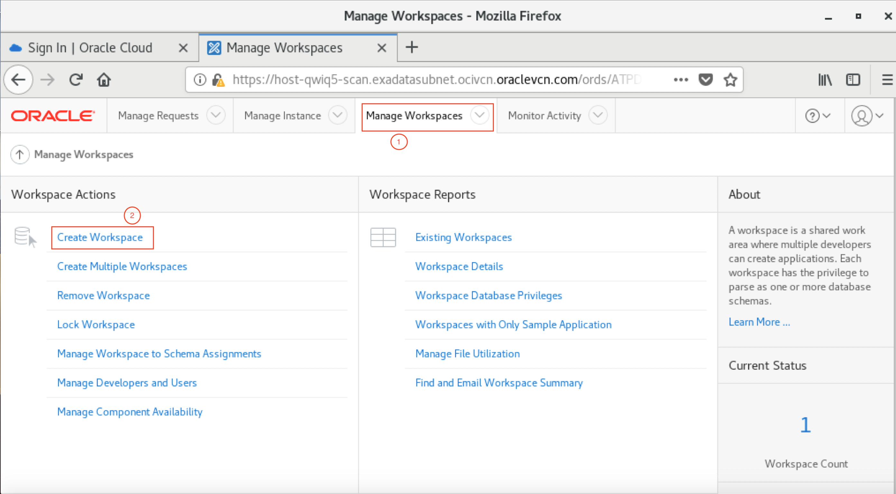
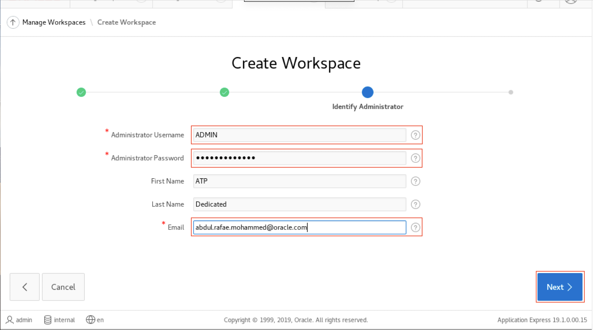
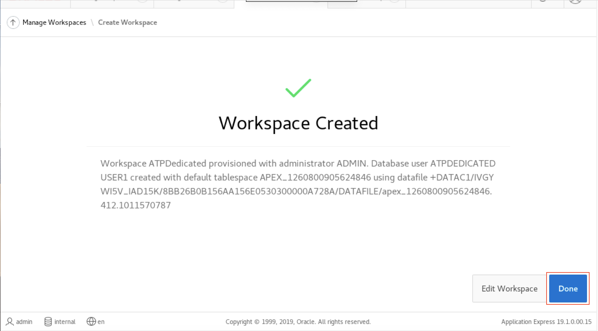

# Oracle Application Express (Oracle APEX)

## Introduction

Oracle APEX is a rapid web application development tool for the Oracle database. Using only a web browser and limited programming experience, you can develop and deploy professional applications that are both fast and secure. Oracle APEX is a fully supported, no cost option of the Oracle database.

Why would you use Oracle APEX?

Oracle Application Express (APEX) is a low-code development platform that enables you to build scalable, secure enterprise apps, with world-class features, that can be deployed anywhere.

**Low Code Development**

With Oracle APEX and low code, your organization can be more agile - develop solutions faster, for less cost, and with greater consistency. You can adapt to changing requirements with ease. Empower professional developers and everyone else in your organization to be a part of the solution.

[Learn More](https://apex.oracle.com/en/platform/low-code/)

## Objectives

- Access OCI autonomous database console and get URL for apex web console
- Setup additional apex developer users 

## Required Artifacts

1. A pre-provisioned Autonomous Transaction Processing instance. Refer to [Create Database lab](createDB.md).
2. The Order entry database that you have created in [Database Performance Monitor](labs/adb-performance-hub.md).
3. You will need to login to the Compute instance with the swingbench and SQL lite client install, e.g. devtool3.us.osc.oracle.com.

## Tasks

### **Task 1: Accessing the OCI Autonomous Transaction Processing console and finding APEX URL**

To get the APEX URL for your ATP Dedicated instance, 

1.  Open the navigation menu. Under **Database**, click **Exadata Cloud@Customer**.

    
2.  Click **Autonomous Databases**.
    - You may need to select the compartment that you are assigned to if it is not selected already.
3. Click the Name of your database. 

    
2. In your database's details page, click the **Tools** tab.

    
    

3.  The Tools page provides you access to SQL Developer Web and Oracle Application Express. In the SQL Developer Web box, click **Open APEX**.
4. Select Copy on the Oracle Application Express dialog and paste the URL to the SGD browser or the browser with access to the on-premise/OSC network/VPN.





### **Task 2: Setting up additional users on APEX**

#### Steps to Log into APEX and Create additional users

- Login to APEX, by using the following credentials.

```
Workspace : Internal
username : Admin
password : <You database admin password>
```


Note : If you are an experienced APEX user, you can just click on Create a Workspace and skip the next 3 steps.

- Click on Manage Workspace, this page will have all the options for you to manage your workspace or all the workspaces if you are an admin.

- Click on Monitor activity, this page allows you to manage and monitor your applications.


- Now, go back to the Manage workspace page and click on create workspace option.


- Enter a workspace name for your new workspace.Click next.



- In the dialog box, Select yes, if you want to re-use schema from your database. Select No, if you want to create a new schema for your workspace. in this lab we are going to create a new schema.


- Enter a Schema Name and a password for that schema. Click next.


- Enter a password for the workspace admin, enter name(optional) and give an email id for the confirmation email.



- Verify the information you just entered and click Create Workspace.


- You will see a conformation message stating that the workspace has been created.



- On the top right corner of the page, click on the profile menu and sign out. Sign in to the new workspace using the workspace credentials you just created.

```
Workspace : new workspace name
username : Admin
password : <You new workspace admin password>
```


- Change the workspace password, if prompted.


- You have now logged into the new workspace that you have created and can start developing your application right away!


## Conclusion
Great Work! You successfully learned to access the Apex console, create worksheets and add additional database users to Apex.

For more complex APEX lab click to see [Oracle APEX Hands-On Workshops](https://github.com/oracle/learning-library/tree/master/developer-library/apex)

## Acknowledgements
This lab is based on [Lab 12: Building Apex application on dedicated autonomous database](https://github.com/oracle/learning-library/blob/master/data-management-library/autonomous-transaction-processing/dedicated/Apex.md).
