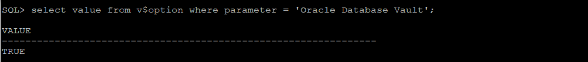

# Protect your data with Database Vault
## Introduction

Managed database services run the risk of 'Admin snooping', allowing privileged users access to customer data. Oracle Autonomous Database provides powerful security controls within your dedicated database, restricting access to application data by privileged database users, reducing the risk of insider and outsider threats and addressing common compliance requirements.

You can deploy controls to block privileged account access to application data and control sensitive operations inside the database. Trusted paths can be used to add additional security controls to authorized data access and database changes. Through the runtime analysis of privileges and roles, you can increase the security of existing applications by implementing least privileges and reducing the attack profile of your database accounts. IP addresses, usernames, client program names and other factors can be used as part of Oracle Database Vault security controls to increase security.  Oracle Database Vault secures existing database environments transparently, eliminating costly and time consuming application changes.**
For more information, refer to the [Database Vault Administrator’s Guide](https://docs.oracle.com/en/database/oracle/oracle-database/19/dvadm/introduction-to-oracle-database-vault.html)

## Objectives

As a database security admin,

- Configure and enable Database Vault for your dedicated database instance
- Create a realm to restrict schema access
- Add audit policy to audit Database Vault activities


## Required Artifacts

This lab requires the artifact describe in [commPreReq.md, click to see or right mouse button click to open new tab as you may need it for other labs](../ecc/labs/commPreReq.md).

## Tasks

### **Task 1: Set up Application Schema and Users**

Oracle Database vault comes pre-installed with your Autonomous database on dedicated infrastructure. In this lab we will enable Database Vault (DV), add required user accounts and create a DV realm to secure a set of user tables from priviledged user access. 

Our implementation scenario looks as follow,


The HR schema contains multiple tables. The employees table contains sensitive information such as employee names, SSN, pay-scales etc. and needs to be protected from priviledged users such as the schema owner (user HR) and admin (DBA)

The table should however be available to the application user (app). Note that while the entire HR schema can be added to DV, here we demonstrate more fine grained control by simply adding a single table to the vault.

**Let's start by creating the HR schema and the app user account**


Connect to your dedicated autonomous database instance as user 'admin' and run the following commands to build the 'HR' schema,

````sql
sqlplus "ADMIN/${myPwd}@$cs"
select * from global_name;
create user hr identified by WElcome_123#;
grant create session, create table to hr;
grant unlimited tablespace to hr;
create table hr.employees (id number, name varchar2 (20), salary number);
insert into hr.employees values (10,'Larry',20000);
commit;
````

Next, create the application user 'app'

````sql
create user appuser identified by WElcome_123#;
grant create session, read any table to appuser;
````

### **Task 2: Configure and enable Database Vault**

We start with creating the two DV user accounts - DV Owner and DV Account Manager. The dv_owner2 account is mandatory as an owner of DV objects. DV account manager is an optional but recommended role. Once DV is enabled, the user 'admin' loses its ability to create/drop DB user accounts and that privilege is then with the DV Account Manager role. While DV Owner can also become DV account manager, it is recommended to maintain separation of duties via two different accounts.

Create the Database Vault owner and account manager users as shown below

````sql
create user dv_owner2 identified by WElcome_123#;
grant create session to dv_owner2;
grant audit_admin to dv_owner2;
create user dv_acctmgr2 identified by WElcome_123#;
grant create session to dv_acctmgr2;

````

Configure the Database Vault user accounts,

````sql
exec dvsys.configure_dv('dv_owner2','dv_acctmgr2');

````

Next, verify if Database Vault is enabled:

````sql
SELECT VALUE FROM V$OPTION WHERE PARAMETER = 'Oracle Database Vault';
exit
````


As you can see, DV isn't enabled yet.

Connect as the Database Vault Owner that you just configured and enable Database Vault.

````sql
sqlplus "dv_owner2/WElcome_123#@$cs"

exec dbms_macadm.enable_dv; 
````

You must “restart” the database to complete the Database Vault registration process. You may restart the database from the console as shown.
<!--- Check to use new feature Restart instead of stop and start --->


Once restart completes, log in as Database Vault owner and verify DV is enabled

````sql
select value from v$option where parameter = 'Oracle Database Vault';
````


### **Task 3: Create security Realms and add schema objects**

Next we create a 'Realm', add objects to it and define access rules for the realm.

Let's create a realm to secure HR.EMPLOYEES table from ADMIN and HR (table owner) and grant access to APPUSER only.

1. Connect the as Database Vault Owner.
    ````sql
    sqlplus "dv_owner2/WElcome_123#@$cs"

    ````
1. Create a realm.
    ````sql
    BEGIN
    DBMS_MACADM.CREATE_REALM(
      realm_name    => 'HR App', 
      description   => 'Realm to protect HR tables', 
      enabled       => 'y', 
      audit_options => DBMS_MACUTL.G_REALM_AUDIT_OFF,
      realm_type    => 1);
    END; 
    /
    ````
3. Add Realm object for HR
    ````sql
    BEGIN
    DBMS_MACADM.ADD_OBJECT_TO_REALM(
      realm_name   => 'HR App', 
      object_owner => 'HR', 
      object_name  => 'EMPLOYEES', 
      object_type  => 'TABLE'); 
    END;
    /
    ````
3. Grant access to APPUSER.
    ````sql
    BEGIN
    DBMS_MACADM.ADD_AUTH_TO_REALM(
      realm_name   => 'HR App', 
      grantee      => 'APPUSER');
    END;
    / 
    ````


### **Task 4: Create Audit Policy to Capture Realm Violations**

You may also want to capture an audit trail of unauthorized access attempts to your realm objects. Since the Autonomous Database includes Unified Auditing, we will create a policy to audit database vault activities. For more information on Unified Auditing, refer to the [Database Security Guide](https://docs.oracle.com/en/database/oracle/oracle-database/19/dbseg/introduction-to-auditing.html)

Create an audit policy to capture realm violations

````sql
create audit policy dv_realm_hr
actions select, update, delete
actions component=DV Realm Violation ON "HR App";
audit policy dv_realm_hr;
````


Finally, let's test how this all works.

To test the realm, try to access the EMPLOYEES table as HR, ADMIN and then APPUSER, you can test with a combination of SELECT and DML statements.
1. Test user HR access.
    ````sql
    sqlplus "hr/WElcome_123#@$cs"
    select user from dual;
    select * from hr.employees;
    exit
    ````
1. Test user ADMIN access. Repeat the above Select statements:
    ````sql
    sqlplus "ADMIN/${myPwd}@$cs"
    ````
1. Test user appuser access. Repeat the above Select statements:
    ````sql
    sqlplus "appuser/WElcome_123#@$cs"
    ````
    - As you can see only appuser have access to the table.


**Note: The default 'admin' account in ADB has access to all objects in the database, but realm objects are now protected from admin access. In fact, even the table owner HR does not have access to this table. Only APPUSER has access.**

### **Task 5: Review realm violation audit trail**

We can query the audit trail to generate a basic report of realm access violations. 

Connect as Audit Administrator, in this lab this is the Database Vault owner, and execute the following:

````sql
sqlplus "dv_owner2/WElcome_123#@$cs"
set head off
select os_username, dbusername, event_timestamp, action_name, sql_text 
from UNIFIED_AUDIT_TRAIL where DV_ACTION_NAME='Realm Violation Audit';
exit
````
[](./images/audit3.png)

You can see the access attempts from HR and Admin.

That is it! You have successfully enabled and used database vault in your autonomous database.

If you'd like to reset your database to its original state, follow the steps below -

To remove the components created for this lab and reset the database back to the original configuration. 
As Database Vault owner, execute:

````sql
sqlplus "dv_owner2/WElcome_123#@$cs"
noaudit policy dv_realm_hr;
drop audit policy dv_realm_hr;
EXEC DBMS_MACADM.DELETE_REALM('HR App');
EXEC DBMS_MACADM.DISABLE_DV;
exit
````

Restart the database, go to the console to Stop and Start the ATP database.

[click to see or right mouse button click to open new tab for sample input and output](DBVaultIO.txt).

## Acknowledgements

This lab is based on [Protect your data with Database Vault](https://github.com/oracle/learning-library/blob/34a6a98f698aadd3d8267712fc314e53d4be3b4c/data-management-library/autonomous-transaction-processing/dedicated/DBVault.md).
