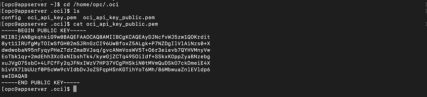
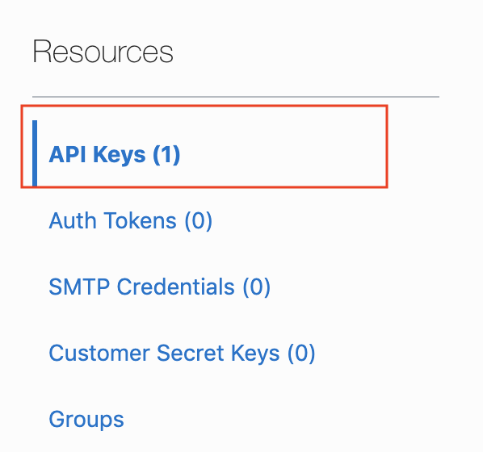
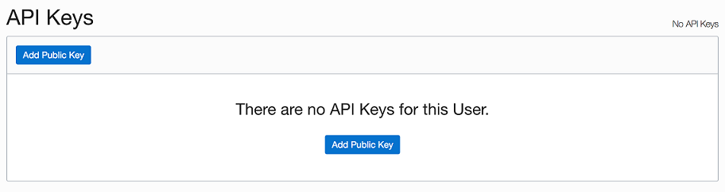

## Introduction

The Oracle Cloud Infrastructure Command Line Interface, OCI CLI, is a small footprint tool that you can use on its own or with the Console to complete Oracle Cloud Infrastructure tasks. The CLI provides the same core functionality as the Console, plus additional commands. Some of these, such as the ability to run scripts, extend the Console's functionality.

This CLI and sample is dual-licensed under the Universal Permissive License 1.0 and the Apache License 2.0; third-party content is separately licensed as described in the code.

The CLI is built on Python (version 2.7.5 or later), running on Mac, Windows, or Linux. The Python code makes calls to Oracle Cloud Infrastructure APIs to provide the functionality implemented for the various services. These are REST APIs that use HTTPS requests and responses. For more information, see [About the API](https://docs.cloud.oracle.com/iaas/Content/API/Concepts/usingapi.htm)

This lab walks you through some examples using the OCI CLI for Exadata Cloud at Customer Service.

## Objectives

As a developer, DBA or DevOps user,

- Create/Destroy your Exadata Cloud Service database instances using a command line interface
- Interact with Oracle Cloud Infrastructure resource using a CLI instead of a web console


## Required Artifacts

1. An Oracle Cloud Infrastructure account to access the control plane
1. OSC LDAP access account to access OSC data center
3. Compute instance (e.g. devtool3) with OCI CLI installed if you are not going to do Task 0.
   - You may want to start firefox browser before ssh to the OCI CLI instance.

## Tasks

If you run out of time, you can go straight to Task 3 by opening the Cloud Shell using the icon next to the region and run the OCI CLI command there.


### Task 0: (Optional) install OCI CLI on your computer
1. You can skip this task by using the computer instance provide in [commPreReq.md, click to see or right mouse button click to open new tab as you may need it for other labs](../ecc/labs/commPreReq.md).
2. For advance user, you can follow the [OCI CLI installation manual](https://docs.cloud.oracle.com/en-us/iaas/Content/API/SDKDocs/cliinstall.htm) to install OCI CLI on your computer.
    - OCI CLI run in all major OS's such as Windows, MacOS, Linux, and Unix.


### **Task 1: Configure OCI CLI**

1. This step describes the required configuration for the CLI and includes optional configurations that enable you to extend CLI functionality.
1. Before using the CLI, you have to create a config file that contains the required credentials for working with your Oracle Cloud Infrastructure account. You can create this file using a setup dialog or manually, using a text editor.
1. To have the CLI walk you through the first-time setup process, step by step, use
    ```
    oci setup config
    ```
1. The command prompts you for the information required for the config file and the API public/private keys. The setup dialog generates an API key pair and creates the config file.

    
5. Once you run the above command, you will need to enter the following:
    - **Enter a location for your config [/home/opc/.oci/config]**: Press Return key
    - **Enter a user OCID**: This is located on your user information page in OCI console

    To access your user OCID, click on the user icon on the top right of the page and click on your username from the menu

    

    Copy the user OCID from the user details page

   

    - **Enter a tenancy OCID**: Similarly, for the tenancy, click on the tenancy name in the top right menu as shown above and copy the tenancy OCID
    
   

    - **Enter a region (e.g. eu-frankfurt-1, uk-london-1, us-ashburn-1, us-phoenix-1)**: Select a region

    - **Do you want to generate a new RSA key pair? (If you decline you will be asked to supply the path to an existing key.) [Y/n]**: Y
    - **Enter a directory for your keys to be created [/home/opc/.oci]**: Press Return key
    - **Enter a name for your key [oci_api_key]**: Press Return key
    - **Enter a passphrase for your private key (empty for no passphrase)**: Press Return key
    
### **Task 2: Add public key to Oracle Cloud Infrastructure**

Now that you have a private / public key combo , you must add it to OCI Console:

- Open Terminal and navigate to folder containing **oci_api_key_public.pem**. Copy the public key.
    ```
    <copy>cat oci_api_key_public.pem</copy>
    ```

    
- Login to your OCI console and click on Menu and select Identity and Users. Select a User and navigate to User Detail page.
- Click on Add Public Key under API Keys section.

    

    

- Paste Public key which you copied from CLI in Add Public Key

    


- Once you add the key run the below command to autocomplete OCI setup.
    ```
    oci setup autocomplete
    ```

    

### **Task 3: Interacting with Oracle Exadata Cloud Service Database**

Now that you have setup OCI CLI, let us now look at examples of using Exadata Cloud at Customer Service.

Let's start with a simpler command to get details on your Exadata Cloud Service database instance.

1. Setup variables specific to your ExaCC compartment:
   * To set the TF_VAR_compartment_ocid variable. you can run the following command to find the OCID of the compartments.

      **Note:** Typically the Exadata infrastructure is the parent of database, e.g. ExaCC9 contain the Autonomous Extadata Infrastructure (AEI) that has subcompartment for VM cluster, then c#Fleet for fleet/container database, below that is the c#ADBs contains all you autonomous database. You can verify it from the GUI.
      1. Get top level compartment
         ```bash
         oci iam compartment list
         oci iam compartment list | jq '.data[] | .name + " " + .id'
         ```
      2. Repeat the following by copy/pasting the OCID of the compartment that you want to query, e.g. ExaCC, ExaCC9, exacc9vm7, c7Fleet1, then c7ADBs
         ```bash
         oci iam compartment list -c <pastOCID> | jq '.data[] | .name + " " + .id'
         ```
         - **Note:** The compartment structure is usually /ExaCC/ExaCC#E/exacc#Evm#VM/c#VMfleet1/c#VMADBs, e.g. /ExaCC/ExaCC9/exacc9vm7/c7fleet1/c7ADBs so you can set the following OCID as you go.
      3. Set the compartment OCID
         ```bash
         vmCompId=
         fleetOCID=
         export TF_VAR_compartment_ocid=
         ```
         - TF_VAR_compartment_ocid is the compartment where your database will be located.
         - You will need to use the DB compartment OCID for the Terraform lab so we use the same variable here.

   * Alternatively, switch to OCI Console window, Click **Compartment** under **Identity**. Locate your compartment name and Click it. In the compartment details page , clik **copy** to copy the OCID, then Paste this OCID in to the command windows to set the variable
        - Note: You may need to do multiple click to get into the nested compartment, e.g. ExaCC, ExaCC9, etc.

        

        
2. List database versions.
   ```bash
   oci db autonomous-db-version list --compartment-id $TF_VAR_compartment_ocid 
   ```
3. Query the Autonomous VM Cluster ID in the given region and compartment
   ```bash
   export TF_VAR_region=us-ashburn-1
   oci db autonomous-vm-cluster list --compartment-id $vmCompId --region $TF_VAR_region  | jq '.data[] | ."display-name" + " " + .id'
   aVMcluID=
   ```
5. Query the ACD (Autonomous Container Database).
   ```bash
   oci db autonomous-container-database list --autonomous-vm-cluster-id $aVMcluID --compartment-id $fleetOCID --region $TF_VAR_region | jq '.data[] | ."display-name" + " " + .id'
   acdID=
   ```
2. List database
   ```bash
   oci db autonomous-database list --compartment-id $TF_VAR_compartment_ocid --region $TF_VAR_region  --autonomous-container-database-id $acdID
   oci db autonomous-database list --compartment-id $TF_VAR_compartment_ocid --region $TF_VAR_region  --autonomous-container-database-id $acdID | jq '.data[] | ."display-name",."infrastructure-type",."connection-urls"'
   ```
4. Copy/paste the above URLs to the browser that has access to the on-premise ExaCC then login as ID ADMIN and the following password.
   - you can also run the firefox browser with the copy/paste URL.
   ```bash
   firefox '<paste URL>' &
   echo Workspace: internal ID: ADMIN password: ${myPwd}
   ```
3. Query Database connection string then copy/paste to set variable cs.
   - **Note:** make sure you copy the quote (") or added the quote when setting variable cs.
   ```sql
   oci db autonomous-database list --compartment-id $TF_VAR_compartment_ocid --region $TF_VAR_region  --autonomous-container-database-id $acdID | jq '.data[] | ."connection-strings"'
   cs=
   sqlplus "ADMIN/${myPwd}@$cs"
   select * from global_name;
   select * from V$TABLESPACE;
   exit
   ```
3. Creating Database
    - **Note:** This assume that you have deleted the database you created/assigned in the previous lab, otherwise, you can delete them before running the command or use another initial or increment the myDBnum.
   <!--- Add copy/paste to search work-request ID on UI when/if ready --->
   ```bash
   oci db autonomous-database create --admin-password ${myPwd} --db-name ${myInit}pdb${myDBnum} --compartment-id $TF_VAR_compartment_ocid --region $TF_VAR_region --autonomous-container-database-id $acdID --cpu-core-count 1 --data-storage-size-in-tbs 1
   workReqID=
   oci work-requests work-request get  --work-request-id $workReqID
   oci work-requests work-request get  --work-request-id $workReqID | jq '.data."operation-type" + " " + (.data."percent-complete"|tostring) + " " + .data.status'
   ```
   - This will take a few minute. You can check the work request status by running the get work-request command above repeatedly or check in on the UI that will be automatically refresh with the latest status.
5. Save the OCID of the new DB by copy pasting the ID field return from the create command for later use:
   ```bash
   adbID=
   ```
6. Once the new DB is created, namely status become AVAILABLE on the UI, you can start to use it.
   ```bash
   sqlplus "ADMIN/${myPwd}@$cs"
   select * from global_name;
   select * from V$TABLESPACE;
   exit
   ```
8. Delete Database
   ```bash
   oci db autonomous-database delete --region $TF_VAR_region --autonomous-database-id $adbID
   ```

[click to see or right mouse button click to open new tab for sample input and output](oci-cli.txt).

## References ##
- [CLI Reference for DBCS](https://docs.cloud.oracle.com/en-us/iaas/tools/oci-cli/2.12.5/oci_cli_docs/cmdref/db.html)
