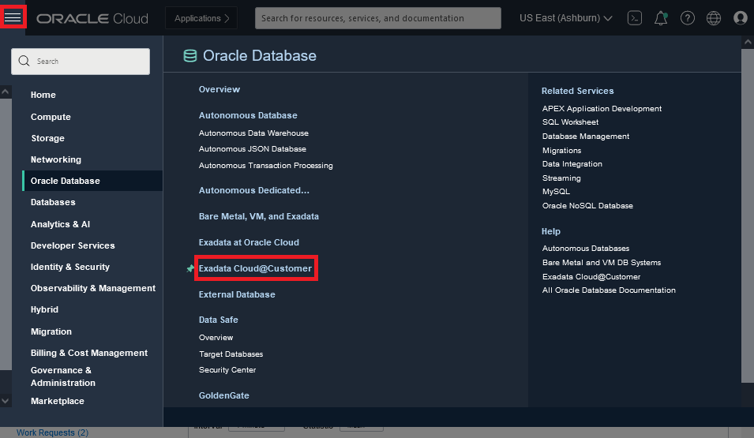
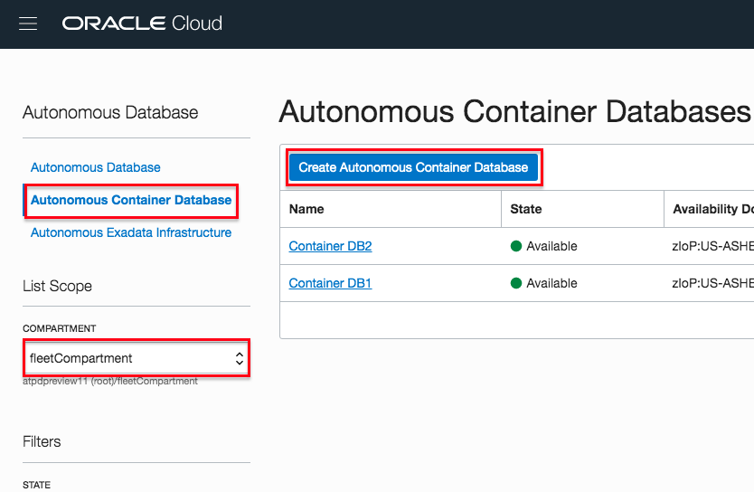
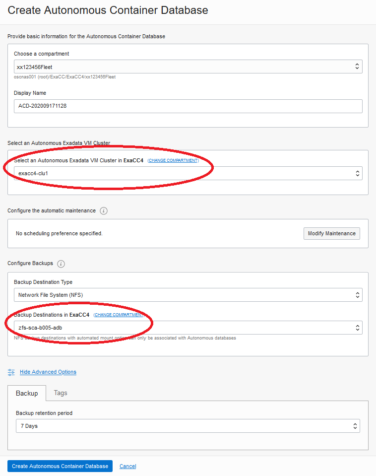
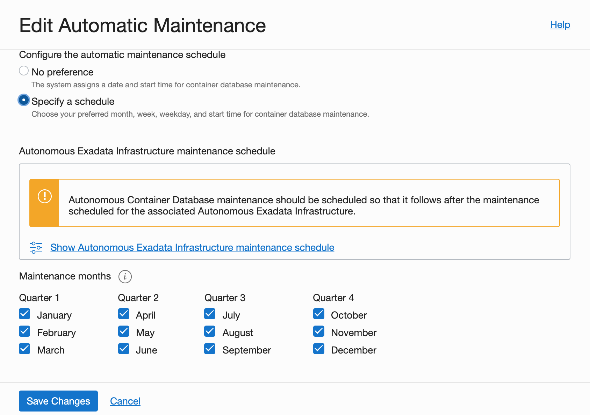

# Provisioning an Autonomous Container Database

## Introduction
An Autonomous Container Database resource provides a container for your Autonomous Databases. You can create multiple Autonomous Container Database resources in a single Autonomous Exadata Infrastructure resource, but you must create at least one before you can create any Autonomous Databases

## Objectives

As a fleet administrator
- Deploy an Autonomous Container Database (ACD) onto an Autonomous Exadata Infrastructure (AEI)

## Required Artifacts

- An Oracle Cloud Infrastructure account with fleet administrator privileges. For a detailed description of required IAM policies, please refer to the [fleet admin guide](https://docs.oracle.com/en/cloud/paas/atp-cloud/atpfg/index.html) of the autonomous database documentation set.

## Tasks

### **Task 1:** Create an Autonomous Container Database (ACD)

**Note:** It will take about 40 minutes to create an ACD.

1.  Open the navigation menu. Under **Database**, click **Exadata Cloud@Customer**.

    
2.  Click **Autonomous Container Databases**.
    - You may need to select the fleet compartment, e.g. xx123456Fleet, that you are assigned to if it is not selected already.
3.  Click **Create Autonomous Container Database**.

    
4. On the Create Autonomous Container Database dialog box, you need to select the compartment hosting your AEI (e.g. ExaCC9) and select the VM Cluster. Similarly for backup destination as well.

    
5. You can modify your ACD's maintenance schedule and the type of update you wish to apply to the container. 
    - Specify your ACDs maintenance schedule, picking a month, week, day and time in each quarter when a maintenance operation can be carried out on that container

    
6. You may also choose a different backup retention period by selecting a retention policy from the Management tab under Advanced Options as shown below

    

That's it. Simply scroll down to the bottom and hit the blue 'Create Autonomous Container Database' button to deploy your ACD.

### **Task 2:** Maintaining ACD
1. [Change the Backup Retention Policy of an Autonomous Container Database](https://docs.cloud.oracle.com/en-us/iaas/exadata/doc/eccmanagingacds.html#GUID-9061741F-9B64-459E-9AA5-5E42577271E9)
2. [Change the Maintenance Schedule of an Autonomous Container Database](https://docs.cloud.oracle.com/en-us/iaas/exadata/doc/eccmanagingacds.html#GUID-5C87D473-2CA8-4367-AA1C-2F8E325ED1D4)
3. [Restart an Autonomous Container Database](https://docs.cloud.oracle.com/en-us/iaas/exadata/doc/eccmanagingacds.html#GUID-CAFDD7E8-332B-4B14-99DB-20A10880EF65)

## Acknowledgements

This lab is based on [Lab 3: Provisioning an Autonomous Container Database](https://github.com/oracle/learning-library/blob/7354f5b9ca87fffd827a2875591ec0c946c1a718/data-management-library/autonomous-transaction-processing/dedicated/ProvisionACD.md).
