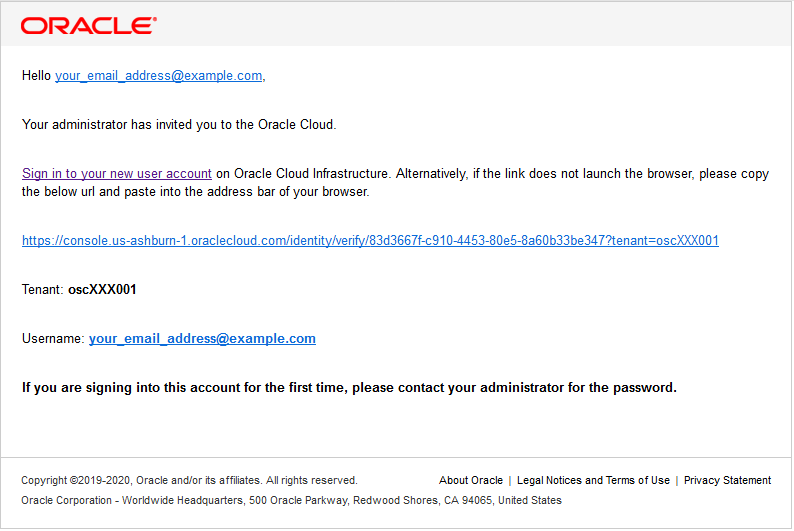
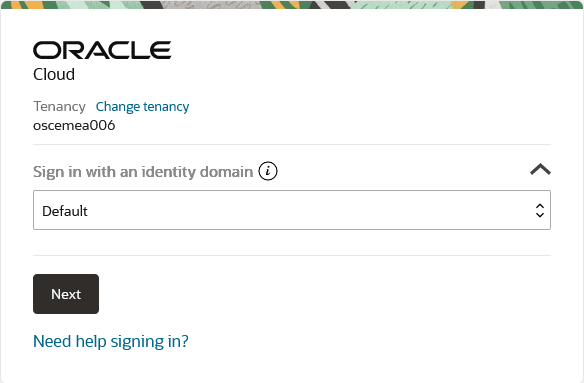
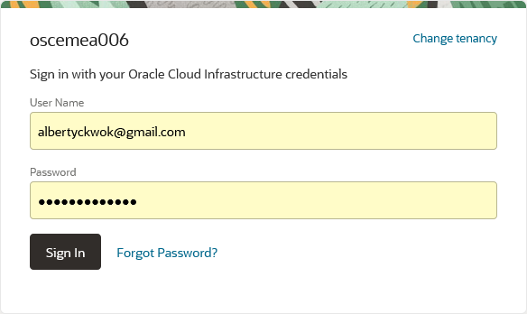
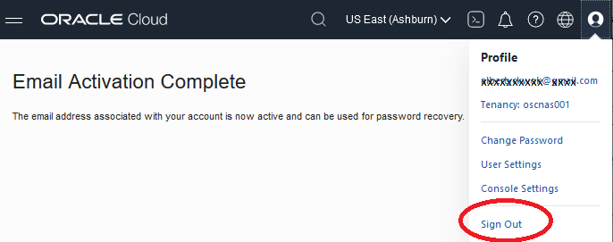
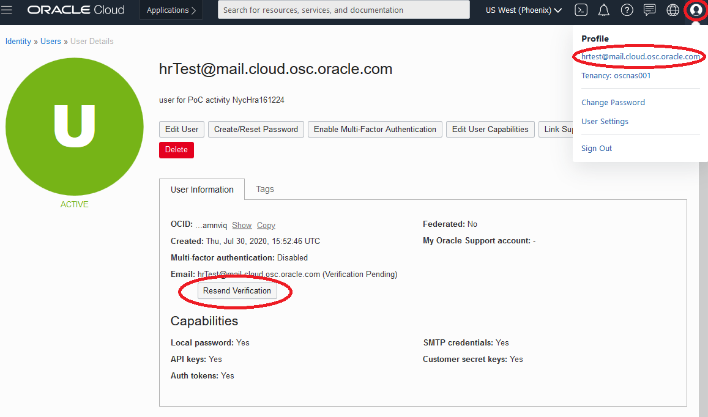
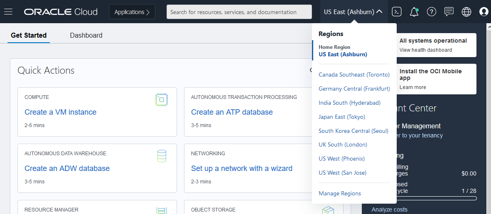

# Cloud/OCI control plane

Overview

As we discuss, ExaCC uses public cloud control plane to manage your on-premise Exadata and autonomous database service. You will need an ID and password to access the service.

The ID is your email address. The pwd will be email to you directly under subject "OCI Access Info". Please note that this email may end up in your SPAM/Junk folder as it is required to be a random character string. The following is a instruction on how to login.

## Tasks

You only need to perform either task 1 if you received an activation/Welcome email otherwise task 2. Task 3 is for relogin.

**Note**:

1. Please login within 7 days to change the initial password, otherwise it will expire and we will have to manually reset it.
2. The initial privilege for the ID is view/read only access to
ensure that you know what you are doing before granting more
authority to protect our environment from accident.
3. You should be able to go through most of the Console/UI
screens except committing any change to the environment.

### Task 1: Activation with Welcome email

1. Open your email and look for email with Subject "Welcome to Oracle Cloud - Sign in and get started" from oraclecloud.com. The email look something like the following:

   
2. Select the "Sign in to your new user account" or the URL below it.
2. Make sure the Default is selected for "Sign in with an identity domain", if not select the dropdown and select it, then select next button

    * 
3. Enter User name that is your email address and the initial password that is likely email to you with subject "OCI Access Info"

    * 
4. It will prompt you to set a new password that is only known to you with complexity restriction.
5. Select logout after after you receive the activation complete message.

    * 

**Note**: You can reset your password by selection "Forgot Password" link on the login screen.

### Task 2: Manual activation without email

1. Point your browser to https://cloud.oracle.com/
   Enter the Account name, e.g. oscnas001.
2. Make sure the Default is selected for "Sign in with an identity domain", if not select the dropdown and select it, then select next button

    * 
3. Enter User name that is your email address and the initial password that is likely email to you with subject "OCI Access Info"

    * 
5. Select "Sign in" button. You will receive a prompt to change your
initial password.
6. This should place you in the dashboard screen of the OCI Console.
    * You may want to Resend the verification email so that you can reset your password by yourself similar to Task 1 as follow:
    * Click on the Person icon on the right top, select your name to view your account details.
    * Your email address
    * click on the resend verification

    * 
    * Execute step 1 and 2 to confirm your email validate your email address.
8. Select the hamburger menu on the left top
9. Select Exadata Cloud at Customer
10. Select Compartment, e.g. ExaCC5/exacc5vm6

### Task 3: Regular login
1. Point your browser to https://cloud.oracle.com/
   Enter the Account name, e.g. oscnas001.
2. Make sure the Default is selected for "Sign in with an identity domain", if not select the dropdown and select it, then select next button

    * 
3. Enter User name that is your email address and the password.
    * You can select the Forgot password link, if you don't remember the password.

    * 
6. This should place you in the dashboard screen of the OCI Console.
7. You may need to change to the Region where the ExaCC is located, e.g. US East (Ashburn), US West (Phoenix) etc.

    * 
8. Select the hamburger menu on the left top
9. Select Exadata Cloud at Customer

    * 
10. Select Compartment, e.g. ExaCC5/exacc5vm6.

## References ##

- [What’s New in Oracle Exadata Database Service on Dedicated Infrastructure](https://docs.oracle.com/en-us/iaas/exadatacloud/exacs/exa-whats-new.html)
- [What’s New in Oracle Exadata Database Service on Cloud@Customer Gen2](https://docs.oracle.com/en/engineered-systems/exadata-cloud-at-customer/ecccm/ecc-whats-new-in-exadata-cloud-at-customer-gen2.html)