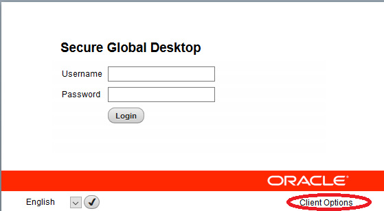
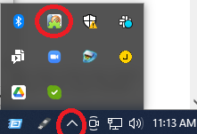
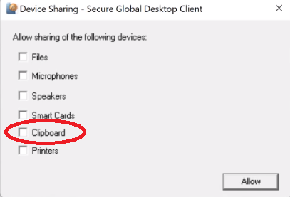
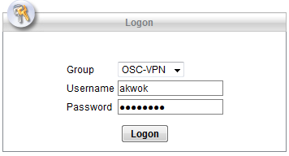
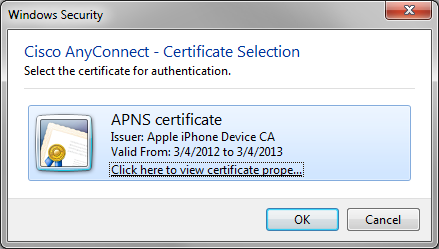
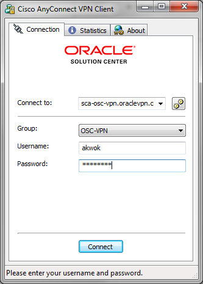
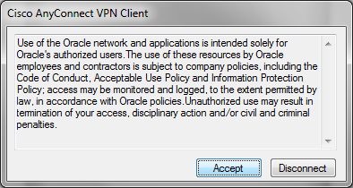

# Task 2: Accessing On-premise/OSC Data Center
## Overview

In order to do anything, you need to gain access to the data center. The method for accessing resources are depended on where the resource are located and the security policy mandated by each company.

## Access Options

The following is 3 different ways to access on-premise data center. Please choose the most convient one for you.

The ID will be derive from your email address into a maximum 8 character string. The pwd will be email to you directly under subject "OSC Access Info". Please note that this email may end up in your SPAM/Junk folder as it is required to be a random character string. The following is a instruction on how to login.

### Option 1: Browser (SGD - Secured Global Desktop) Access

* Web browser to: https://sgdsca.osc.oracle.com/sgd
    * The followings are 3 ways of using SGD:
        1. [Oracle Secure Global Desktop Client](https://sgdsca.osc.oracle.com/sgd/thin.jsp?clientmode=installed)
            * [You need to install the Client if you have not done so yet](https://sgdsca.osc.oracle.com/client/webserver/installic_en.html).
            * https://sgdsca.osc.oracle.com/sgd/thin.jsp?clientmode=installed
        2. [To use Java](https://sgdsca.osc.oracle.com/sgd/thin.jsp?clientmode=download)
            * [You need to install Oracle Java if you have not done so yet](http://www.java.com/).
            * https://sgdsca.osc.oracle.com/sgd/thin.jsp?clientmode=download
        3. [HTML5 Client](https://sgdsca.osc.oracle.com/sgd/index.jsp?clienttype=h5c)
            * https://sgdsca.osc.oracle.com/sgd/index.jsp?clienttype=h5c
            * Note: you need to use the 3 dots on the top of the page to transfer clipboard content.
    * You can change the "Client Option" by click on the link at the bottom right.

        
    * Once you get one of the above three working, you may want to bookmark the URL as you will be accessing frequently.
    * You will likely need to use a terminal window and/or Firefox browser on the left pane.
        1. Click on the terminal link.

            

        2. Enter the following to start the browser in the xTerm Windows from the above.
            ```bash
            firefox &
            ```
            * You may want to bookmark the following frequently use web site:
                - Workshop content at http://osc-ws-download.us.osc.oracle.com/adbcc/ or set it as home by drag it to the home icon from the location bar on firefox.
                - OCI Control plane and the on-premise access/SGD URL, the following is an sample, please refer to the access instruction email from the instructor for the actual URLs:
                    ```
                    https://console.us-ashburn-1.oraclecloud.com/exacc?telemetry=false&tenant=oscnas001
                    https://sgdsca.osc.oracle.com/sgd
                    ```
        3. You will likely need to keep the terminal windows open for other labs/practices.
    * If you have problem copy/paste between you PC and the SGD windows (terminal or firefox), you need to select device setting on the SGD icon in the notification area for Windows 10 is typically on the right bottom, then select the share clipboard checkbox.

        

        


### Option 2: VPN Access

1. Skip this step if you already has CISCO AnyConnect VPN client as it
comes with most Oracle and other company issued computer.
    * Point your browser to [https://sca-osc-vpn.oraclevpn.com](https://sca-osc-vpn.oraclevpn.com).
    * Select OSC-VPN as the dropdown Group.
    * Enter id/pwd that was issued to you to access OSC data center,
    select Logon

      
    * Select Continue to accept the Oracle VPN Policy
    * Select  Start
    AnyConnect and follow the instruction.
2. Start Cisco AnyConnect VPN Client, you may need to select OK on the popup Certification Selection dialog

   
3. Enter sca-osc-vpn.oraclevpn.com as the "connect to" or selected if it is in the dropdown already, select OSC-VPN as the dropdown Group, enter id/pwd that was issued to you to access OSC data center, select Connect

   
4. Select Accept to accept the Oracle VPN Policy

   
5. Now, you are virtually in the OSC data center.
   - You will need to use one of the following proxy to access the Internet.
     * Santa Clara, US/NAS: 140.83.186.195 port 80.
     * Linlithgow, UK/EMEA: 138.3.34.194 port 80.
     * Singapore, JAPAC: 10.115.208.19 port 80.

### Option 3: SSH in Oracle WAN/Office/VPN
If you have access to Oracle WAN, e.g. in an Office campus, then you can ssh to  lz1.us.osc.oracle.com id/pwd that was issued to you to access OSC data center.

### Task 3: Additional test for lab prerequists.

You may want to follow the instruction describe in [commPreReq.md, click to see or right mouse button click to open new tab as you may need it for other labs](../ecc/labs/commPreReq.md) as most labs require them.
