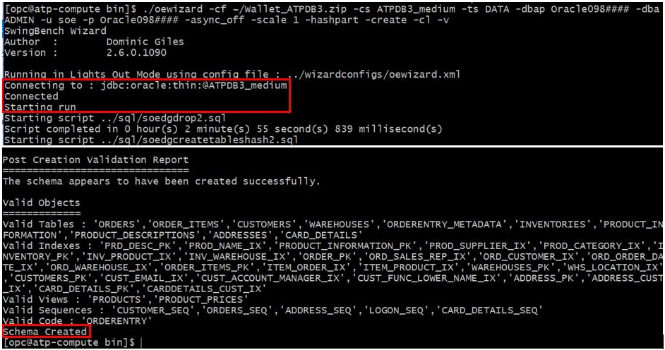
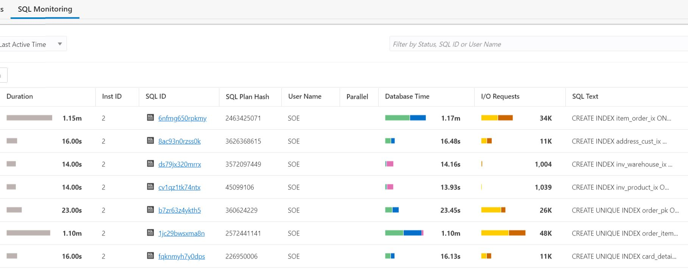

# Manage database performance with Performance Hub 


## Introduction
 The Performance Hub is a feature in autonomous database that provides a new consolidated view of all performance data for a given time range.  The user can select a time range using a time picker at the top of the page, and the detail tabs will display the available performance data for the selected time range.

In this lab we will simulate a production workload using Swingbench tool and monitor performance using the OCI native Performance Hub console.

### Objectives

As an administrator,
1. Simulate a production workload using Swingbench load generator.
2. Monitor and Manage your autonomous database performance using Performance Hub.


### Required Artifacts

1. You will need the compartment name where you are authorized to create database, e.g. /ExaCC/ExaCC9/exacc9vm7/c7fleet1/c7ADBs.
    - where xx is your or your company's initial, 123456 is the OSC activity number
1. A pre-provisioned Autonomous Transaction Processing instance. Refer to [Create Database lab](createDB.md).
3. You will need to login to the Compute instance with the swingbench and SQL lite client install, e.g. devtool3.us.osc.oracle.com.

## Tasks:

### **Task 1**: Configuring load generator

We will use the famous [swingbench](http://www.dominicgiles.com/swingbench.html) to generate workload.

**Note:** Make sure auto-scaling is off, otherwise, you won't see auto-scaling effect when generating load as it would have scaled up during schema/table creation.

1. Install the OE (Order Entry) schema to run transactions against.
    - Using the oewizard from swingbench is the best way to do it.
    - The script will take around 10-15 minutes to populate the Database. This is another good time to take a quick break. Verify the script completes successfully.
    - The following are the commands you need to enter:
      ```
      cd $sbHome/bin
      ./oewizard \
            -cs $cs \
            -ts SOE \
            -dba ADMIN -dbap $pp$myDBnum \
            -u soe -p $pp$myDBnum \
            -async_off \
            -scale 5 \
            -hashpart \
            -create \
            -cl \
            -v
      ```

      See [Predefined Database Service Names for Autonomous Transaction Processing](https://docs.oracle.com/en/cloud/paas/atp-cloud/atpug/connect-predefined.html#GUID-9747539B-FD46-44F1-8FF8-F5AC650F15BE) for more details on connection string (-cs)

      The following is the sample input and output:
      
2. Validate the schema with another swingbench utility sbutil
   ```
    ./sbutil -soe \
        -cs $cs \
        -u soe -p $pp$myDBnum \
        -tables
   ```
   
3. Next we will configure the load generator file with the following settings:
   ```
   cd $sbHome/bin
   cat ../configs/SOE_Server_Side_V2.xml \
           | sed -e 's/<LogonGroupCount>1<\/LogonGroupCount>/<LogonGroupCount>5<\/LogonGroupCount>/' \
                   -e 's/<LogonDelay>0<\/LogonDelay>/<LogonDelay>300<\/LogonDelay>/' \
                   -e 's/<WaitTillAllLogon>true<\/WaitTillAllLogon>/<WaitTillAllLogon>false<\/WaitTillAllLogon>/' \
                   > ~/SOE_Server_Side_V2.xml
   ```
    - **LogonGroupCount** to **4**
    - **LogonDelay** to **300**
    - **WaitTillAllLogon** to **false** (case sensitive).

### **Task 2**: Generate workload

1. Now we will generate some load using swingbench.
    - **Note:** The command below will run for 30 min, you can press Ctrl-C to exit or adjust the -rt value in hh:mm.sec.
   ```
    ./charbench -c ~/SOE_Server_Side_V2.xml -r ~/results.xml \
        -cs $cs \
        -u soe -p $pp$myDBnum \
        -v users,tpm,tps,resp \
        -intermin 0 \
        -intermax 0 \
        -min 0 \
        -max 0 \
        -di SQ,WQ,WA \
        -uc 30 \
        -rt 0:1.30
   ```
5. After a few seconds the number in 4th column (TPS)indicating Transactions Per Seconds and Response time in milliseconds will stabilize.
    
    
3. You can open another terminal windows and login to the compute instance with SQL lite and repeatedly run the following select command to see the CPU_COUNT value.
    - You should see the CPU-COUNT will increase to 3 times as shown in the UI after you enable auto-scaling on the next task.
    - **Note:** the CPU_COUNT is in number of thread, namely, 2 x OCPU.
    ```sql
    sqlplus "ADMIN/${myPwd}@$cs"
    select localtimestamp from dual;
    show parameter cpu
    SHOW PARAMETER SGA_TARGET
    SHOW PARAMETER PGA_AGGREGATE_TARGET
    ```

### **Task 3**: Enable Auto-scaling of the database
Oracle Autonomous Database on Oracle Exadata Cloud@Customer systems provides an auto scaling feature that automatically increases the number of cores an autonomous database during periods of increased demand and, as demand returns to normal, automatically decreases the number of cores down to the databases's base number.

1.  Open the navigation menu. Under **Database**, click **Exadata Cloud@Customer**.
    
2.  Click **Autonomous Databases**.
    - You may need to select the compartment that you are assigned to if it is not selected already.
3. Click the Name of your database. 
5. In Database details window, click the **Scale Up/Down** button, then **Auto scaling** check box.
6. Select update
   

### **Task 4:** Sample terminal output

1. [click to see or right mouse button click to open new tab to see output of SQL show command for effect of scaling](adb-performance-hubSQLio.txt).
    - Note that the timestamp is in PST.
1. [click to see or right mouse button click to open new tab to see output of Swingbench for effect of scaling](adb-performance-hubSBio.txt).
    - Note that the timestamp is in UTC but the minute mark should match the SQL output above.
3. As you can see, the memory increase along with CPU when scaling manually while memory remain constant with auto-scaling.

### **Task 5:** Analyzing workloads with Performance Hub

As you continue to run your swingbench workload, you can analyze the transactions that are running on the database with the cloud based Performance Analyzer. From the main ATP console, select *Performance Hub*.
    

The main Performance Hub page should display. This page has 3 sections. 
1. The top section is a timeline of activity from which you can select a specific time period to analyze.
2. The middle section contains ASH Analytics and SQL Monitoring that allows analysis by different parameters.
3. The bottom section contains information that can be analyzed by either *SQL ID* or *User Session*.
    

- In the picture above we can see a specific time period of activity in the *time range* section, and in the *ASH Analytics* section, the swingbench activity for users connected through the *\_medium* service, as the information is filtered by *Consumer Group*.

- To analyze information by a different filter, select the appropriate filter from the drop down list next to the *Average Active Sessions* header in the *ASH Analytics* section as shown below.
    

- On the bottom section of the *Performance Hub* page is displayed active *SQL* and *User Sessions*.
    

- By clicking on a specific *SQL ID*, the *SQL Detail* page is displayed which contains much  more detailed information about the specific SQL execution, as shown below. Navigate around to discover all the information available.
    

- For example, below we selected *Execution Statistics* for a specific SQL and the execution plan is displayed. 
    
    

- *SQL Monitoring* displays the top 100 SQL's by the filters selected, in the case below by *Last Active Time*
    

- *SQL Monitoring* also allows administrators to kill specific sessions if necessary. Highlight the session and a *Kill Session* button appears on top. If pressed the session will be terminated.
    


## Acknowledgements
*Congratulations! You successfully completed setting up the swingbench workload generator for use in subsequent labs.*

This lab is based on [adb-performance-hub](https://github.com/oracle/learning-library/tree/master/data-management-library/autonomous-database/dedicated/adb-performance-hub) and [ATP_Lab](https://github.com/oracle/learning-library/tree/master/oci-library/L100-LAB/ATP_Lab).
