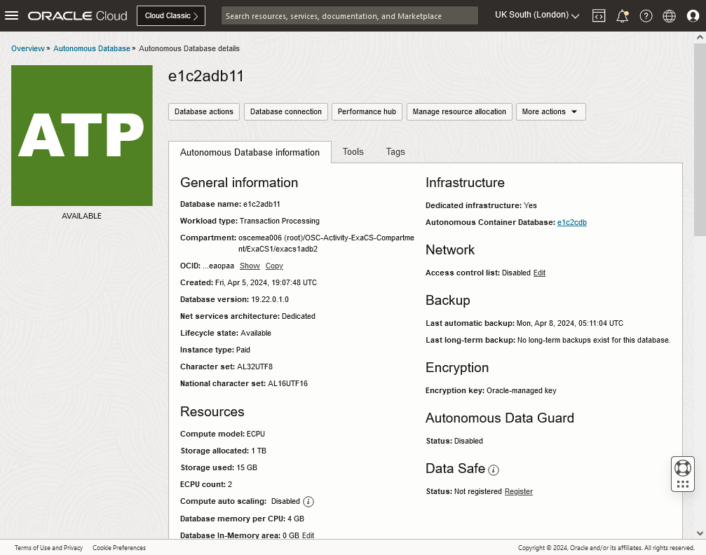
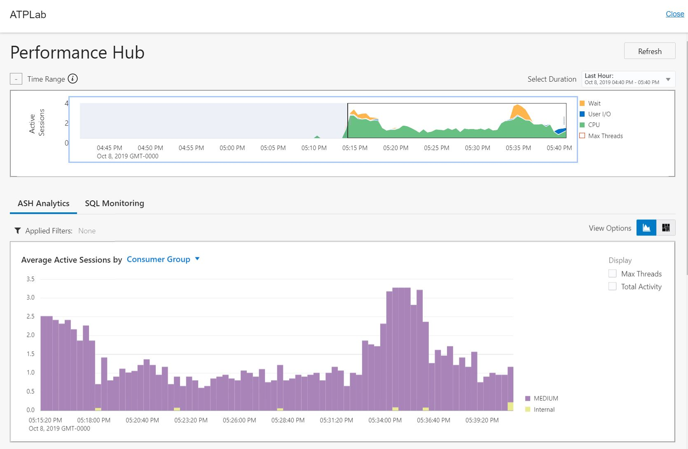
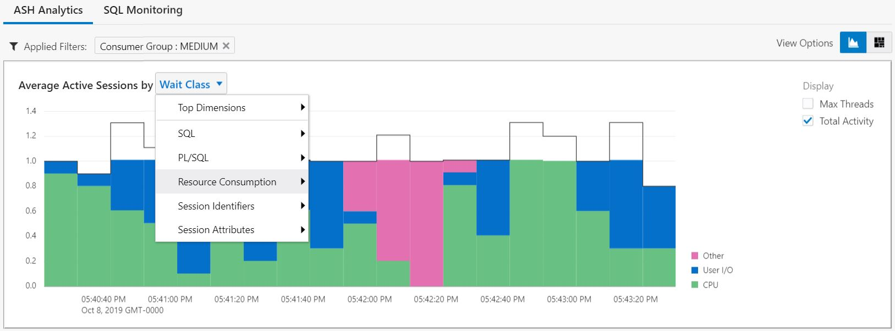
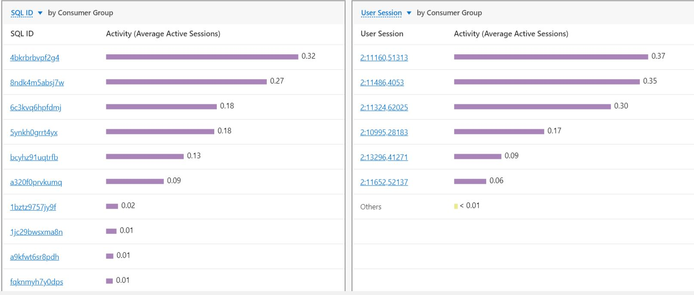
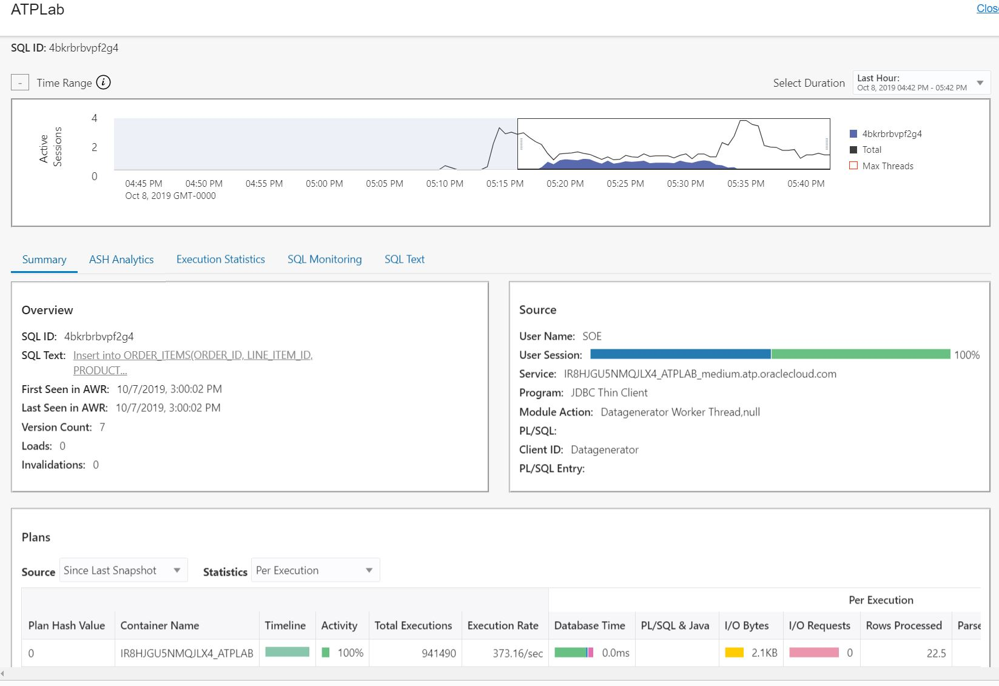
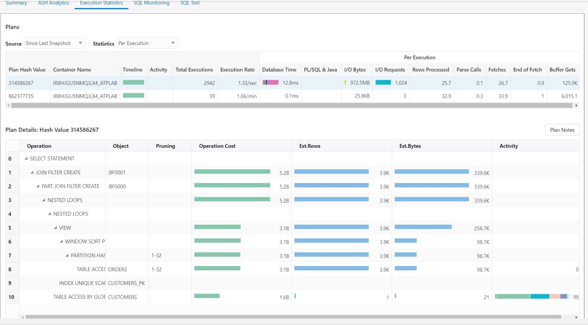

# Scaling and Performance Monitoring

## Introduction
Continuous uptime is a key requirement of most business critical applications. While the cloud provides the notion of unlimited scale, this scalability comes at a cost of downtime with most services. The Oracle autonomous database service provides scalability without downtime as demonstrated in this lab.

Traditionally database deployments have been designed and provision for the peak possible workload. And in reality, a substantial margin of safety was also provisioned on top of that in order to make sure the system could cope with any unforeseen demands.

But peak workloads tend to occur infrequently, leaving most of this costly capacity idle the majority of the time.

In order to enable customers to pay for only the resources they need, Oracle Autonomous Database allow customers to elastically adjust their compute and storage resources when necessary. 

An Autonomous Database can be scaled through the UI, CLI commands, Terraform, Python SDK, etc that support REST API. In this lab, you will scale the database using UI.

### Objectives

As an administrator,
1. Simulate a production workload using Swingbench load generator.
2. Scale up the OCPUs in your autonomous database service through cloud console and observe effect on the workload performance.
3. Scale down the OCPUs in your autonomous database service through cloud console and observe effect on the workload performance.


### Required Artifacts

For most of the labs you just need the connection string (cs) to connect to the database and password (myPwd) for the database. See [lab setup, click to see or right mouse button click to open new tab as you may need it for other labs](../../ecc/labs/commPreReq.md) or refer to the email sent by the instructor.

## Tasks

### **Task 1**: Check resource of AVM

1. Before you can scale up, you need to make sure that you have available CPU by looking at the AVM details as follow:
   - See the basic setup and navigation on how to get to the AVM details page.

   

2. If there are enough, you can select Scale AVM but it will required a reboot. However, you database will continue to run as each node will be reboot one at a tme in the rolling manner assuming you have at least 2 nodes.
   - **Note**: There should be enough CPU to allow workshop participant to scale. If not, please check with the instructor.

### **Task 2**: Configuring load generator

We will use the famous [swingbench](http://www.dominicgiles.com/swingbench.html) to generate workload.

**Note:** Make sure auto-scaling is off, otherwise, you won't see auto-scaling effect when generating load as it would have scaled up during schema/table creation.

1. Install the OE (Order Entry) schema to run transactions against.
    - Using the oewizard from swingbench is the best way to do it.
    - The script will take around 10-15 minutes to populate the Database. This is another good time to take a quick break. Verify the script completes successfully.
    - The following are the commands you need to enter:
      ```
      cd $sbHome/bin
      ./oewizard \
            -cs $cs \
            -ts SOE \
            -dba ADMIN -dbap $myPwd \
            -u soe -p $myPwd \
            -async_off \
            -scale 5 \
            -hashpart \
            -create \
            -cl \
            -v
      ```

      See [Predefined Database Service Names for Autonomous Transaction Processing](https://docs.oracle.com/en/cloud/paas/atp-cloud/atpug/connect-predefined.html#GUID-9747539B-FD46-44F1-8FF8-F5AC650F15BE) for more details on connection string (-cs)

      The following is the sample input and output:
      
2. Validate the schema with another swingbench utility sbutil
   ```
    ./sbutil -soe \
        -cs $cs \
        -u soe -p $myPwd \
        -tables
   ```
   
3. Next we will configure the load generator file with the following settings:
   ```
   cd $sbHome/bin
   cat ../configs/SOE_Server_Side_V2.xml \
           | sed -e 's/<LogonGroupCount>1<\/LogonGroupCount>/<LogonGroupCount>5<\/LogonGroupCount>/' \
                   -e 's/<LogonDelay>0<\/LogonDelay>/<LogonDelay>300<\/LogonDelay>/' \
                   -e 's/<WaitTillAllLogon>true<\/WaitTillAllLogon>/<WaitTillAllLogon>false<\/WaitTillAllLogon>/' \
                   > ~/SOE_Server_Side_V2.xml
   ```
    - **LogonGroupCount** to **4**
    - **LogonDelay** to **300**
    - **WaitTillAllLogon** to **false** (case sensitive).

### **Task 3**: Generate workload

1. Now we will generate some load using swingbench.
    - **Note:** The command below will run for 10 min, you can press ctrl-c to exit or adjust the -rt value in hh:mm.sec.
   ```
    ./charbench -c ~/SOE_Server_Side_V2.xml -r ~/results.xml \
        -cs $cs \
        -u soe -p $myPwd \
        -v users,tpm,tps,resp \
        -intermin 0 \
        -intermax 0 \
        -min 0 \
        -max 0 \
        -di SQ,WQ,WA \
        -uc 30 \
        -rt 0:10
   ```
5. After a few seconds the number in 4th column (TPS)indicating Transactions Per Seconds and Response time in milliseconds will stabilize.
    
    
3. You can open another terminal windows and login to the compute instance with SQL lite and repeatedly run the following to check the CPU and memory being used for the database.
    - You should see the CPU-COUNT will increase to 3 times as shown in the UI after you enable auto-scaling on the next task.
    - **Note:** the CPU_COUNT is in number of thread, namely, 2 x OCPU.
    ```sql
    for((i=0;i<99;i++))do
        echo Checking CPU and memory at
        date
        printf "SELECT 'ECPU '||AVG_RUNNING_SESSIONS FROM V\$RSRCPDBMETRIC;\n SELECT 'OCPU '||AVG_RUNNING_SESSIONS/2 FROM V\$RSRCPDBMETRIC;\n SHOW PARAMETER SGA_TARGET\n SHOW PARAMETER PGA_AGGREGATE_TARGET\n" | sqlplus "ADMIN/$myPwd@$cs" | /usr/bin/egrep -i 'target|cpu '
        sleep 30
    done
    ```

### **Task 4:** Performance monitoring

The following steps allow you to monitor the performance of the database.

1. On the database detail page, select Performance Hub button on the top to see the detail performance data.
   - See the basic setup and navigation on how to get to the AVM details page.

    

6. Open a new tab on your browser and paste the URL, then hit enter to view the chart details.

    


### **Task 5:** Scale up the OCPUs in your autonomous database service

As your company grow, the demand on the database will likely increase permanently. You can manually scale an Autonomous Database. This will increase the memory allocation, the number of concurrent sessions allowed, and the degree of parallelism used for queries issued on the HIGH service, as well as the CPU count and IO throughput. 

1. To scale the system go to your Cloud Database details page and select *Manage resource allocation*:

    

1. When the scaling windows pops up, enter a new *CPU CORE COUNT* and click *UPDATE*.
    

1. The database status will go into *Scaling*. When done it will turn back to *Available*. Please not that during all this time the swingbench application will continue to run because there is no disruption to the service for scaling. You should also notice that the transactions per second increased. or decreased depending on whether you scale the system up or down in number of CPU's.

    

3. You can open another terminal windows and login to the compute instance with SQL lite and repeatedly run the following select command to see the CPU_COUNT value.
    - **Note:** both CPU and memory will scale together.
    ```sql
    for((i=0;i<99;i++))do
        echo Checking CPU and memory at
        date
        printf "SELECT 'ECPU '||AVG_RUNNING_SESSIONS FROM V\$RSRCPDBMETRIC;\n SELECT 'OCPU '||AVG_RUNNING_SESSIONS/2 FROM V\$RSRCPDBMETRIC;\n SHOW PARAMETER SGA_TARGET\n SHOW PARAMETER PGA_AGGREGATE_TARGET\n" | sqlplus "ADMIN/$myPwd@$cs" | /usr/bin/egrep -i 'target|cpu '
        sleep 30
    done
    ```

### **Task 6**: Enable Auto-scaling of the database
Oracle Autonomous Database systems provides an auto scaling feature that automatically increases the number of cores an autonomous database during periods of increased demand and, as demand returns to normal, automatically decreases the number of cores down to the databases's base number.

1. In Database details window, click the **Scale Up/Down** button, then **Auto scaling** check box.
6. Select apply

   

### **Task 7:** Analyzing workloads with Performance Hub

As you continue to run your swingbench workload, you can analyze the transactions that are running on the database with the cloud based Performance Analyzer. From the main ATP console, select *Performance Hub*.
    

The main Performance Hub page should display. This page has 3 sections. 
1. The top section is a timeline of activity from which you can select a specific time period to analyze.
2. The middle section contains ASH Analytics and SQL Monitoring that allows analysis by different parameters.
3. The bottom section contains information that can be analyzed by either *SQL ID* or *User Session*.
    

- In the picture above we can see a specific time period of activity in the *time range* section, and in the *ASH Analytics* section, the swingbench activity for users connected through the *\_medium* service, as the information is filtered by *Consumer Group*.

- To analyze information by a different filter, select the appropriate filter from the drop down list next to the *Average Active Sessions* header in the *ASH Analytics* section as shown below.
    

- On the bottom section of the *Performance Hub* page is displayed active *SQL* and *User Sessions*.
    

- By clicking on a specific *SQL ID*, the *SQL Detail* page is displayed which contains much  more detailed information about the specific SQL execution, as shown below. Navigate around to discover all the information available.
    

- For example, below we selected *Execution Statistics* for a specific SQL and the execution plan is displayed. 
    
    

- *SQL Monitoring* displays the top 100 SQL's by the filters selected, in the case below by *Last Active Time*
    

- *SQL Monitoring* also allows administrators to kill specific sessions if necessary. Highlight the session and a *Kill Session* button appears on top. If pressed the session will be terminated.
    


### **Task 8:** Scale down the OCPUs in your autonomous database service

Repeat the above task and scale it back down to what it was, e.g. 1 CPU and uncheck the auto scaling checkbox, so that your fellow participant have enough resource (CPU, memory) do execute the same lab as you did.

### **Task 9:** Sample terminal output

1. [click to see or right mouse button click to open new tab to see output of the terminal windows](adb-scaling.txt).
1. [click to see or right mouse button click to open new tab to see output of SQL show command for effect of scaling](adb-performance-hubSQLio.txt).
    - Note that the timestamp is in PST.
1. [click to see or right mouse button click to open new tab to see output of Swingbench for effect of scaling](adb-performance-hubSBio.txt).
    - Note that the timestamp is in UTC but the minute mark should match the SQL output above.

As you can see, the memory increase along with CPU when scaling manually while memory remain constant with auto-scaling.

## Conclusion ##
As you can see autonomous database allows you to scale your database dynamically and without downtime. You can either manually scale as the need arise or select auto-scale to allow the cloud tooling to scale as workload increase. 

When you manually scale an Autonomous Database, we will increase the memory allocated, the number of concurrent sessions allowed, and the degree of parallelism used for queries issued on the HIGH service, as well as the CPU count and IO throughput. The assumption being that you will need these additional resources going forward or for some period of time.

However, when Auto Scale kicks in, you do not get additional memory, or a higher degree of parallelism, since the goal of Auto Scale is to help you deal with a rapid increase in concurrent queries / workload. Once the demand drops off you want the system to go right back to what it was before.

Therefore, if you need more CPU power or a higher degree of parallelism for an individual SQL statement you should manually increase the base number of CPUs on your system. If you just need additional resources periodically when there is an increase in concurrency, you should use Auto Scale.

## References ##

- [Enable or Disable Auto Scaling of an Autonomous Database on Dedicated Exadata Infrastructure](https://docs.oracle.com/en/cloud/paas/autonomous-database/dedicated/adban/index.html#articletitle)
- [How do I scale an Autonomous Database?](https://sqlmaria.com/2019/10/22/how-do-i-scale-an-autonomous-database/)

## Acknowledgements

This lab is based on [adb-performance-hub](https://github.com/oracle/learning-library/tree/master/data-management-library/autonomous-database/dedicated/adb-performance-hub), [ATP_Lab](https://github.com/oracle/learning-library/tree/master/oci-library/L100-LAB/ATP_Lab), and [adb-scaling lab](https://github.com/oracle/learning-library/blob/master/data-management-library/autonomous-database/dedicated/adb-scaling/adb-scaling.md).