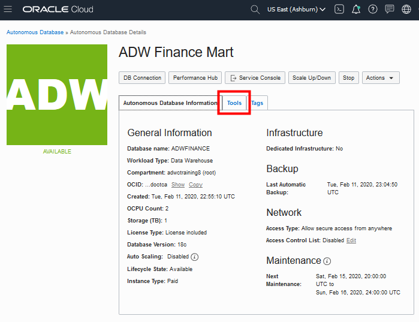
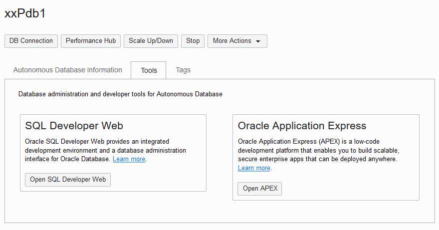
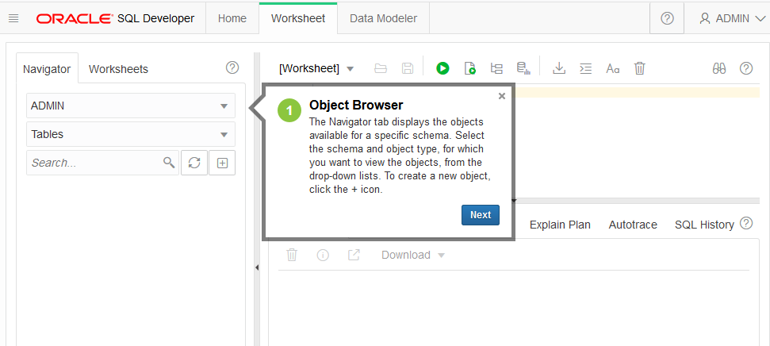

# SQL Developer Web

## Introduction

In this lab, you will explore the SOE (Swingbench Order Entry) data sets that that you have created in [Database Performance Monitor](labs/adb-performance-hub.md) using SQL Developer Web.

### Objectives

- Learn how to connect to your new Autonomous Database using SQL Developer Web
- Learn about the SOE data sets
- Run a query on an SOE data sets

### Prerequisites

1. A pre-provisioned Autonomous Transaction Processing instance. Refer to [Create Database lab](createDB.md).
2. The Order entry database that you have created in [Database Performance Monitor](labs/adb-performance-hub.md).
3. You will need to login to the Compute instance with the swingbench and SQL lite client install, e.g. devtool3.us.osc.oracle.com.

### Tasks
### **Task 1**: Connect with SQL Developer Web

Although you can connect to your autonomous database using local PC desktop tools like Oracle SQL Developer, you can conveniently access the browser-based SQL Developer Web directly from your ADW or ATP console.

1.  Open the navigation menu. Under **Database**, click **Exadata Cloud@Customer**.

    

2.  Click **Autonomous Databases**.
    - You may need to select the compartment that you are assigned to if it is not selected already.
3. Click the Name of your database. 

    

2. In your database's details page, click the **Tools** tab.

    

3.  The Tools page provides you access to SQL Developer Web and Oracle Application Express. In the SQL Developer Web box, click **Open SQL Developer Web**.

    

4. Select Copy on the SQL Developer Web dialog and paste the URL to the SGD browser or the browser with access to the on-premise/OSC network/VPN.

    

5. For this lab, simply use your database instance's default administrator account, **Username - ADMIN**, and with the admin **Password** you specified when creating the database. Click **Sign in**.
    - you can run the following command on the terminal windows to copy/paste the password for your database.
        ```bash
        echo ${myPwd}
        ```

    

5.  SQL Developer Web opens on a worksheet tab. The first time you open the SQL Developer Web, a series of pop-up informational boxes introduce you to the main features.

    

### **Task 2**: Run Scripts in SQL Developer Web

Run a Query on a Sample Autonomous Database Dataset.

1.  Copy and paste the code snippet below to your SQL Developer Web worksheet. This query will run on the SOE data sets. Take a moment to examine the script. Make sure you click the **Run Statement** button to run it in the SQL Developer Web so that all the rows are displayed on the screen.

    ```sql
    select * from soe.inventories;
    ```

    

2.  Take a look at the output response from your Autonomous Database

3.  You can see more about the SOE tablespace by selecting the SOE in the table space drop down on the left pane and run other query to explore the SOE data sets.

## Want to Learn More?

1. [RESTful Services for your Autonomous Database](rest_services_for_adb.md)
2. Click [here](https://docs.oracle.com/en/cloud/paas/autonomous-data-warehouse-cloud/user/sql-developer-web.html#GUID-102845D9-6855-4944-8937-5C688939610F) for documentation on connecting with the built-in SQL Developer Web.

## **Acknowledgements**

This lab is base on the [Connect to ADB with SQL Developer Web and Run Your First Query](https://github.com/oracle/learning-library/blob/d1ce2667ed554dfd3051e45849cb3fc08c9fc8e9/data-management-library/autonomous-database/shared/adb-sqldevweb/adb-sqldevweb.md)