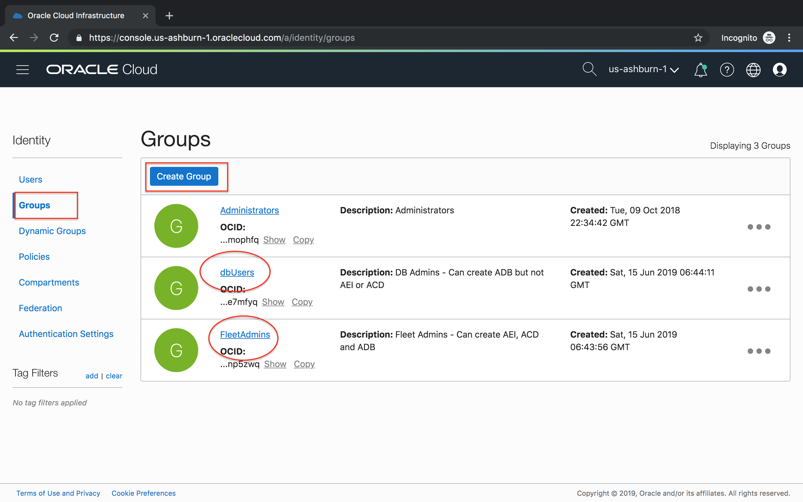

# IAM Practice - Identity and Access Management

## Introduction
Oracle Cloud Infrastructure Identity and Access Management (IAM) Service lets you control who has access to your cloud resources. You control the types of access a group of users has and to which specific resources. The purpose of this lab is to give you an overview of the IAM Service components and an example scenario to help you understand how they work together.

When configuring the dedicated infrastructure feature of Oracle Autonomous Transaction Processing, you need to ensure that your cloud users have access to use and create only the appropriate kinds of cloud resources to perform their job duties.

To institute access controls for cloud users, you define policies that grant specific groups of users specific access rights to specific kinds of resources in specific compartments.

The picture below illustrate the concept of IAM.


### Objectives
In this hands-on lab we take a look at some best practices to setting up a secure autonomous data platform. Note that while every organization should implement their own corporate security policies, this guide aims to provide a framework for working with the autonomous data platform in the Oracle Cloud Infrastructure.

The following is a typical compartment structure:
```
Root
|-- ExaInfra/ - contains Exadata Infrastructure (AIE), Autonomous Exadata VM Clusters, and Backup Destinations
|   |-- FleetHR/ - ACD for HR department
|   |   |-- dbHR - ATP and ADW for HR department
|   |-- FleetFin/ - ACD for Finance department
|   |   |-- dbFin - ATP and ADW for HR department
```

The following is how we structure our compartments. For example, ExaCC9 contains the AEI for our ExaCC number 9, c7Fleet contains the ACD, and c7ADBs contains the ATP or ADW.


As an OCI account administrator,

1. Create compartments and user groups with the right set of access policies for separation of duties
2. Create fleet admin and database user accounts

### Required Artifacts
1. An Oracle Cloud Infrastructure account with privileges to create users and IAM policies.
2. [You may want to signup for a free account](https://www.oracle.com/cloud/free/)
    - Your free account will give you full administrator authority to the tenant that is much closer to what you will get when your ExaCC is activated.
2. The account we provided for this lab is mostly view only that allows you to go through all the labs except actually creating or delete account at the last screen.

**Note:** *Some of the UIs might look a little different than the screen shots included in the instructions, but you can still use the instructions to complete the hands-on labs.*

## Tasks
### Task 1: Signing in to the Console

In this task, you sign in to the Oracle Cloud Infrastructure console using your credentials.

1. Open a supported browser and go to the Console URL: [https://console.us-ashburn-1.oraclecloud.com](https://console.us-ashburn-1.oraclecloud.com).
2. Enter your tenant name and click **Continue**


3. Oracle Cloud Infrastructure is integrated with Identity Cloud Services, you will see a screen validating your Identity Provider. Click **Continue**.


4. Enter your user name and password
5. When you sign in to the Console, the dashboard is displayed.


6. Click on the Person icon on the right top, select your name to view your account details.


7. Please note down the activity number in the "Description" area. It is 159164 in the above example. You will need the activity number, and other info in this screen for other labs.

### **Task 2:** Create compartments, groups, users and IAM policies
For separation of duties Oracle recommends a fleet administrator provision the exadata infrastructure and container databases while the database users simply become consumers of these resources and provision their databases on it. 

We will use the following IAM structure in line with the bare minimum isolation recommended,

- A fleetCompartment to hold the Autonomous Container Databases (ACD). 
    - The fleet Admin will have IAM policies to create and manage ACDs in the fleet compartment. 
- A dbUserCompartment for database and application user objects such as Autonomous Databases (ADBs) and application client machines. While for the purpose of this lab we create a single dbUser compartment, in practice, each user may have their own compartment for further isolation.
    - Database users in the dbUser compartment will have privileges to *READ* ACD resources in the fleet compartment only. They cannot create, delete or modify those resources. A database user may have complete read/write privileges on their own compartments where they can create and destroy database and application instances.


1. Lets create compartments  fleetCompartment and dbUserCompartment as shown.
    - On the main menu, Hit “Identity”, then choose  “Compartments”

        

    - Click on *“Create Compartment”* and fill in the information:

        Name: fleetCompartment

        Description: Compartment for resource testing

        Parent Compartment: ExaInfra

        

        
    - Repeat the above to create dbUserCompartment compartment with fleeCompartment as the parent.

2. Create groups fleetAdmins and dbUsers.

    

3. Now, add the following IAM policies on the fleetAdminCompartment.

    

    - The following policy statement on the fleetCompartment ensure group fleetAdmins and dbUsers have the right privileges as explained earlier. Note how fleet admins have 'manage' privileges while dbUsers have 'read' privileges.

    ````
    Allow group fleetAdmins to MANAGE autonomous-exadata-infrastructures in compartment fleetCompartment
    Allow group fleetAdmins to MANAGE autonomous-container-databases in compartment fleetCompartment
    Allow group fleetAdmins to MANAGE virtual-network-family in compartment fleetCompartment
    Allow group fleetAdmins to MANAGE tag-namespaces in compartment fleetCompartment
    Allow group fleetAdmins to MANAGE tag-defaults in compartment fleetCompartment
    ````
    - The only privilege dbUsers need on the fleet compartment is READ privilege on the Autonomous Container Databases to create their own Autonomous databases. Therefore, we add a policy statement on the fleet compartment as follows.

    ````
    Allow group dbUsers to READ autonomous-container-databases in compartment fleetCompartment
    ````

    - The final set of policy statements on the fleet compartment appear as shown below.

    


4. Similarly, create a dbUserPolicy on the dbUserCompartment as show. *Make sure you pick the right compartment before you hit the 'Create Policy' button*.

    **Note:** The assumption here is that the DB user will need to create other resources such as network, compute instances, storage buckets etc in their own compartment. This is highly dependant on a customer's individual requirement and can be configured in many different ways.

    ````
    Allow group dbUsers to MANAGE autonomous-databases in compartment dbUserCompartment
    Allow group dbUsers to MANAGE autonomous-backups in compartment dbUserCompartment
    Allow group dbUsers to USE virtual-network-family in compartment dbUserCompartment
    Allow group dbUsers to MANAGE instance-family in compartment dbUserCompartment
    Allow group dbUsers to MANAGE buckets in compartment dbUserCompartment
    Allow group dbUsers to MANAGE objects in compartment dbUserCompartment
    Allow group dbUsers to MANAGE app-catalog-listing in compartment dbUserCompartment
    ````

      - You may alternatively choose to grant 'MANAGE all-resources' privileges to users that need to provision databases and other cloud resources in their own private compartment as shown below.

       


5. And finally, lets create a fleet admin and a database user and add them to their respective groups. Any additional fleet admins or database users will simply need to be added to their groups and they will automatically assume their group privileges.

    

    

      - You now have the users, groups and compartments setup to provision an autonomous database platform.

## References ##
- [IAM Policies Required to Manage Autonomous Transaction Processing Dedicated Databases](https://docs.oracle.com/en/cloud/paas/atp-cloud/atpud/iam-policies-manage-adbs.html#GUID-196A2FC9-8015-41D4-AA71-25EB0B919B6D)
- [Policy Details for Exadata Cloud@Customer](https://docs.cloud.oracle.com/en-us/iaas/exadata/doc/eccpolicyreference.html)
- [IAM Policies Required to Manage Autonomous Container Databases](https://docs.oracle.com/en/cloud/paas/atp-cloud/atpfg/iam-policies-manage-acds.html#GUID-8A34EE5D-0B44-458C-920F-7E6AC35FFDA6)
- [Overview of IAM](https://docs.oracle.com/en-us/iaas/Content/Identity/getstarted/identity-domains.htm)
- [IAM with Identity Domains Tutorials](https://docs.oracle.com/en-us/iaas/Content/Identity/tutorials/iam-tutorials.htm)

## Acknowledgements

This lab is based on [Preparing the Oracle Cloud Infrastructure for ADB](https://github.com/oracle/learning-library/blob/master/data-management-library/autonomous-database/dedicated/adb-network-prepare/adb-network-prepare.md).
