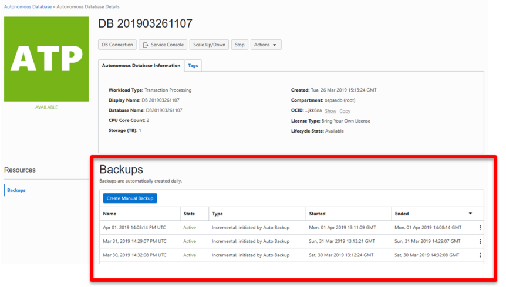
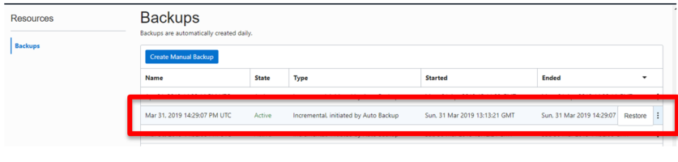
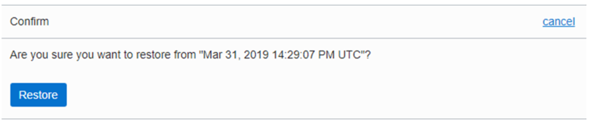
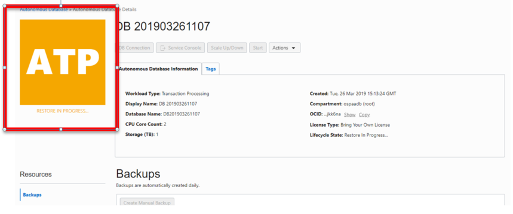
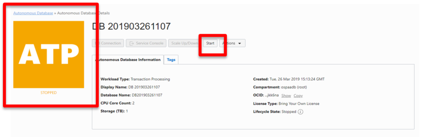
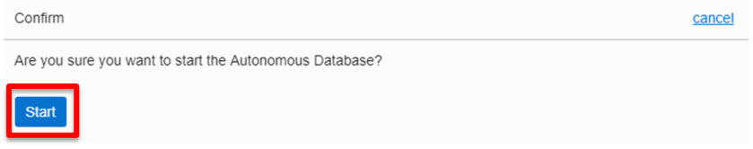
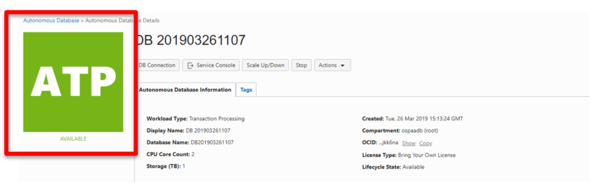

# Backups and Recovery

## Introduction
============================================================

Oracle Autonomous Database (ADB) is configured to perform automatic backups of your database and retain them for 60 days. The schedule for these built-in backups is to run a full backup every week and incremental backups every day.

You can restore and recover your database to any point-in-time in the 60-day retention period, or to a manually saved backup, in case you have initiated that separately.

You can perform on-demand manual backups as well. This is ideal when you want to take a backup before some major application change, or for additional data retention requirements due to regulations which is beyond the 60 days provided by the ADB service.

You can initiate recovery for your ADB using the cloud console. ADB automatically restores and recovers your database to the point-in-time you specify. The recovery process internally decides which backup to use to provide you the fastest recovery, either the automatic backups or the manual backups.

You can backup database to one of the following destinations, see [Managing Backup Destinations](https://docs.cloud.oracle.com/en-us/iaas/exadata/doc/eccmanagingbackupdest.html) for more details.
1. Recovery Appliance.
2. Network file storage (NFS).
3. Oracle Cloud Infrastructure object storage.
4. Local Exadata storage

## Tasks
### Task 1:  Review Backup information from the Console

1. Login in to your database console where you will see backups that were
    created for your database. If your database is new and has not undergone a
    full day of operation you will not see any backup and will not be able to
    perform this lab.

    
    
Figure 1-1

2. In the picture above you can see the daily backup that have been performed
    on this database and whether they are an incremental or full backup. 

### Task 2:  Perform a Point In Time Recovery

1. To perform a point in time recover of your database select the backup you wish
    to recover from and click on the three dots at the far right of the backup,
    and select restore.

    
    
Figure 2-1

2. A pop-up will ask to confirm you want to perform a restore from that backup,
    click Restore.

    
    
Figure 2-2

3. The database goes into restore mode and is not available until the restore
    is done. The restore and re-start take time so make sure you won’t need your
    database in the immediate future before performing a restore.

    
    
Figure 2-3

4. When the restore completes, the database goes into STOPPED status and must
    be restarted by clicking on the Start button.

    
    
Figure 2-4

5. Confirm you want to start the database. The database will go into STARTING
    mode. When the startup continues it will switch to AVAILABLE and the restore
    is complete.

    
    
Figure 2-4

    
    
Figure 2-5

### Task 3:  Manual on demand backup
You can manually back up an autonomous database should the need arise.

**Note:** During the backup operation, your autonomous database remains available. However, lifecycle management operations such as stopping it, scaling it, or terminating it are disabled.

1. Open the navigation menu. Under **Database**, click **Exadata Cloud@Customer**.
2. Click **Autonomous Databases**.
3. In the list of Autonomous Databases, click the display name of the database you wish to back up.
4. On the Details page, under **Resources**, click **Backups**.
5. Click **Create Manual Backup**.
6. In the Create Manual Backup dialog, enter a name for your backup. Avoid entering confidential information.
7. Click **Update**.
The backup operation begins. This operation may take several hours to complete, depending on the size of the database.

Optionally, you can check the state of your backup in the list of backups
on the database details page. For some states, an information icon is displayed to
provide additional details regarding the state or ongoing operations like deletions.
The backup has one of the following states:

* `Creating`
* `Active`
* `Deleting`
* `Deleted`
* `Failed`

## Acknowledgements

This lab is based on [Backups, Recovery, and Cloning an Autonomous Database](https://github.com/oracle/learning-library/blob/c9c5dfaa2bb5ad0bfab1abb28112c07cd8b98d42/ospa-library/data-mgmt/adb-certifications-labs/adb-backup-recovery/Backup%2C%20Recovery%2C%20and%20Cloning%20and%20Autonomous%20Database.md).
