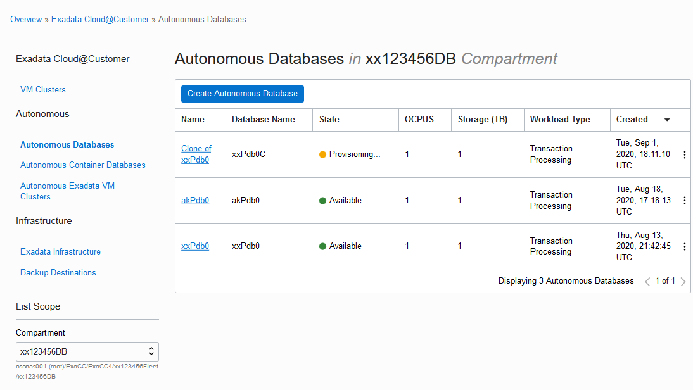

# Cloning an Autonomous Database

## Introduction

Autonomous Database provides cloning where you can choose to clone either the
full database or only the database metadata. Depending on the type of cloning
being performed, this will provide a full point in time copy of the original
database into a new standalone Autonomous Database

## Required Artifacts

1. An Oracle Cloud Infrastructure account.
1. A pre-provisioned Autonomous Transaction Processing instance. Refer to [Create Database lab](createDB.md).

## Tasks:
### Task 1: Create a clone

1.  Open the navigation menu. Under **Database**, click **Exadata Cloud@Customer**.
    
2.  Click **Autonomous Databases**.
    - You may need to select the compartment that you are assigned to if it is not selected already.
3. In the list of Autonomous Databases, click the display name of the database you want to clone.
4. From the More **Actions drop-down list**, select **Create Clone**.
    
4. The parameters are similar to original database creation and prefill with valid value except CDB and password.
    - CDB is in the Fleet compartment.
    - You may also want to change the database name.
5. Select **Create Autonomous Database Clone** after filling the information.
    
6. Click on Autonomous Database on the top left to return to the Console, where you will see your original database and your clone. Notice your original database is not affected by the cloning process and continues to run uninterrupted.
    

When the cloning process completes, the **State** will change to     **Available**. Select the database when it becomes available and examine and     use it right away.

## Acknowledgements

This lab is based on [Backup, Recovery, and Cloning and Autonomous Database](https://github.com/oracle/learning-library/blob/c9c5dfaa2bb5ad0bfab1abb28112c07cd8b98d42/ospa-library/data-mgmt/adb-certifications-labs/adb-backup-recovery/Backup%2C%20Recovery%2C%20and%20Cloning%20and%20Autonomous%20Database.md)

## References ##
- [Clone an Autonomous Database](https://docs.cloud.oracle.com/en-us/iaas/exadata/doc/eccmanagingadbs.html#GUID-F30099C7-FB11-443B-88C7-45E2D77E959F)