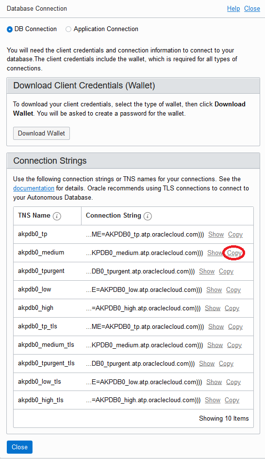

# Create Database

## Introduction
An Autonomous Database resource is a user database. When you create an Autonomous Database, you choose the Autonomous Container Database for it and you specify "Data Warehouse" or "Transaction Processing" as its workload type to create an Autonomous Data Warehouse database or an Autonomous Transaction Processing database.

You can create up to 400 Autonomous Databases in each Autonomous Container Database, depending on the capacity of your Exadata Infrastructure hardware, as described in [Available Exadata Infrastructure Hardware Shapes](https://docs.oracle.com/en/engineered-systems/exadata-cloud-at-customer/19/eccad/eccadboverview.html#GUID-36E73A8B-2E14-4A6A-8B21-3FE1395F9E82).

## Required Artifacts

This lab requires the artifact describe in [commPreReq.md, click to see or right mouse button click to open new tab as you may need it for other labs](../ecc/labs/commPreReq.html).

## Tasks:
### Task 1: Create database
Follow these steps to create an autonomous database on an Oracle Exadata Cloud@Customer system.

1.  Open the navigation menu. Under **Database**, click **Exadata Cloud@Customer**.
    - The navigation menu is on the right top.

    

2.  Click **Autonomous Databases**.
    - You may need to select the compartment that you are assigned to if it is not selected already.
3.  Click **Create Autonomous Database**.
4.  In the Create Autonomous Database dialog, enter the following:

    **Basic Database Information**
      - **Compartment:** Default to the compartment you selected on Step 1.
      - **Display Name:** A user-friendly description or other information that helps you easily identify the resource. The display name does not have to be unique. Avoid entering confidential information.
      - **Database Name:**
        * if you will be using this database for other labs, you may want to name the database with the format xxPdbN, where xx is your or your company's initial and N is the database number, e.g. jdPdb3 for John Dow's database number 3.
        * The database name must consist of letters and numbers only, starting with a letter. The maximum length is 14 characters. Avoid entering confidential information.

    **Workload Type**

    Select the desired workload type. See [About Autonomous Data Warehouse](https://docs.oracle.com/pls/topic/lookup?ctx=en/cloud/paas/autonomous-data-warehouse-cloud&id=ADWUD-GUID-60C71F84-9C64-4F6E-B521-E3242B1ABB28) and [About Autonomous Transaction Processing](https://docs.oracle.com/pls/topic/lookup?ctx=en/cloud/paas/atp-cloud&id=ATPUD-GUID-3EBB400C-FD6B-4291-B1E6-01AB82821167)
    for information about each workload type.

    Click **Change Compartment:** in "Choose autonomous container database" section and select the parent compartment of your database, e.g. xx123456Fleet.

    **Note:** If you are going to use this DB for other labs, please uncheck the auto scaling as we will do that later.
    
    **Autonomous Container Database:** Select an Autonomous Container Database, e.g. xx123456CDB.

    **Administrator Credentials:**
      - If you want to use the database for other lab, you may want to set the password as BEstr0ng###N, where N is your database number that you enter as part of the name above, e.g. BEstrong###3.
      - **Note:** The ID for administration is ADMIN.
    

5.  Click **Create Autonomous Database**.

### Task 2: Connect to the newly created database
1.  Open the navigation menu. Under **Database**, click **Exadata Cloud@Customer**.
    
2.  Click **Autonomous Databases**.
    - You may need to select the compartment that you are assigned to if it is not selected already.
3. Click the Name of your database. 
5. In Database details window, click the **DB Connection** button, select Copy on one of the connection string, e.g. _medium, then paste to set the cs variable in the command shell.
    See [Predefined Database Service Names for Autonomous Transaction Processing](https://docs.oracle.com/en/cloud/paas/atp-cloud/atpug/connect-predefined.html#GUID-9747539B-FD46-44F1-8FF8-F5AC650F15BE) for more details on connection string (-cs)
    
5. On the terminal windows, run the SQL connect to the newly created database and see what table spaces are created.
    - **Note**: Make sure you paste the connection string to the variable cs in quote. Otherwise, you will get error from Linux shell.
    ```
    cs=""
    sqlplus "ADMIN/${myPwd}@$cs"
    select * from global_name;
    select * from V$TABLESPACE;
    exit
    ```

The following is sample input and output:
```
akwok@devtool3:~ $ cs='(DESCRIPTION=(CONNECT_TIMEOUT=120)(RETRY_COUNT=20)(RETRY_DELAY=3)(TRANSPORT_CONNECT_TIMEOUT=3)(ADDRESS_LIST=(LOAD_BALANCE=on)(ADDRESS=(PROTOCOL=TCP)(HOST=exacc4-01-scan.us.osc.oracle.com)(PORT=1521)))(CONNECT_DATA=(SERVICE_NAME=AKPDB0_medium.atp.oraclecloud.com)))'
akwok@devtool3:~ $ sqlplus "ADMIN/${myPwd}@$cs"

SQL*Plus: Release 19.0.0.0.0 - Production on Mon Aug 31 15:36:22 2020
Version 19.6.0.0.0

Copyright (c) 1982, 2019, Oracle.  All rights reserved.

Last Successful login time: Mon Aug 31 2020 14:57:18 -07:00

Connected to:
Oracle Database 19c EE Extreme Perf Release 19.0.0.0.0 - Production
Version 19.8.0.0.0

SQL> select * from global_name;

GLOBAL_NAME
--------------------------------------------------------------------------------
AKPDB0.ATP.ORACLECLOUD.COM

SQL> select * from V$TABLESPACE;

       TS# NAME                           INC BIG FLA ENC     CON_ID
---------- ------------------------------ --- --- --- --- ----------
         0 SYSTEM                         YES YES YES              4
         1 SYSAUX                         YES YES YES              4
         2 UNDOTBS1                       YES YES YES              4
        10 DBFS_TS                        YES YES YES              4
         4 UNDO                           YES YES YES              4
         6 UNDO_4                         YES YES YES              4
         7 UNDO_5                         YES YES YES              4
         8 DATA                           YES YES YES              4
         9 TEMP                           NO  YES YES              4

9 rows selected.

SQL> exit
Disconnected from Oracle Database 19c EE Extreme Perf Release 19.0.0.0.0 - Production
Version 19.8.0.0.0

```

## References
- [Managing Autonomous Databases](https://docs.oracle.com/en/engineered-systems/exadata-cloud-at-customer/19/eccad/eccmanagingadbs.html#GUID-AE51DD35-2858-49FE-B54B-B7B900A7ADD2).
- [API to Manage Autonomous Databases](https://docs.oracle.com/en-us/iaas/exadata/doc/adb-managing-adb.html#ECCCM-GUID-341FE78B-C3D2-4AF5-B258-0E090FDF6764)
