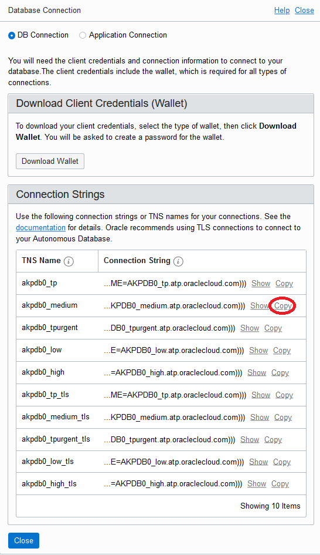

# Oracle Database Network Encryption

## Introduction

Network encryption is one of the most important security hardening strategies to be adopted in any enterprise infrastructure. It will ensure confidential data transmitted over the wire is encrypted and will prevent malicious attacks in man-in-the-middle form intended for data exfiltration. Network encryption guarantees that data exchanged between the clients (Application) and Database System or indeed between any two endpoints should be securely transmitted and transparently decrypted without fear of prying eyes. Moreover, compliance with mandatory laws like HIPAA dictates or highly recommends to implement tools of encryption of in-transit and/or at-rest data as protection from theft or malicious attacks. ExaCC enforce network traffic encryption to secure over-the-wire data out-of-the-box.

## Required Artifacts

This lab requires the artifact describe in [commPreReq.md, click to see or right mouse button click to open new tab as you may need it for other labs](../ecc/labs/commPreReq.md).

## **Tasks**

### **Task 1**: Get connection string to database

1.  Open the navigation menu. Under **Database**, click **Exadata Cloud@Customer**.
    
2.  Click **Autonomous Databases**.
    - You may need to select the compartment that you are assigned to if it is not selected already.
3. Click the Name of your database. 
5. In Database details window, click the **DB Connection** button, select Copy on one of the connection string, e.g. _medium, then paste to set the cs variable in the command shell.
    
5. On the terminal windows, run the SQL connect to the newly created database and see what table spaces are created.
   ```
   cs=
   sqlplus "ADMIN/${myPwd}@$cs"
   select * from global_name;
   select * from V$TABLESPACE;
   ```

### **Task 2**: Out of box connection is encrypted:

1. Show encrypt setting use for the current connection.
   ```
   select network_service_banner from v$session_connect_info where sid in (select distinct sid from v$mystat);
   ```
   - This shows that the connection is encrypted with AES256.
2. Exit from SQL client (ctrl-D).
   ```
   exit
   ```

The following is a sample input and output

```
akwok@devtool3:~ $ nNodes=8;nodeName=exacc4-01;domName=us.osc.oracle.com;pp=BEstr0ng###;myInit=xx;myDBnum=0
akwok@devtool3:~ $ cs='(DESCRIPTION=(CONNECT_TIMEOUT=120)(RETRY_COUNT=20)(RETRY_DELAY=3)(TRANSPORT_CONNECT_TIMEOUT=3)(ADDRESS_LIST=(LOAD_BALANCE=on)(ADDRESS=(PROTOCOL=TCP)(HOST=exacc4-01-scan.us.osc.oracle.com)(PORT=1521)))(CONNECT_DATA=(SERVICE_NAME=XXPDB0C_medium.atp.oraclecloud.com)))'
akwok@devtool3:~ $ sqlplus "ADMIN/${myPwd}@$cs"

SQL*Plus: Release 19.0.0.0.0 - Production on Tue Sep 1 15:21:17 2020
Version 19.6.0.0.0

Copyright (c) 1982, 2019, Oracle.  All rights reserved.

Last Successful login time: Tue Sep 01 2020 15:20:20 -07:00

Connected to:
Oracle Database 19c EE Extreme Perf Release 19.0.0.0.0 - Production
Version 19.8.0.0.0

SQL> select network_service_banner from v$session_connect_info where sid in (select distinct sid from v$mystat);

NETWORK_SERVICE_BANNER
--------------------------------------------------------------------------------
TCP/IP NT Protocol Adapter for Linux: Version 19.0.0.0.0 - Production
Encryption service for Linux: Version 19.0.0.0.0 - Production
AES256 Encryption service adapter for Linux: Version 19.0.0.0.0 - Production
Crypto-checksumming service for Linux: Version 19.0.0.0.0 - Production

SQL> Disconnected from Oracle Database 19c EE Extreme Perf Release 19.0.0.0.0 - Production
Version 19.8.0.0.0

```

## References ##
- [Configuration of TCP/IP with SSL and TLS for Database Connections](https://docs.oracle.com/database/121/DBSEG/asoconfg.htm#DBSEG1047)
