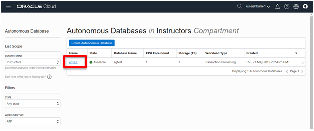
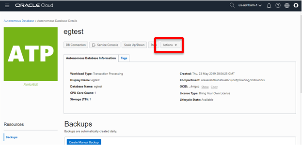
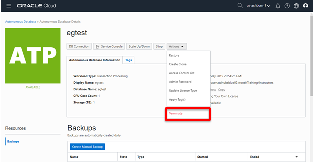
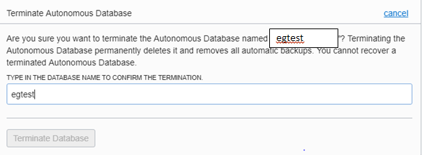
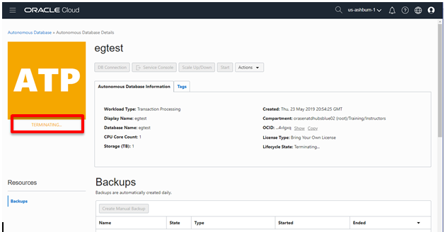
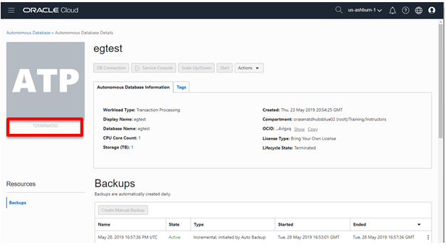
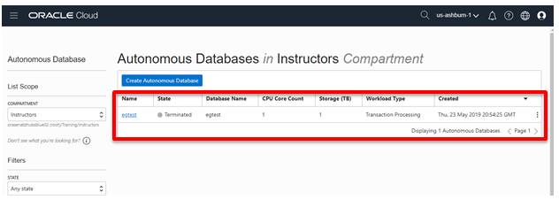

# Delete an Autonomous Database
## Instroduction

After you finish all the labs, its important to clean up the environment so the next group has available resources. In this module you will terminate your Autonomous Database so the resources are released. In this example s database called **egtest** is terminated. You should **only** terminate the database your created and be careful not to terminate another groups database.

## Tasks:
1. From the **Database Console** page of your ADB service, click on your database.
    
2. From the **Database Details** page of your ADB service, click on the **Actions** drop down 
    
3. Select **Terminate** your service.
    
4. A **Terminate Autonomous Database** pop up appears, type in your  **Database Name** to confirm you want to delete it, then click **Terminate Database**
    
5. The Database Details console will reappear showing the database **Terminating**
    
6. After a few minutes the database will show **Terminated**
    

In the Database Console page you will notice that the database remains in **Terminated** status. It takes about 24 hours for the database to dissapear from the Console, but it is no longer active or consuming resources.
