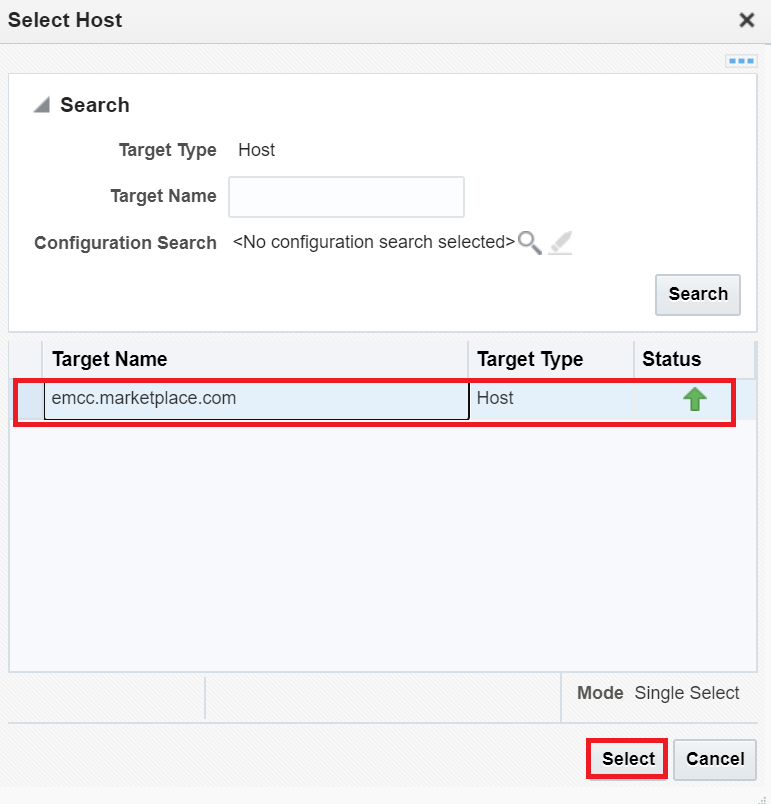
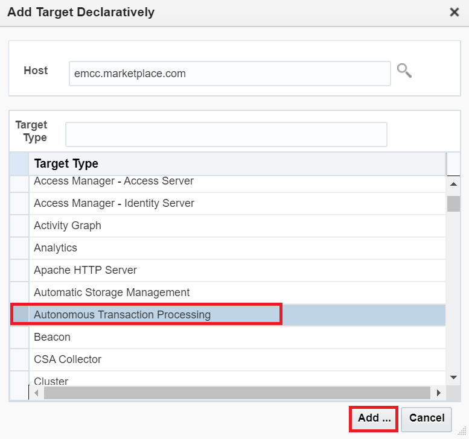
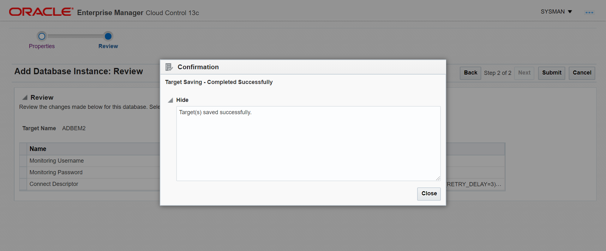

# Connecting to Autonomous Transaction Processing Dedicated from Oracle Enterprise Manager

## Introduction
This lab is to show what Database Administrators (DBAs) need to know to accelerate their adoption of Oracle Autonomous Database using Oracle Enterprise Manager skills they already possess. 

There are four areas in which Oracle Enterprise Manager can benefit DBAs who plan to deploy Oracle Autonomous Database:
1. Discovering Autonomous Databases 
2. Monitoring the health and performance of Autonomous Databases and performing deep diagnostics using features like ASH Analytics, Real-Time SQL Monitoring and similar. 
3. Completing database administration tasks such as automatic index management, storage management, and schema management tasks such as creating database objects 
4. Migrating databases and managing the entire fleet: the new release of Enterprise Manager 13.4 adds functionality that automates database migration and provides a single dashboard that improves visibility, control, and management for hybrid IT environments. 

*In this lab we will configure and access Autonomous dedicated Transaction Processing database from Oracle Enterprise Manager.*

### Objectives

As a Database Administrator,

- Learn how to connect to Autonomous Dedicated Transaction Processing Database from Oracle Enterprise Manager.
   

### Required Artifacts

This lab requires the artifact describe in [commPreReq.md, click to see or right mouse button click to open new tab as you may need it for other labs](../ecc/labs/commPreReq.html).

You will also need the following:
1. Enterprise Manager URL
2. ID and password to login to the Enterprise Manager.

## Tasks
### Task 1: Enable monitoring user

1. Connect to the database and verify it is the database you created or assigned to you.

   ```sql
   sqlplus "ADMIN/${myPwd}@$cs"
   select * from global_name;
   ```
   
2. Set password for monitoring ID adbsnmp.

   ```sql
   ALTER USER adbsnmp IDENTIFIED BY WElcome_12345#;
   ```

3. Unlock/enable adbsnmp.

   ```sql
   ALTER USER adbsnmp ACCOUNT UNLOCK;
   exit
   ```

### Task 2: Download database wallet

1. Using SGD browser, Login to Oracle Cloud Infrastructure account and Open the navigation menu. Under **Database**, click **Exadata Cloud@Customer**.
   * **Note:** if you are using the SGD browser in the on-premise data center (SGD), you will need to upload the wallet to where the EM browser has access to it.

    

1. Click on Autonomous Database and select your previously created database.
    - You may need to select the compartment that you are assigned to if it is not selected already.

    

1. Click on DB Connection and under Download Client Credential(Wallet) click *Download*.

    

1. Provide a password and download the wallet to a local folder. 

    

    The credentials zip file contains the encryption wallet, Java keystore and other relevant files to make a secure TLS 1.2 connection to your database from client applications. Store this file in a secure location.

### Task 3: Add Autonomous Transaction Processing Database dedicated as Target in OEM

1. Enter the EM URL in your browser, e.g. https://ecc4em.us.osc.oracle.com:7802/em/, and login.
2. Click "Setup" and select "Add Target" and click on "Add Targets Manually".
    

2. Click on "Add Target Manually".
    

2. Search the host name and select as "emcc.example.com". There should only be one
   - **Note:** you may need to expand the dialog to see the search button looks like a magnifying glass.
    
    
    

2. Select Target Type as "Autonomous Transaction Processing" and click on "Add..". 
    

2. Set the Target Name to be the same as your database name (Target name can be anything of your desire).

2. Select "OCI Client Credential (Wallet)" as ATPD instance wallet downloaded from console   

2. Select "Service Name" as "<ATPD_Name>_low"

1. Give the "Monitoring Username" as "ADBSNMP"

1. Give "Monitoring Password" as ADBSNMP user password and click on "Test Connection"
	

1. Once the connection test is successful, Click "OK" and click "Next" 
	

1. Click on "Submit" to establish the connection	
	

	

### Task 4: Test the Connection

1. Click on "Targets" select "All Targets"
	
	
1. Under Databases select "Autonomous Transaction Processing" 
	
	
	
	
1. Under Target Name select your database name

### Task 5: Remove target to clean up

1. Select Targets from the **Enterprise** menu.
2. Select Databases from the drop-down list of Targets.
3. Select the database from the listed databases under the Databases screen. ...
4. Select Targets Setup from the **Oracle** Database drop-down list. ...
5. Click on Yes to **remove** the **target**.

## Conclusion ##

Oracle’s Autonomous Database automates all system-level operational DBA functions. The new capabilities of Oracle Enterprise Manager enable enterprises to easily adopt Oracle Autonomous Database and Exadata Cloud Service and improve their security posture, while leveraging the same skillsets and processes their DBA teams are used to from Oracle Enterprise Manager. Specifically for DBAs, the ability to deliver higher quality and more agile database administration services helps to elevate their impact and effectiveness, resulting in better outcomes for IT and business.

## References ##

- [Oracle Enterprise Mananger for Autonomous Databases](https://www.oracle.com/a/otn/docs/enterprise-manager/wp-oracle-enterprise-manager-for-autonomous-database.pdf)

## Acknowledgements

This lab is based on [Connecting to Autonomous Transaction Processing Dedicated from Oracle Enterprise Manager](https://github.com/oracle/learning-library/blob/4b7ee195159adcaea1fd268e7f9f891a16a555ad/data-management-library/autonomous-database/dedicated/adb-oem/deploy%20OEM%20and%20connecting%20to%20ADB%20from%20OEM.md)
