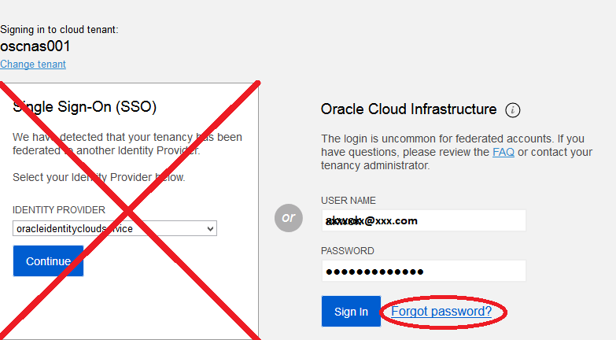

# Multi-Factor Authentication (MFA) for Oracle Cloud Infrastructure Users
It's more important than ever to protect your assets in the cloud. Many customers already use identity providers like Oracle Identity Cloud Service (IDCS), Microsoft Active Directory Federation Services (AD FS), and [Okta](http://blogs.oracle.com/cloud-infrastructure/oracle-cloud-simplifies-identity-management-with-enhanced-okta-support) to control access to Oracle Cloud Infrastructure. Customers set up multi-factor authentication with these identity providers to help keep out unwanted visitors. The OCI Control Plane also support multi-factor authentication natively.

In this lab, you will add a temporary one-time password (TOTP) device to your account to enable MFA. All that you need to set up TOTP is a mobile device with a TOTP application like Oracle Mobile Authenticator (available on [iTunes](http://itunes.apple.com/us/app/oracle-mobile-authenticator/id835904829?mt=8) and [Google Play](http://play.google.com/store/apps/details?id=oracle.idm.mobile.authenticator&hl=en_US)).  

## Tasks

### Task 1: Sign in to your Oracle Cloud Infrastructure account

[Sign into your Oracle Cloud Infrastructure tenancy](https://console.us-ashburn-1.oraclecloud.com/) as a native user (that is, don't use any single sign-on federation that you might have set up).

### Task 2: Visit your user profile page

In the upper-right corner of the Console, click the Profile icon and select your profile ID.

### Task 3: Click to enable multi-factor authentication

Click the **Enable Multi-Factor Authentication** tab. You are given instructions to install a TOTP app on your mobile device.

### Task 4: Install a TOTP app on your mobile device

For your TOTP app, try Oracle Mobile Authenticator (available on [iTunes](http://itunes.apple.com/us/app/oracle-mobile-authenticator/id835904829?mt=8) and [Google Play](http://play.google.com/store/apps/details?id=oracle.idm.mobile.authenticator&hl=en_US)).

### Task 5: Use your TOTP app to get the code

Use the barcode scan function in the app to scan the barcode on the Enable Multi-Factor Authentication dialog box in the Console.

### Task 6: Enter the code into the confirmation dialog box

Enter the verification code that the app generates into the **Verification Code** field in the Enable Multi-Factor Authentication dialog box. Then, click **Enable** and then **Close**.

You're done! The next time that you sign in to this account, you will be prompted to enter the code from your TOTP app.

If you ever lose the device, any administrator for your tenancy can disable TOTP on your behalf and allow you to sign in. You just need to set up multi-factor authentication again when you sign back in.

## Acknowledgements

This lab is based on [Multi-Factor Authentication for Oracle Cloud Infrastructure Users](https://blogs.oracle.com/cloud-infrastructure/multi-factor-authentication-for-oracle-cloud-infrastructure-users).
