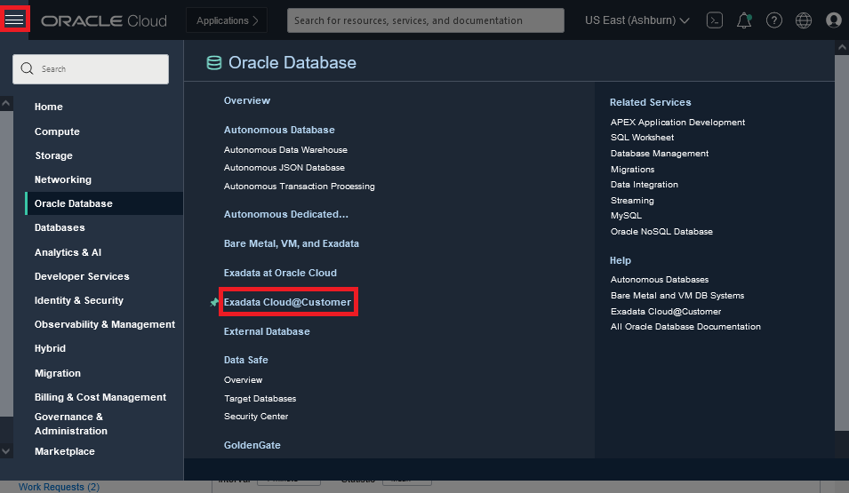

# Basic setup and navigation for Autonomous database on Exadata cloud@customer

## Introduction

This is the instruction for basic access to your cloud resource and setup you need for many of the practice labs.

## Required Artifacts

You need access to OCI cloud.


## **Tasks**

### **Task 1**: Database details

1.  Open the navigation menu. Under **Database**, click **Exadata Cloud@Customer**.
    - The navigation menu is on the right top.

      

1. Navigating to the compartment for the workshop, e.g. for compartment /ExaCC/ExaCC2/exacc2vm7, you can select dropdown of List scope Compartment near the left botoom, click '+' sign next to ExaCC, '+' sign for ExaCC2, then Select **exacc2vm7** 

    

2. Click **Autonomous Databases**.  A list of ADB will be display
    - Similarly, you can view a list of ACD by clicking on the Autonomous Container Database link or a list of AVM by clicking on the Autonomous Exadata VM Cluster link.

    

3. Click the link on your database to view the details that including the performan metrics such as CPU Utilization.

    


### **Task 2**: Shell Terminal setup

1. You should set the following shell environment variables for running the practice labs. You can also set them your .profile or .bashrc to automate the setup for you.
   ```bash
   export sbHome=/usr/local/swingbench
   export myPwd=BEstr0ng###X
   export cs=""
   ```
   - Where X is the database number that is assigned to you on the ID and database number assignment table above in the myDBnum column.
   - The following are steps to get the connection string (cs) to assign to the environment variable cs.
       - On the database details page, see previous task to how to navigate to it.
       - Click the database connection button near the top of the ADB details page.
       - Click Copy link on the row for tp, e.g. e1c2adbX_tp.
       - Paste the connection string in between the double quote for the environment variable cs command export cs="", then hit enter.
2. Run the following command to test that your variables are setup correctly. Make sure the output of the command return match the database number that is assigned to you.
   ```bash
   echo show con_name | sqlplus "admin/$myPwd@$cs"
   ```
## References ##

- See [Hands on Participant setup](../ecc/labs/commPreReq.html) for more details
