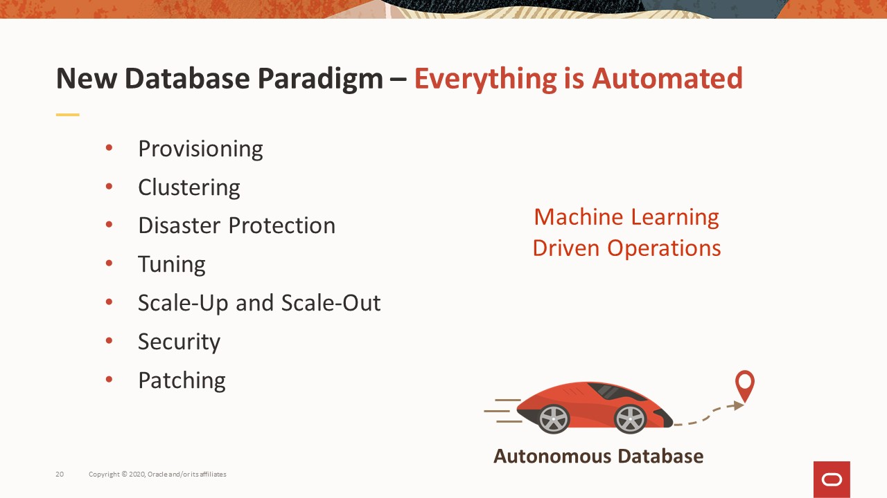
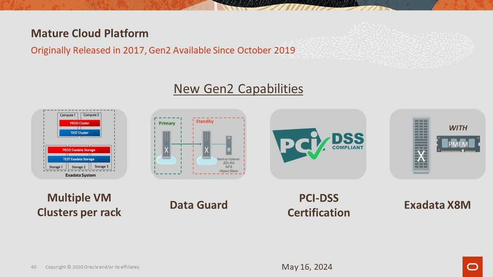
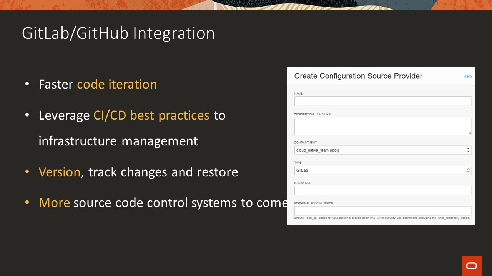
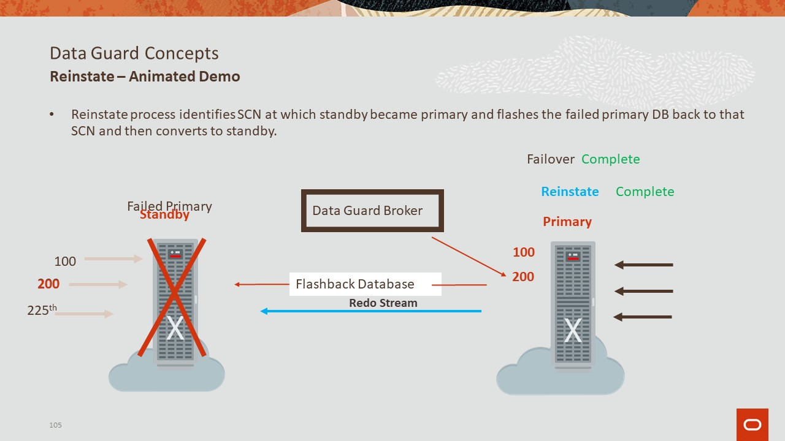

# Slide 1: Gen 2 Exadata Cloud at Customer

Think of OSC is the showcase in a car dealership where potential car buyer will go and test drive before they buy. OSC offer similar service such as:
1. Demo - take the customer for a ride on a brand new car to show different features.
2. Workshop - teach the customer how to drive before handing the key to allow customer to test drive themselves.
3. PoC (Proof of Concept) - hand the key to the customer for them to test drive themselves.

Oracle Sales can submit activity request at https://osc.oraclecorp.com/. Customer can view https://www.oracle.com/osc/ page for more details.

Note: This presentation is a condense version of multi-day workshop into an hour.

# Slide 2: Safe Harbor

We are required to give you a few second to view this.

# Slide 3: Oracle Exadata Advantage 

1. Ideal Database Hardware - Scale-out, database optimized compute, networking, and storage for fastest performance and lowest cost
   * Back to the car analogy, Exadata is like a car, the engine, wheels, etc are engineered together to deliver the most efficient database service.
2. Smart System Software - Specialized algorithms vastly improve all aspects of database processing: OLTP, Analytics, Consolidation, IoT, Blockchain, High Frequency Trading..
   * We have specialize SW to manage all aspect of the Exadata machine.
3. Automated Management - Automation and optimization of configuration, updates, performance, and management culminating in Fully Autonomous Infrastructure and Database
   * Automation is our key to success and enable us to provide 4 nines of reliability for Exadata cloud service by eliminating much of the human error and labor cost. Human is only have 1 nines of reliability at best. I typically make 1 mistake out of a 10 manual steps. Also, human need to sleep and the longer you work the less reliable a human become.
   * Example for 99.95% (4 nines) reliability it means less a min down time per day, 5m/wk, 22min/mo, or 4hr/yr compare to human need 8 hr sleep/day.

Exadata is our best database platform 
   Runs all workloads
   Best scalability and database performance with smart Oracle DB algorithms
   Best MAA DB platform, fully integrated with best practices, advantages include fully redundant, lower brownout, inherent data protection, HA quality of service for toughest issues 
   Cloud automation for life cycle

https://www.oracle.com/cloud/iaas/sla.html

# Slide 4: Thousands of Critical Deployments Since 2008

Matured and leading edge technology that has been in production used by thousands of customer since 2008.
Identical On-Premises and On-Cloud - Starts small scales huge, no technology compromises, simple migration of applications to cloud

# Slide 5

Exadata is our best database platform 
   Runs all workloads
   Best scalability and database performance with smart Oracle DB algorithms
   Best MAA DB platform, fully integrated with best practices, advantages include fully redundant, lower brownout, inherent data protection, HA quality of service for toughest issues 
   Cloud automation for life cycle

# Slide 6: Platform Responsibilities  Comparison of Models

So, now lets summarize the Choice that we offer on Automation and Control around Exadata Technology in customer's data center.

On the left side is Exadata purchased and owned by the customer. This provides full control and customization.
The one in the middle is Exadata Cloud at Customer, where Oracle provides Exadata as a cloud service in customer's data center but the database is managed by the customer. We call it co-managed service as both customer and Oracle need to manage different part of the infrastructure.
And on the right side is Autonomous Database on Exadata Cloud at Customer.

Back to the car analogy:
1. For On-prem deployment is like DIY your car or at most buying a car with up front cost that you have to depreciate as your own assets and that you need to maintain it such as oil change, fix leaking tires, in the case of Exadata is patching, hw, sw, switches etc. That is even worse is that most of that is manually and error prone work.
2. ExaCC is similar to leasing a car with maintenance included, you can drive as fast or as slow as you want and you have a steering wheel that means you need to figure out how to get there. The steering wheel comes with extra work to patch DomU OS, DB and GI home however, much of the tasks such downloading, pre-check, apply etc are automated. You just need to click a button to do precheck, check the result to make sure it pass, then click another button to apply. You can think of the cloud tooling automation as your car maintenance is done by robot that is highly reliable. In the case of ExaCC, we have a 4 nines or more exactly a 99.95% SLO which means less a min down time per day, 5m/wk, 22min/mo, or 4hr/yr compare to human need 8 hr sleep/day. I typically give 1 nine for human reliability that means if a human being is to perform a 10 step manual tasks, they will make 1 mistakes.
3. ADB-CC is like Tesla FSD (Fully Self Driving) to take you to the destination the quickest and safest it can. It will keep getting better, faster, safer, and so on as AI and ML are getting better and better. For autonomous DB, all the patching including DomU, DB home and GI all automated, i.e. done by highly reliable robot.
4. 
The beauty is that it's the same Exadata Cloud at Customer with a choice to make the entire stack automatic, and the customer can change between autonomous and not autonomous as they may like. And unlike Tesla there is no additional fees for the autonomous function.

Given the breadth and depth of Exadata offerings, we continue to invest heavily in the continued innovation in this technology.

Gen2 Exadata Cloud at Customer is the most ideal choice for the customers to built DbaaS in their data center using a true cloud. Its meets all the criterias of a local cloud.

# Slide 7: Autonomous Database - Dedicated Consolidation Constraints

# Slide 8: Oracle Future :  all roads lead to Autonomous

# Slide 9: Typical Deploying Oracle Database Steps

It uses to take a lots of step to create DB, it is likely less for you now but still quite a number of steps even with traditional on-premise Exadata hw, it may be half of that but still take a bit of times and effort. Even if you have fully automated all this steps, it will still better to use our cloud automation as we own the full stack, will ensure everything from HW, OS, SW, tooling, all the way up to REST API, UI work together. Also we have the scale of economy as the same service is utilized by many customer.

# Slide 10

http://netsoftmate.blogspot.com/2017/03/create-12201-database-on-exadata.html
If you have Exadata on-prem before you may be using DBCA that still take quite a number of screens and lots of choices to made. Again, you don't have to do that either.

# Slide 11: Deploying Oracle Database on ADB@CC

Now with cloud automation, everything is simpler, it only need to give it a password and the rest has default but you can change it to what you want in 1 page.
Let me show you how easy it is to create a DB using the cloud tooling now as it will still take time about 30 to 40 min to create a DB but it is still till a lot quicker than the old way and it is mostly hand free or manual free with little human intervention.
We will talk more about ExaCC after I started the DB creation job.

# Slide 12: Management Interfaces

   Oracle Cloud Infrastructure provides a wide choice of management interfaces that can be used with Exadata Database Service.  The easiest to use is the web-browser interface, which allows you to use a browser to graphically configure and initiate operations.  This is great for one time actions, but most customers prefer a more programmatic interface for things done repeatedly, such as provisioning and patching databases.  Anything you can do with the browser, you can also do with a corresponding REST API.  Similar to the browser, the REST APIs transit the internet via https, and require no special software installed on the local system.  All interfaces are also exposed via a command line interface that can be used for scripting, and for building custom tooling, and there is a software development kit to integrate with common languages such as Java, Python, Ruby, and Go.  If you prefer to manage your infrastructure as code, there is also a Terraform and Ansible interface. 
   
   Cloud automation simplifies most lifecycle and management tasks, including scaling OCPUs up and down, creating databases, performing backup and recovery operations, and even enabling disaster recovery protections through Data Guard.

# Slide 13: Oracle Autonomous Database 

 3 perspectives, read the slide.

# Slide 14: Introducing: Multiple VM Autonomous Database

Exadata cloud@customer allows mix and match of both co-manage and autonomous.

# Slide 15: How does Multi-VM Autonomous Database Work?

# Slide 16: How does Multi-VM Autonomous Database Work?

# Slide 17: Autonomous Database - Dedicated Consolidation Constraints

This is a bit of eye chart, you can read the details. The main thing here is that if you want to have the max ACD counts, then you need 2 AVM for Exa M machine that will give your 24 and 30 respectively for X8M and X9M

# Slide 18: Multiple VM Autonomous Database for Cloud@Customer

# Slide 19: Artificial Intelligence Revolution

# Slide 20: New Database Paradigm - Everything is Automated

# Slide 21: New Database Paradigm- Mission Critical Made Simple

# Slide 22: New Database Paradigm - Pervasive Security

# Slide 23: New Database Paradigm- Innovate More and Faster 

# Slide 24: Same Advantages, On-Premises Through Cloud

On the public cloud, we can safely claim that there is no database that is too big for our Exadata service.
You can scale from 2 DB nodes to 32 Database and 64 Storage Servers
* 4,672 CPU Cores, 9,344 Threads
   1,600 database cores 
   3,072 storage cores
* 44 TB DRAM
* 96 TB Persistent Memory
* 1.6 PB Flash
* 25 PB Database Size
   2.5 PB without compression
   25  PB with 10x HCC compression

# Slide 25: Fully-Elastic Configurations

So far we haven't seen any workload that is too big for Exadata Cloud Service.
Exadata Cloud Infrastructure provides scale-out X9M database and storage servers.  Each server features the hardware resources listed on the slide and customers can properly size hardware configurations with elastic compute and storage during provisioning as well as expand as needed by adding servers post deployment.
You can scale from 2 DB nodes to 32 Database and 64 Storage Servers. That is 4K+ CPU, 2.5PB uncompressed and 25PB HCC Compressed data.
The following is a quick math of that you can get:
* 32*126=4032 (4,672 CPU Cores, 9,344 Threads??)
   1,600 database cores 
   3,072 storage cores
* 44 TB DRAM
* 96 TB Persistent Memory
* 1.6 PB Flash
* 25 PB Database Size
   2.5 PB without compression
   25  PB with 10x HCC compression

# Slide 26: Oracle Cloud Infrastructure Global Footprint

Public map at https://www.oracle.com/cloud/architecture-and-regions.html
Internal map with planed at https://iaas.us.oracle.com/regions
Download PPT at https://salescentral.oracle.com/SCAssetsRest/downloadservice?id=159084 on sales central page 
Regions Slide Deck on Sales Central: Product Content>IaaS>Oracle Cloud Infrastructure OCI>Core Assets at https://salescentral.oracle.com/SCPortal/index.html?root=offeringDetails%2F50271
Send https://cloudharmony.com/speedtest-for-oracle to chat for audients participation to see latency between them and OCI region that should tell them which region to use for their ExaCC.
Note: the speed test is based on browser location, e.g. their home, or VPN will be the proxy of the browser to OCI.
* Each square on the map represent a region, each region frequently consist of multiple data centers we call them availability domains (AD) that  are isolated from each other, fault tolerant, and very unlikely to fail simultaneously. ADs are close enough about 30 to 40 kilometers apart but are interconnected with a high bandwidth low-latency network to make up what's known as a single cloud computing region. This architecture allows customers to building replicated systems in multiple availability domains. This will ensure your application to be both high-availability and disaster recovery. 
* Your Exadata/ExaCC will be connected to one of the region. It is recommend to select the region that is closest to your data center in terms of network hops that is frequently correlated to physical distance.
* The map also show Microsoft Azure because we have many customer use multi cloud. Recently the video conference service that we are using zoom was able to added OCI oracle cloud as one of their cloud service provider easily and quickly, because they started with multi-cloud architecture using Azure and AWS so adding Oracle OCI is a very simple. 
* The high bandwidth low-latency network allow MS app running in Azure or one AD to use Exadata in OCI seamlessly.

# Slide 27: Some Customers Cannot Move to Public Cloud

Check with account team to see what one(s) of the above 4 is their major motivation for C@C instead of public cloud.

Latency is most likely the biggest problem if you cannot lift and shift the entire application stack to the cloud.

There is many applications are tightly integrated to the on-prem database.

Customers who desire the benefits of the cloud but cannot move their Oracle Databases to Oracle Cloud Infrastructure due to data privacy/sovereignty laws, industry regulations, corporate policies, security requirements, latency concerns, or a tightly coupled on-premises IT infrastructure, can now use Oracle Exadata Cloud@Customer

# Slide 28: Introducing: Gen 2 Exadata Cloud@Customer

# Slide 29: Fully-Elastic Configurations

So far we haven't seen any workload that is too big for Exadata Cloud Service.
Exadata Cloud Infrastructure provides scale-out X9M database and storage servers.  Each server features the hardware resources listed on the slide and customers can properly size hardware configurations with elastic compute and storage during provisioning as well as expand as needed by adding servers post deployment.
You can scale from 2 DB nodes to 32 Database and 64 Storage Servers. That is 4K+ CPU, 2.5PB uncompressed and 25PB HCC Compressed data.
The following is a quick math of that you can get:
* 32*126=4032 (4,672 CPU Cores, 9,344 Threads??)
   1,600 database cores 
   3,072 storage cores
* 44 TB DRAM
* 96 TB Persistent Memory
* 1.6 PB Flash
* 25 PB Database Size
   2.5 PB without compression
   25  PB with 10x HCC compression

# Slide 30: Oracle Cloud Infrastructure Global Footprint

Public map at https://www.oracle.com/cloud/architecture-and-regions.html
Internal map with planed at https://iaas.us.oracle.com/regions
Download PPT at https://salescentral.oracle.com/SCAssetsRest/downloadservice?id=159084 on sales central page 
Regions Slide Deck on Sales Central: Product Content>IaaS>Oracle Cloud Infrastructure OCI>Core Assets at https://salescentral.oracle.com/SCPortal/index.html?root=offeringDetails%2F50271
Send https://cloudharmony.com/speedtest-for-oracle to chat for audients participation to see latency between them and OCI region that should tell them which region to use for their ExaCC.
Note: the speed test is based on browser location, e.g. their home, or VPN will be the proxy of the browser to OCI.
* Each square on the map represent a region, each region frequently consist of multiple data centers we call them availability domains (AD) that  are isolated from each other, fault tolerant, and very unlikely to fail simultaneously. ADs are close enough about 30 to 40 kilometers apart but are interconnected with a high bandwidth low-latency network to make up what's known as a single cloud computing region. This architecture allows customers to building replicated systems in multiple availability domains. This will ensure your application to be both high-availability and disaster recovery. 
* Your Exadata/ExaCC will be connected to one of the region. It is recommend to select the region that is closest to your data center in terms of network hops that is frequently correlated to physical distance.
* The map also show Microsoft Azure because we have many customer use multi cloud. Recently the video conference service that we are using zoom was able to added OCI oracle cloud as one of their cloud service provider easily and quickly, because they started with multi-cloud architecture using Azure and AWS so adding Oracle OCI is a very simple. 
* The high bandwidth low-latency network allow MS app running in Azure or one AD to use Exadata in OCI seamlessly.

# Slide 31: Some Customers Cannot Move to Public Cloud

Check with account team to see what one(s) of the above 4 is their major motivation for C@C instead of public cloud.

Latency is most likely the biggest problem if you cannot lift and shift the entire application stack to the cloud.

There is many applications are tightly integrated to the on-prem database.

Customers who desire the benefits of the cloud but cannot move their Oracle Databases to Oracle Cloud Infrastructure due to data privacy/sovereignty laws, industry regulations, corporate policies, security requirements, latency concerns, or a tightly coupled on-premises IT infrastructure, can now use Oracle Exadata Cloud@Customer

# Slide 32: Gen 2 Exadata Cloud@Customer Architecture Overview

1. CPS requires no inbound TCP connections
2. CPS requires outbound access on TCP/443 to OCI
3. Passive proxy (e.g., corporate proxy) supported
   * Challenge proxy and traffic inspection are not supported
   * Oracle does not provide a mechanism for customer certificate management of TLS VPN.  A passive (no inspection) proxy can be implemented.

The network block diagram depicts the networking between the major subsystems that make up an Exadata Cloud at Customer deployment.  

The Exadata Cloud at Customer deployment on the left is located in the data center of the customer's choice.  The infrastructure components are owned and managed by Oracle.  The control plane, hosted in an OCI region, executes Cloud Automation functionality on behalf of the customer by sending commands to the local Control Plane Servers deployed in the Exadata Cloud at Customer rack. There are 3 types of access:
1. Infrastructure access by Oracle staff (red arrow)
2. Infrastructure access by Oracle Cloud automation (red arrow)
3. Customer database and DomU access by Oracle Cloud automation (blue arrow)
4. 
Oracle staff accesses Exadata Cloud at Customer infrastructure via bastion servers and the gen 2 control plane as follows
1. Oracle cloud ops staff logs into bastion server as a named user via 2FA using a hardware UbiKey
2. Oracle cloud ops staff accesses the local control plane server as named user via an ssh proxy configured in the gen 2 control plane
3. Oracle cloud ops staff accesses infrastructure components via ssh as a privileged user
4. 
Oracle Cloud Automation accesses  Infrastructure (Dom0), 

Customer's consume DomU and database resources via layer 2 connections to customer managed switches, shown in shades of blue. 

# Slide 33: How does Multi-VM Autonomous Database Work?

# Slide 34: How does Multi-VM Autonomous Database Work?

# Slide 35: Gen 2 ExaC@C  X8M vs X9M Comparison at a Glance 

# Slide 36: Gen 2 Exadata Cloud@Customer X9M Performance

# Slide 37: Gen 2 Exadata Cloud@Customer Elastic Storage Expansion

# Slide 38: Autonomous Database - Dedicated Consolidation Constraints

This is a bit of eye chart, you can read the details. The main thing here is that if you want to have the max ACD counts, then you need 2 AVM for Exa M machine that will give your 24 and 30 respectively for X8M and X9M

# Slide 39: Multiple VM Autonomous Database for Cloud@Customer

# Slide 40: Mature Cloud Platform

# Slide 41: Exadata Cloud at Customer (ExaCC)

Exadata Cloud at Customer enables you to apply the combined power of Exadata and Oracle Cloud Infrastructure inside your own data center. You have full access to the features and capabilities of Oracle Database along with the intelligent performance and scalability of Exadata, but with Oracle owning and managing the Exadata infrastructure. You can use the Oracle Cloud Infrastructure console and APIs to manage Exadata Cloud at Customer like any other cloud resource, while maintaining absolute sovereignty over your data.

# Slide 42: CPU Scaling to Reduce Costs

Demo EM Express and scaling
The demand for infrastructure resources - compute, storage, and network - are often not static in nature. Users sometimes access websites more often at certain times of the day, month, or year. We (OSC) used to host many performance activity for customer to test drive on-prem HW acquisition. For example, a typical customer buying HW for on-prem usually need to buy sufficiently large HW to handle the peak workload even though they may only need it a couple months in a year. As a matter of fact, customer typically want to find a brake point using our center, such as if they estimated that their peak load is say 100K (TPM -Transaction Per minute), they will test 200K TPM so that they will find the break point, e.g. 180K TPM. This way customer will have the confident they need to purchase the system knowing that they will be fine as long as they don't hit the break point e.g. 180 TPM or as soon as they hit 150K TPM, then they need to start to think of buy additional resource. With the cloud, they just need to buy what they need as an average and scale up the resource as needed.

Cloud computing, with its perceived infinite scale to the consumer, allows us to take advantage of these patterns and keep costs down.

Dynamic scaling enable businesses with dynamic resource demands to only pay what they use and when they need it. Various seasonal events (like Christmas, Black Friday) and other engagement triggers (like when HBO's Chernobyl spiked an interest in nuclear-related products) cause spikes of customer activity. These volatile ebbs and flows of workload require flexible resource management to handle the operation consistently. 

Modern business operations live on consistent performance and instant service availability. 
Cloud scalability and cloud elasticity handle these two business aspects in equal measure. 
Cloud scalability is an effective solution for businesses whose workload requirements are increasing slowly and predictably. 
Cloud elasticity is a cost-effective solution for the business with dynamic and unpredictable resource demands. 
These features make both scalability and elasticity a viable instrument for the company to hold its ground,  grow steadily, and gain a competitive advantage.

# Slide 43: Gen 2 Exadata Cloud@Customer

Check to see DB creation has finished.

# Slide 44: Database and Exadata Features

On the left is the all the basic function of Oracle database that you are probably familiar with. On the right is the additional features that enable by Exadata machine.

# Slide 45: Gen 2 ExaC@C  X8M vs X9M Comparison at a Glance 

# Slide 46: Gen 2 Exadata Cloud@Customer X9M Performance

# Slide 47: Gen 2 Exadata Cloud@Customer Elastic Storage Expansion

# Slide 48: Gen 2 Exadata Cloud@Customer X8M Hardware Shapes

# Slide 49: Gen 2 Exadata Cloud@Customer X8M Performance

The latest tech Pmem and 100GB Ethernet improve performance of Exadata machine tremendously.
We will explain more in the next few slides.

# Slide 50: Exadata Cloud@Customer X9M Hardware

# Slide 51

The best and unique feature of X8M are:
RDMA = Remote Direct Memory Access
   Allow DB node to read PMEM on the storage directly thus Bypasses network and I/O software, interrupts, context switches.
   The result is an average of 19usec to read that same 8K block, 10x faster than before. 
RoCE = RDMA over Converged Ethernet
   Ethernet speed has catch up IB.
   100 Gb/sec throughput - 2.5x faster than 40 Gb/sec InfiniBand
PMEM = Persistent memory is a new silicon technology that enable us to achieve less than 19 nano-second IO latency
* Capacity, performance, and price is between DRAM and flash
* Reads are like DRAM reads but somewhat slower
* Writes survive power failure (persist), unlike DRAM
* Persistent Writes require sophisticated new software to
   * Flush data from CPU cache to PMEM
   * Back-out sequence of writes interrupted by a crash
Database uses RDMA instead of I/O to read remote PMEM
   Bypasses network and I/O software, interrupts, context switches
PMEM automatically tiered in front of flash and disk
   Caching only hottest data increases effective capacity 10X
PMEM RDMA also used to accelerate log writes up to 8x

# Slide 52: Service Features

Management - Highlighted Cloud Automation to enable creation of database in 3 simple steps instead of 88 steps as show in the demo.
Security:
1. Data is always encrypted
2. Protect data at rest including backup with TDE (Transparent Data Encryption) that mean nothing DBA or application need to do or even be aware as it is transparently encrypted and enable out of the box.
3. SQLNet encryption protect data in transit meaning if Oracle cloud OPS can't see data even though they have access to the switches inside the Exadata rack. It is also enable out of the box.
4. Cloud ops has no visibility to customer's data.
5. DB Vault can be enable to add separation of duty to restrict privilege user such as dba admin/sysdba to access sensitive data such as PII data while allow them to manage database operation to meet regulatory compliance requirements.
   * With Oracle Database Vault, you address the most difficult security problems remaining today: protecting against insider threats, meeting regulatory compliance requirements, and enforcing separation.

# Slide 53: Gen 2 Exadata Cloud@Customer Architecture Overview

1. CPS requires no inbound TCP connections
2. CPS requires outbound access on TCP/443 to OCI
3. Passive proxy (e.g., corporate proxy) supported
   * Challenge proxy and traffic inspection are not supported
   * Oracle does not provide a mechanism for customer certificate management of TLS VPN.  A passive (no inspection) proxy can be implemented.

The network block diagram depicts the networking between the major subsystems that make up an Exadata Cloud at Customer deployment.  

The Exadata Cloud at Customer deployment on the left is located in the data center of the customer's choice.  The infrastructure components are owned and managed by Oracle.  The control plane, hosted in an OCI region, executes Cloud Automation functionality on behalf of the customer by sending commands to the local Control Plane Servers deployed in the Exadata Cloud at Customer rack. There are 3 types of access:
1. Infrastructure access by Oracle staff (red arrow)
2. Infrastructure access by Oracle Cloud automation (red arrow)
3. Customer database and DomU access by Oracle Cloud automation (blue arrow)
4. 
Oracle staff accesses Exadata Cloud at Customer infrastructure via bastion servers and the gen 2 control plane as follows
1. Oracle cloud ops staff logs into bastion server as a named user via 2FA using a hardware UbiKey
2. Oracle cloud ops staff accesses the local control plane server as named user via an ssh proxy configured in the gen 2 control plane
3. Oracle cloud ops staff accesses infrastructure components via ssh as a privileged user
4. 
Oracle Cloud Automation accesses  Infrastructure (Dom0), 

Customer's consume DomU and database resources via layer 2 connections to customer managed switches, shown in shades of blue. 

# Slide 54: Oracle Cloud Infrastructure Global Footprint

Public map at https://www.oracle.com/cloud/architecture-and-regions.html
Internal map with planed at https://iaas.us.oracle.com/regions
Download PPT at https://salescentral.oracle.com/SCAssetsRest/downloadservice?id=159084 on sales central page 
Regions Slide Deck on Sales Central: Product Content>IaaS>Oracle Cloud Infrastructure OCI>Core Assets at https://salescentral.oracle.com/SCPortal/index.html?root=offeringDetails%2F50271
Send https://cloudharmony.com/speedtest-for-oracle to chat for audients participation to see latency between them and OCI region that should tell them which region to use for their ExaCC.
Note: the speed test is based on browser location, e.g. their home, or VPN will be the proxy of the browser to OCI.
* Each square on the map represent a region, each region frequently consist of multiple data centers we call them availability domains (AD) that  are isolated from each other, fault tolerant, and very unlikely to fail simultaneously. ADs are close enough about 30 to 40 kilometers apart but are interconnected with a high bandwidth low-latency network to make up what's known as a single cloud computing region. This architecture allows customers to building replicated systems in multiple availability domains. This will ensure your application to be both high-availability and disaster recovery. 
* Your Exadata/ExaCC will be connected to one of the region. It is recommend to select the region that is closest to your data center in terms of network hops that is frequently correlated to physical distance.
* The map also show Microsoft Azure because we have many customer use multi cloud. Recently the video conference service that we are using zoom was able to added OCI oracle cloud as one of their cloud service provider easily and quickly, because they started with multi-cloud architecture using Azure and AWS so adding Oracle OCI is a very simple. 
* The high bandwidth low-latency network allow MS app running in Azure or one AD to use Exadata in OCI seamlessly.

# Slide 55: Oracle Technology included with Exadata Cloud Service and Exadata Cloud at Customer Subscriptions

# Slide 56: New Generation Oracle RAC

RAC stand for Real Application Cluster has been around for 20+ years. It is a an integrated family of solution that integrated seamlessly to ensure high availability with minimum or no interruption to user sessions.
Oracle RAC Database provides linear horizontal scalability and high availability. Oracle RAC Cache Fusion is a component of Oracle RAC responsible for synchronizing the caches among Oracle RAC instances making it possible for applications to seamlessly utilize the computing resources of all the Oracle RAC instances without making any changes. Cache Fusion utilizes a dedicated private network for cache synchronization. Application scalability therefore relies on the latency and bandwidth provided by the underlying private network.
Exadata, with its adoption of advanced networking components like RDMA (Remote Direct Memory Access) over Converged Ethernet (RoCE) or InfniBand, enables Oracle to further improve performance and scalability. In addition to benefiting from the improved wire speed of the underlying network, we re-engineered significant portions of Oracle RAC Cache Fusion layer to leverage the advanced protocols and RDMA capabilities available on Exadata. For example, on Exadata, Oracle RAC instances directly transfers buffers to the wire and bypasses the Operating System (OS) kernel. This results in block transfers that have ultra-low latency (< 19usec) and that incur dramatically lower CPU cost. Oracle RAC on Exadata also uses new protocols that eliminate waits in the performance critical parts of transaction commits.

# Slide 57: Exadata Uses RDMA for Extreme Performance

HCA stand for Host Channel Adaptor in this case it is the network card as shown on the right bottom.

# Slide 58: Zero Downtime for Planned outages

# Slide 59: Recommended TNS Connector String

The ezConnect string that is used in most of the lab won't work. I have it there for simplicity.

Start demo of RAC.

sales = (DESCRIPTION =
 (Connect_Timeout=90)  (Retry_Count=20)  (Retry_Delays=3) (Transport_Connect_Timeout=3)
  (Address_List=
    (Load_Balance=ON)
    (ADDRESS = (PROTOCOL = TCP)(HOST = primary-scan)(PORT = 1521))
  )
  (Address_List=
    (Load_Balance=ON)
    (ADDRESS = (PROTOCOL = TCP)(HOST = secondary-scan)(PORT = 1521))
  )
  (CONNECT_DATA =
   (SERVER = DEDICATED)
   (SERVICE_NAME = gold-cloud )
  )
)

# Slide 60: Session Load Balancing, Failover and Replay with Application Continuity

# Slide 61: Resource Management - Conceptual

High performance database deployment relies on effective management of system resources.  Only Oracle Exadata provides fully integrated management of system resources including Oracle databases, server compute resources, and I/O.

The picture below illustrate the concept of Resource management where life could be lost if it stuck behind an slow moving truck in the highway instead of dedicating a lane for it to go as fast as it can to deliver a critically ill patient to the hospital.

# Slide 62: OCI Identity and Access Management (IAM)

   * Identity and Access Management Service (IAM) enables you to control who can do what in your OCI account
   * IAM service Principals - Users/Groups, Instance Principals
   * Authentication done through username/password and API Signing Keys
   * Authorization done by defining specific privileges in Policies and associating them with Principals
   * Policies are comprised of one or more human-readable statements which specify what groups can access what resources and what level of access users in that group have
   * OCI supports both free form tags and defined tags with a schema and secured by policies
   * OCI Audit Service Automatically records calls to OCI services API endpoints as log events
   * Compartment, a unique OCI feature, can be used to organize and isolate related cloud resources
Compartments are used to group resources into hierarchical administrative units for least-privilege permission assignment.

Think of it this way: IAM policy is designed to express permissions about the set of actions (verbs) that a set of users (a group) can perform on a set of resources (a compartment).

Compartments are designed to provide:
* High Flexibility
* Governance and Security
* Overcome RBAC limitations (i.e. 'role explosion' effect)

# Slide 63: Authentication

   Now, let's take a look at different authentication methods that is provided by OCI to Ensure, you are who you are: Click per bullet.
   1. The first way that we all familiar with is something you know, namely id/pwd. In OCI, there is a one-time password that is generated by the system when an ID is created, then the user will be prompted to set a password that only he or she knows to ensure non-repudiation. Remember that the ID has no authorization to do anything initially till it is assigned to a group. This is how principle of least privilege enhance the security posture in case the initial id/pwd is intercepted.
   2. The second way is something you have, namely API Signing Key using well known PKI (Public Key Infrastructure). The main feature of PKI is asymmetric encryption that you can give out your public key and it is virtually impossible to discover your private key and message encrypted with private key can only be decrypted by the corresponding public key and vise versus. You should never copy or move your private key to reduce the chance the key being stolen. We have service call key vault to help you to securely store private key in an HSM (Hardware Security Module) that is temper proof to prevent anyone from getting the private key out. OCI allows you to have multiple signing key so that if your laptop or pc is lost, stolen, or suspecting that it was hacked or compromised, you just simply delete it from the UI/console. You are required to use this for OCI CLI and SDK include tools that implemented with SDK such as Terraform or Ansible. It is the standard practice for most cloud service providers.
   3. The third way probably the most secure is something you are, namely biometrics that most smartphone enable such as finger print or face recognition. This is enable by OCI's multi-factor authentication.
   4. The last that is seldom use but is available on OCI is authentication token that is required by some legacy application doesn't support PKI signature authentication.

# Slide 64

OK, now that we are sure that you are who you are, 
Click, the next thing we need is what you can do, namely authorized to do.
Click, in OCI, authorization is defined by the policy to allow specific privileges to specific resources, such as manage database in the Finance compartment or depart.
Click, again OCI enforce principle of least privilege, namely by default users are not allow to perform any actions.
Click, policy are comprised of one or more human-readable statement.
Click, Here is what a policy looks like, notice that you don't need to deny anything, namely only have "ALLOW" because by default nothing is allow, namely everything is denied. The scope for an action is either the your whole cloud tenancy or specific compartments. You can also further restrict the action with a where clause, for example, a DBA group can create database but not delete database to prevent someone from accidentally delete a production database.
Click, The policy can be attached or authorized a group of user on the tenancy which means all compartments or a specific compartment which include all the sub compartments. In essence, the tenancy is the root compartment.
Now let me show you how this is come together in a demo of least privilege concept by creating a user without authorizing the ID to do anything.

# Slide 65

   Fine grain and least privilege model only allow no deny needed as if it is not allow it will be deny.
   Identity and Access Management (IAM) service enables you to control what type of access a group of users have and to which specific resources
   Security principle of least privilege; by default, users are not allowed to perform any actions (policies cannot be attached to users, but only groups)
   IAM Principals - IAM users and Instance Principals
   Authentication - username/password, API Signing keys, Auth Tokens
   Authorization - Policies and associating them with Principals
   Policies syntax and examples of advanced policies 
   Compartment, a unique OCI feature, can be used to organize and isolate related cloud resources
   OCI supports both free form tags and defined tags with a schema and secured by policies
   OCI Audit service automatically records calls to OCI services API endpoints as log events

# Slide 66

Makes a lot of sense for traditional IT models where a single ops team will have permissions to prod resources.

# Slide 67

Great for DevOps IT models where a single engineering team is responsible for all stages of their application.

Remember, network architecture is orthogonal to compartment organization.  You can have the same strong isolation of prod and non-prod networks under either example.

# Slide 68: End to End Data Security

As described in this lesson, Oracle Network/SQLNet Encryption protects data in flight. This feature protects your data from administrators who have or hackers that gain access to the hardware such as switches and/or routers. For example, Oracle owns, need and have access to all hardware on the ExaCC rack(s) that include switches in the customer data center in order to properly maintain them to provide the services. Similarly, TDE (Transparent Data Encryption) protects your data at rest from admins who have/gain access to the compute and/or storage cell nodes. In addition, Database Vault Protects your data in processing from privileged access. Both SQLNet Encryption and TDE are included and enabled by default and automatically out of the box. This means that customer does not need to do anything themselves. However, Database Vault needs to be configured outside of the cloud automation.

The Oracle database security features that protect you from insiders
   Protect you from Oracle Cloud Operations
The Exadata security features that isolate operating systems, hypervisors, guest VMs, and Oracle databases
   Protect you from Oracle Cloud Operations
The Oracle Advanced Support Gateway security and logging features
   Protect you from unauthorized access to Cloud at Customer infrastructure
   Provide transparency for when Cloud Operations staff access infrastructure
Oracle Cloud Operations staff does not access customer services, VMs or data to deliver the Exadata Cloud at Customer service

## Oracle Native Network Encryption 
Oracle Native Network Encryption helps to protect data in flight between the application and the Oracle database instance and is automatically configured for databases created via the Exadata Cloud at Customer automation. When Oracle Native Network Encryption is enabled, access to infrastructure components that can observe IP and Ethernet packets does not provide access to customer data because the data is encrypted. Documentation for Oracle Native Network Encryption is published in the Security Guide for each Oracle Database version. For example, for Oracle database 19c, see https://docs.oracle.com/en/database/oracle/oracle-database/19/dbseg/configuring-network-data-encryption-andintegrity.html#GUID-7F12066A-2BA1-476C-809B-BB95A3F727CF. 
## Oracle Database Vault 
Oracle Database Vault security controls are designed to help protect application data from privileged account access and help address privacy and regulatory requirements. You can deploy controls to block privileged account access (e.g., sys, sysdba, etc.) to application data and control sensitive operations inside the database using trusted path authorization. By blocking privileged account access to data, unauthorized access to customer VM as a privileged account (e.g, root, opc, oracle) that leads to unauthorized access to a database account (e.g., sys, sysdba) does not lead to access to user data. Oracle Database Vault helps to secure existing database environments transparently, eliminating costly and timeconsuming application changes. Customers are responsible for configuring and managing Oracle Database Vault via Oracle database software methods. Documentation for Oracle Database Vault is published in the Oracle Database Vault Administrator's guide published for each database version. For example, for Oracle Database 19c, see https://docs.oracle.com/en/database/oracle/oracle-database/19/dvadm/introduction-to-oracle-databasevault.html#GUID-0C8AF1B2-6CE9-4408-BFB3-7B2C7F9E7284. 
## Oracle Transparent Data Encryption 
Transparent Data Encryption (TDE) encrypts sensitive data stored in tables and tablespaces. 
After the data is encrypted, this data is transparently decrypted for authorized users or applications when they access this data. TDE helps protect data stored on media (also called data at rest) in the event that the storage media or data file is stolen, or if Oracle Cloud Operations staff access the media where the data is stored. TDE also encrypts data in flight between the Oracle database instance and the Exadata Storage Server, and the Exadata Storage Server software is tightly integrated with TDE to help protect operations like Smart Scan. 
TDE stores the encryption keys in a security module external to the database, called a keystore. The default location for the keystore for Exadata Cloud at Customer is in a PKCS12 wallet file stored in the /u02 file system on the customer VM operating system. Customers may change the keystore location using operating system and database tools. Details for managing TDE and keystore location are published in the Oracle Database Advanced Security Guide for each database version. For example, for Oracle Database 19c, see https://docs.oracle.com/en/database/oracle/oracledatabase/19/asoag/introduction-to-transparent-data-encryption.html#GUID-769EC29B-0107-40FE-9A9DBF81A4BBD0E9. 

# Slide 69: Ports and Protocols  Exadata Database Service

Customer access to database services in the Customer VM are the same as any on-premises deployment

Pointer to right top
* Customer controlled layer 2 (Ethernet) access via customer controlled VLAN and customer controlled switch
* ssh on port 22 to access to Customer VM operating system
* SQL*Net on port 1521 to access oracle database instance
* Other ports and protocols as required, in accordance with customer polices, procedures, and software

Pointer to left top
Customer access to isolated OCI tenancy via https on port 443
* Customer managed identity via OCI Identity and Access Management (IAM) service
* Customer control of access to OCI services (DbaaS UI/API) and resources via standard OCI security controls (compartments, security lists)
* ExaC@C is managed as any OCI resource, major difference is it is in your data center
* 
If management action is permitted by OCI security controls
Pointer to midle
* DB Control Plane relays REST API call to Secure Outgoing Tunnel Service headend via https, port 443
* Secure Outgoing Tunnel Service head end relays command to CPS proxy via TLS 1.2 on port 443
* CPS proxy executes infrastructure and Customer VM operations as required by command
   * (Pointer to right) REST API call to DB Agent in Customer VM via mTLS connection on port 443 between CPS Proxy and DB agent in Customer VM
   * Token based ssh access to infrastructure components (Exadata Database Server, Storage Server, etc.)

Infrastructure Management Metrics (IMM)
Pointer to bottom
* Component status (e.g., fan speed, temperature, hardware faults, etc.)
* Billing information (active OCPUs)
* Configuration details (rack size, software versions, etc.)
* 
Oracle Global Support
* Analyze IMM
* Determine necessary actions
* Create and assign tickets to Cloud Operations for resolution
* 
* 

# Slide 70: Defense in Depth

With our strategy formalized we next draw a block diagram indicating the major subsystems of an Exadata deployment.  We'll group the subsystems according to where they are integrated in the stack as follows:
* Infrastructure - drawn in gray, includes the physical server, network, and storage hardware; these are the components managed my Oracle Cloud operations in an Oracle Cloud Infrastructure or Cloud@Customer deployment; we'll note special security features and considerations related to the cloud as we build out the diagram; note, Exadata Storage Servers and hypervisors count as platform components
* Platform - operating systems that run on physical or virtual hardware; note, Exadata Compute Nodes count as platform
* Data - the information we are tasked with storing, retrieving, protecting, managing, and so on; this is what people steal
* People and applications - things that access data, we need to provide access for legitimate business purposes and deny access for illegitimate purposes
* Ecosystem - products that interact with the platform and database to help us control and monitor access to the data

Click:
The Exadata Platform starts with compute infrastructure, and we run the Exadata platform directly on the physical servers on virtual machines on those servers.

Click:
The Exadata RAC nodes are interconnected by a physically isolated network so all inter-node and node-storage traffic is physically isolated from all other network traffic in the data center.

Click:
The Exadata Storage Nodes are purpose-built to integrate with the Oracle database and TDE. Security controls in the storage server can be implemented from the database server so that authorization for a storage administrator to access the storage device comes from the database administrator.

Click
And they are Intelligent Storage Element (ISE/computing) that is what enable the Smart Scan for Exadata as well as supporting encryption and compression with minimal over head on the database node. This separation of duty minimizes the attack vectors at the storage system level.

Click
There is also a separate switch for infrastructure administration such as iLOM (Intelligent Light Out Management) to administer, click, click, db and storage node.

Click:
We start with the data stored in an Oracle database.  This is a collection of data files, control files, and redo log files that defines the state of the data at any given point in time.  The data in the data files is what we are protecting.  Our first line of defense Transparent Data Encryption to Encrypt the data

Click:
By encrypting the data we remove data file access as an attack surface because the files are useless without the keys.  We also restrict access to using the Oracle database instance because that is the mandatory tool to decrypt the data when the keys are provided

Click:
We deploy the Oracle database on an Exadata platform.  This platform can be deployed on premises as an Exadata Database Machine, on Oracle Cloud Infrastructure as an Exadata Cloud Service, and on an Oracle Cloud@Customer model in your data center.  

Click:
The platform is secured by our standard Linux security best practices, including a minimal software deployment, comprehensive logging, strong authentication, and firewall rules.  

Click:
In Oracle Cloud Infrastructure the Exadata Platform is surrounded by network firewall rules that deny all traffic by default.  You likely have a similar network firewall rule in your shop, or this added layer of security is something your network team is likely working on.  The network firewall is important because access to the platform must be granted  to a specific TCP port and IP address.  This means that any attacker must first gain access to a server authorized to access the Exadata platform, and if an attacker were to create their own virtual machine on your network this machine would not be able to access the Exadata platform because it would not have an authorized IP address.

Click:
Adminstrative staff are important people to consider in any security model.  In our model we look at 4 important people: database system, network, and storage administrators.  Our security implementation starts off by using firewall rules to restrict access to authorized servers.  Next, we use strong authentication mechanisms like RSA/DSA keys to ensure that users asking to be granted administrative access are who they say they are.  We separate out database, system, storage, and network administrators to ensure authorizing to modify the system is restricted to job specific functionality.  It is true that the super user can become anyone, including the database administrator, so we add a further level of security by protecting the data from the database administrator through Oracle Database Vault

Click:
Oracle database vault is a product that reduces the scope of the sys user such that the database administrator cannot access user data.

Click:
Production applications may legitimately access the data in the database if they have authenticated to access the database and have been authorized to access the data in the database.  The network firewalls ensure that such access is only granted from authorized IP addresses, and we can further protect the data using Oracle Key Vault to ensure that users need to have authorized encryption keys to access data

Click:
We can further use Key Vault to stop an attack by deauthorizing specific keys should we suspect those keys are not being used for authorized purposes.  This action can be taken on a key-by-key basis with the database running, so stopping unauthorized access for a specific key is isolated to that specific key, and the database . 

Click
Now that we have minimized the attack surface to access the database we next can use Oracle Database Firewall to minimize the attack surface once the user is inside of the database.  Oracle Database Firewall can whitelist and blacklist SQL statements so that only authorized SQL can be run against the database, log SQL statements along with network information, and finally respond to unauthorized access by rewriting SQL statements to misdirect attackers.  This last bit is important to note as attackers are not likely to know that Oracle Database Firewall is sending them on a wild goose chase.  This puts us in control because we now control what the attacker is seeing, and we can carefully study them in a protected and controlled setting.

Click:
With production secured our next attack surface to worry about is test and development.  Our developers typically do not need access to sensitive information, but they do need access to something that looks like sensitive information.  The Oracle database redaction, masking, and subsetting features let us return nothing, nonsense data that looks like the original data, or just part of the original data.  By removing sensitive data from test and development systems we minimize the attack surface that is test and development systems. 

Click:
Data protection is a critical part of running a database.  

Click:
Oracle databases may be protected a variety of ways, including backups to ZFS Storage Appliance, Zero Data Loss Recover Appliance, Object Storage, and Standby Databases.  This copy of the data presents another attack surface, and we minimize this attack surface by encrypting the backups.  With encrypted backups the attack surface that is the files that protect the database is eliminated unless the attacker can obtain access to the encryption keys.

Click:
Finally all of the subsystems shown in this diagram support comprehensive logging.  We tie all of these logs together through Oracle audit vault.  With Oracle Audit Vault as a central and external repository to store audit records we shine bright lights onto would be attack surfaces so that unauthorized activity is more easily seen.  

Oracle's end-to-end, holistic system security approach not only secures traditional on-premises systems that you are used to running, it also secures Oracle Cloud Infrastructure and Cloud@Customer deployments.  We can see on the picture how administrative attack surfaces are removed, and how audit logging ensures administrators are performing authorized actions.  These techniques protect your data from Oracle Cloud Operations staff just like they protect your data from any other attacker.  As we drill deeper into how to use these features with Exadata keep in mind how these features secure traditional on-premises Exadata Database Machine, OCI Exadata Cloud Service, and Exadata Cloud@Customer.

# Slide 71: Autonomous Database - Oracle Key Vault (OKV)

# Slide 72: Don't Leave the Key Under the Mat

# Slide 73: Patching the GI and Database Homes with On-Premise Exadata

This used to be a big part of our (OSC engineers) life to keep our test drive Exadata machine running. For those who has done enough patching, you may even need to hack patchmgr to troubleshoot or do workaround. To me, patching is always feel like heart surge to Exadata because we are required to reboot the node or storage cell, there is always possibility that it may not restart properly. Exadata is a RAC (Real Application Cluster) so your application will likely continue to run with a DB node or a storage cell node down for a few days but it is still make me feel very uneasy untill everything backup and running.

# Slide 74: Updating Database (DB) and Grid Infrastructure (GI) Today

# Slide 75: Autonomous Database Advancements for ExaC@C

# Slide 76: Infrastructure Maintenance Scheduling

Demo Infra update maintenance following 2 buttons and same for CDB during creation.
1. Manage contact
2. Edit maintenance preference

# Slide 77: Infra, VM cluster, GI, DB home patching

# Slide 78

DevOps is a set of practices that combines software development (Dev) and information-technology operations (Ops) which aims to shorten the systems development life cycle and provide continuous delivery with high software quality.

The primary mission of the Development (Dev) team is to produce new features  while the primary mission of the operational (Ops) team is to keep the systems running, stable, fast, and available. The combination of the 2 teams will increase the productivity of the team by reducing finger pointing, increase collaboration to discover potential problems/bugs due to disconnect between the 2 teams in a traditional development methodology where dev team typically implement new features as quickly as they can and throw it over to wall to the ops team.

DevOps is a methodology to enable Continuous integration (CI) and Continuous Development (CD). Developer and operation as one team will increase collaboration and reduce finger pointing therefore achieve the new mission of keep adding new features while keeping the system stable, agile and available.

DevOps is a software development methodology that combines software development (Dev) with information technology operations (Ops) participating together in the entire service lifecycle, from design through the development process to production support.
* 
* It was - and still is - the time of Agile and DevOps.
* We had to formulate a DevOps strategy for our entire organization.
* But what is DevOps? It can mean radically different things for different people!
* 
Speed and agility is mostly come from automation and extend the same SW egineering methodology that we have develop and matured over half a century for things such as:
1. Infrastructure as Code (IaC): defines the set of DevOps tools used to setup and update infrastructure components. Examples include Ansible, Chef, and Puppet. ...With IaC, if a system has a problem, it is disintegrated, and a new one (or two) are created to fill the spot.
2. Security as Code (SaC): which refers to the building of security into the tools that exist in the DevOps pipeline. This means automation over manual processes. It means the use of static analysis tools that check the portions of code that have changed, versus scanning the entire code base. The speed and agility of devops is a double-edged sword, because new SW always comes with bugs or security holds, therefore security has to be integrated with the DevOps or sometime they name it SecDevOps.

 

# Slide 79: Technology Pillar

The main technology for devops technology pillar are:
1. Just in Time infrastructure that is what cloud enabled by allowing you/customer to provision infrastructure in minutes as everything is ready and automated instead of months using traditional on-prem technology that requires them to acquire physical HW.
2. Infrastructure as Code (IaC): defines the set of DevOps tools used to setup and update infrastructure components. With IaC tool such as Terraform and the cloud that enable rapid and automated infrastructure provisioning, if a system has a problem, it is disintegrated, and a new one (or two) are created to fill the spot.
   * Similarly DevOps tool such as Terraform allow coding of firewall rule in OCI it is security list or network security group (NSG). It enables Security as Code (SaC): which refers to the building of security into the tools that exist in the DevOps pipeline. This means automation over manual processes. It means the use of static analysis tools that check the portions of code that have changed, versus scanning the entire code base. The speed and agility of devops is a double-edged sword, because new SW always comes with bugs or security holds, therefore security has to be integrated with the DevOps or sometime they name it SecDevOps.
3. Distributed Version Control System (VCS) enable us to work independently.
   * covid-19 pandemic highlight importance of VCS as we all work remotely and we need a single source of truth that is not inside someone else's head that you need to walk over to their office to pick their brain.
4. Automated Build and Deployment allow us to make newly develop features and functions quickly with minimum or no interruption to the production system.
5. As such instead of fix what is broken, we can just deploy a new one to replace the broken one.
   * This is classic pet vs cattle. Where the old monolithic application is managed as a pet and require great care compare to the new cloud native microservice that is manage as a cattle that you can buy/build, sell/get rid off without giving it a second thought as there is many of the same thing whether it is a chicken in the farm or a container hosting some microservices among many other containers that does the same thing.

# Slide 80

This is what we need for Just in time infrastructure and that is what cloud enable us to deliver.

# Slide 81

Here is an illustration the pets vs cattle. You can see if one of the cow is missing or dead you probably won't notice where as your pet is part of your family and you will for sure miss it if it is missing.

# Slide 82: Building Database as Pet

Specifically for database, there is many steps to provision a database in the old way.
Click to next slide

# Slide 83: Database as Cattle

A database or many database can be delete, create quickly and easily in the cloud.
Demo TF using ORM

# Slide 84

Again the idea is automate everything from IaaS - infrastructure as a service to PaaS - platform as a service such as database as a service or DBCS.
Now a day, to provision infrastructure, the programmer just need to run a command, e.g. terraform apply, go have a cup of coffee or pizza for lunch, then everything is ready after their done with the coffee break or lunch break.
Show stack job time for coffee break or lunch break.

# Slide 85: ALL New Application Development Should be ADB

  Spend Less
   Reduce Admin Cost:      Eliminates expensive, tedious, unsafe manual database management
   Reduce Runtime Cost:  Cloud pay-per-use, Exadata speed, and self-tuning cuts costs up to 90%
   
Innovate More
   Refocus talent:	       Focus on new projects, user experience, analytics, ML, instead of admin
   Develop faster:	       Instant provisioning, self-tuning, integrated database app development 
   
   
Reduce Risk
   Prevent cyber-attacks:   Secure configurations, fully automatic and online security updates
   Always Available:	        Protects from all downtime including maintenance and DR
   Proven:   		        Runs all your enterprise workloads, easy migration of existing databases

# Slide 86: Introduction to Terraform CLI

Terraform is first class citizen in OCI, all OCI features available to be coded in Terraform as soon as it is GA'ed.
Terraform is the only sophisticated tool that is completely platform agnostic as well as supports other services while there are a few alternatives but they are focused on a single cloud provider, such as cloud formation for AWS.
Terraform is a tool for building, changing, and versioning infrastructure safely and efficiently. Terraform can manage existing and popular service providers as well as custom in-house solutions. Terraform become part of the cloud orchestration tools which handles infrastructure and application lifecycle.

Infrastructure as Code's goal is to create and manage cloud infrastructure and deployments predictably and repeatedly - It makes use of templates and automation for just about everything. 

Developers create modular applications because they're more reliable and maintainable. So why not extend that thinking to IT infrastructure?

This can be difficult to apply to systems because they are always changing. So we get around that by using code for provisioning. Provisioning code can be applied to bare metal, and re-applied to bring a server back to baseline.

It can be stored in version control. It can be tested. Incorporated into CI (continuous integration). Peer-reviewed. You name it.

When institutional knowledge is, well, codified in code, the need for run books and internal documentation fades. What emerges are repeatable processes, and reliable systems. Less talk, more rock.

# Slide 87: Terraform Providers

# Slide 88: Terraform Resources

Show VS studio with eccDbase for ExaCC specific example, zoom annotation to draw arrow and box between DB home and DB

# Slide 89: Terraform Data Sources

Show VS studio eccDbase data.tf, show and zoom annotation to show query of clu num and cluster id for db home.

# Slide 90: Terraform State File

# Slide 91

Resource Manager is a fully managed service that lets you provision and manage infrastructure resources using Terraform. 
So Resource Manager basically is terraform as a service. It's managed service offering. 
* You can bring in your Terraform template definitions and easily create and manage your infrastructure resources. 
* This allows you to use infrastructure-as-code to automate provisioning across all OCI resources including Compute, Networking, Storage, Database, and much more. 
* It enable you to implement IaC (Infrastructure as code).
* Similar to other OCI service, it is available using console/UI, OCI CLI, SDKs, and REST API.

Why does it matter or what problem is it solving? 
* Resource Manager helps mitigate a lot of problems that users face while deploying resources on any cloud. You could write your Terraform configuration once and use it to create multiple environments. 
* Resource Manager saves the state securely for you on OCI object storage and also locks it if multiple members from your team are trying to modify it, preventing any possible corruption and inconsistencies. This solve one of the biggest problem with terraform that is state management. As you recall, terraform need to maintain a state file to know what infrastructure is in the cloud in order for it to know how to maintain the infrastructure as define in your code.
* You can also define permissions for your team through policies and give granular access controls for various Terraform actions like plan, apply, and destroy. As you may have recall OCI has very robust access control to control who have access to what.
* Resource Manager is built on open source standards and integrates well with the overall OCI Platform including IAM, Tagging and KMS and much more. This is one of OCI's advantage to allow customer to build multi-cloud solution without lock in. Both Azure and AWS have their own proprietary system as compare to the resource manager can use terraform that support almost all cloud providers. AWS use cloudformation and Azure Blueprints.

# Slide 92

let's get the basic Key terms. 
* In Resource Manager, a Stack is basically is a set of resources you want to create in your tenancy. For example, you coded in your architecture, One instance pool, which has two instances and there is a load balancer. Then there is a database. And then this is the network definition so that if you put all of those details in a terraform configuration files and that essentially becomes your stack for resource management.
* And the job is execute architecture defined in the code. There are different type of jobs:
   * The plan job is like a test drive to tell what will happen if you were to actually run this.
   * The apply job is to actually run it and it will create, say if you want more compute instance, or delete resources, says if you don't need a database any more, that is based on your infrastructure as coded in terraform. 
   * Then the destroy is to delete your infrastructure that is created as defined in your terraform code and as in the statefile.
   * Import State allow you to import a state file from outside of resource manager.

# Slide 93

So How does Resource Manager orchestrate infrastructure provisioning?
There are multiple ways to get started in Resource Manager:
* You start with authoring terraform config files that describes your infrastructure. You write your own configuration file.
* For beginners who don't know how to write their own code, which is kind of a language itself call HCL stand for Hashicorp Configuration Language.
   1. They use templates.
   2. Another option is to import existing infrastructure. We're going to talk about all of later.
1. 
Once you get the code, you typically want to use source code control system such as GitHub or GitLab to keep track of any changes to your infrastructure to ensure that you have sufficient control as to who did what and when.

I typically use GitHub and clone from a template per OSC activity so that I can share access to the customer for that specific activity. I will also remind account team in the Oracle internal prep meeting that the code I have can be given to ACS to sell as an additional service or give to the customer for free to show good will. The main thing is that the code I give is as it is without warranty and support is best effort only.

Next, you can create the Stack using Console/UI, CLI, SDK, or REST API.

Then you can run the jobs such as plan, apply, destroy, import, export state, namely to provision and manage your infrastructure using resource manager. The same things which we talked about.

One of the bonus with terraform is that it can detect someone who make changes outside of terraform that is call configuration drift, namely someone get in the back door and do something that they are not supposed to.

Now let me show you how in a demo.

# Slide 94

Templates are Oracle-provided, pre-built Terraform configurations that provision sets of resources used in common scenarios such as create some basic networking infrastructure that is ready for you to deploy application such as VCN, subnets, routing and firewall rules, all the way to deploy a multi-tier e-commerce application using the latest cloud native technology.
You can also Create your own private templates to share with others in the tenancy.

# Slide 95

Next feature is resource discovery. So it's the same problem we are solving in a slightly different manner, in here, what if you already ran a proof of concept by creating everything manually and now you want to go further and bring it under the control of resource manager. That's what this feature helps you it again,
1. So the first use case is move manually manage infrastructure to orchestrate by the resource manage it to make it better using Infrastructure as Code.
2. The second use case is duplicating what you already built into a different region, different compartment, or different customer. For example, for ISVs, it might be a pretty handy thing because they have already spent months of effort into creating their application using their software. Now, they don't want to recreate the whole thing from scratch. So they can just take it from one place. And then. Apply it to another customer. 
   * This is how I have been doing it for ExaCC customer who would like to use their own ExaCC for workshop and keep it to train new comers. I plan to use that for HCD as well.
3. And of course, the another use case is a quick start with Terraform as the resource discovery will generate all the terraform code that you have manually create, such as VCN, subnet, routings, firewall rules, compute instance, database, etc. Then you can view the code, learn how it is done in Terraform, and of course enhance it to make it better.
   * This is how I typically learn how to create resource too. I will run terraform create to create the basic then use UI to create additional resource as needed such as FastConnect virtual Circuit to Equinix, then I export it and copy/paste that specific code into my template, then I can use it for future customers.
   * For new customer with a brand new tenant, you may want to direct them to use the CIS (Center for Internet Security) OCI Landing Zone Quick Start Template https://github.com/oracle-quickstart/oci-cis-landingzone-quickstart
Demo resource discovery

# Slide 96

The code that described the infrastructure need to properly manage the same way as other source code for application development. The most popular tool to manage source code is GitLab and GitHub. GitLab is the open source software for version control system or VCS for short and many company run their private GitLab to manage their source code including OSC. GitHub use GitLab to provide VCS service to the public and it is mostly free. Anyone can signup for a free GitHub account to host and/or publish source code. 
The purpose of this feature is to allow you to keep your terraform code in your private GitLab or public GitHub, make changes and then apply those changes to your infrastructure using resource manager. Then you can bring your best practice of CI/CD to ensure that you have a consistent and stable infrastructure that is fit to run your application.
So that's what it helps you with. So you're bringing your best practices of ci/cd to infrastructure manager. And obviously, by doing this, you can track the changes made to the infrastructure by whom and when. It hold people accountable. So that is what this feature is about.
Demo Git

# Slide 97

The last feature drift detection. Let's review how you get here, so you start using the template to play around and learn about Terraform and resource manager, manually create some infrastructure for a PoC, and then clone it, to eventually deploy the application.
Now you are an expert with resource manager and terraform, the next step is, that you want to put your code in the git, keep iterating over and over again. Make some changes to get to a steady state that is production ready. 
Then you don't want to mess things around with a production system. You want to keep things stable, available, and in compliance.
This is where drift detection helps you with that. It can detect unauthorized change because terraform keep the states of all cloud resources so if someone make changes to the infrastructure without terraform, it can tell by comparing what is in the cloud and what it is in the terraform state files.
Demo Drift detection

# Slide 98: Types of downtime and recovery objectives

There are different types of downtime, depending on which type, there are different technologies that help achieving better RTO or RPO.

PLANNED MAINTENANCE:
* Instance restarts (change in parameters)
* DB and GI Patching
* GI Upgrade
* OS Patching
* Hardware changes, Elastic storage, Elastic compute
* 
DB UPGRADE:
* Upgrade usually requires much more downtime in order to update the dictionary to the new version
* It is not rolling (the application cannot run during the upgrade), therefore we keep it separated from PLANNED MAINTENANCE who is, in RAC databases, rolling

RECOVERABLE FAILURES:
* Node crash, instance crash, power failure
* Minor physical failures that can be recovered quickly
* 
UNRECOVERABLE FAILURES:
* Database loss, online redo loss or every data loss that requires a restore of the database and open resetlogs
* Site loss, disasters (fire, flooding, etc)

# Slide 99: Oracle Maximum Availability Architecture(MAA) Solution Options

* Highlight automated Active Data Guard from UI/REST API.
* RTO - Recovery Time Objective, Downtime (RTO), How much downtime before serious business impact.
* RPT - Data Loss (RPO) How much data can I lose before the business suffers irreparable damage?
* Bronze : Single instance Local backups or backups to cloud. Low cost with higher RTO - no redundancy. Patch/upgrade min to hr. In site failure, RTO hours to days RPO = last backup or near zero with ZDLRA
* Silver : Backups + RAC for database instance availability to protect from instance failures. Optionally a customer can configure a local Data Guard copy for HA, rolling upgrade near zero down time. In DR, In DR, RTO hours to days RPO = last backup or near zero with ZDLRA 
* Gold : Backups + RAC + Data Guard for remote replication for DR purposes. In DR, RTO in seconds, RPO zero max avail or seconds max perf.
* Platinum: Backups + RAC + Data Guard + Active Data Guard  (with additional use cases) + Golden Gate. It provides zero data loss RPO capability across any distance along with application continuity capability. RTO and RPO = 0.

# Slide 100: Mixed and match MAA architecture

# Slide 101: ADB Best practice High Availability

The Oracle Autonomous Database is configured and managed for high availability on your behalf. No additional configuration or management is required by you. 	

By following these five simple steps, planned maintenance activities will no longer require outages and unplanned events will rarely result in failed transactions and interruptions to service. 

Continuous Availability Best Practices for Applications Using Autonomous Database - Dedicated
https://www.oracle.com/technetwork/database/options/clustering/applicationcontinuity/continuous-service-for-apps-on-atpd-5486113.pdf
	

# Slide 102: Data Guard Protection Modes

Data Guard provides three different modes to balance cost, availability, performance, and data protection. Each mode uses a specific redo transport method and defines the behavior of the Data Guard configuration if a primary database loses contact with its standby.

# Slide 103: Data Guard Concepts

# Slide 104: Data Guard Concepts

# Slide 105: Data Guard Concepts

# Slide 106

Database Backup Options with ExaCC:

* Using Cloud Automation
   Oracle Public Cloud Object Storage
   Object Storage and Local Exadata Storage (FRA)
   Zero Data Loss Recovery Appliance
   Local NFS-attached storage
* Manual configuration to existing on-premises backup infrastructure
   Customer must install backup agents in DomU and configure RMAN

ZDLRA is the best for backup ExaCC database. ZDLRA's virtual full backups using Incremental Forever Architecture has the best performance and space efficiency. It takes the redo logs from the database similar to dataguard that has minimal performance impact on the database. ZDLRA allows customer to send backup to the cloud archive storage for long term retention so you get the best of both worlds. Archive storage is 1/10 of the cost of active object storage and it is perfect solution to replace traditional tape backup for long term retention. In additional, you can replicate backup in object storage to another regions. OCI typically has 2 regions per country that is far enough apart, typically on opposite site of the country. For example, in the USA, the west cost region in Phoenix AZ is more than 2,000 miles from the east cost region Ashburn, so your backup will be saved even if half of the country got destroyed by tsunami from pacific ocean or meteoroid strikes the Atlantic ocean.

# Slide 107: Recovery Appliance Recommended

# Slide 108

For Exadata Cloud, these roles and responsibilities are split between Oracle and the customer
Exadata Cloud implements Virtual Exadata
The simplest way to view this split of responsibilities is to think about Oracle being responsible for all of the Exadata infrastructure up to and including the hypervisor and dom0's on the Compute Nodes. This represents the bulk of what we just reviewed on the previous slide in terms of the Exadata Infrastructure (compute nodes, storage servers, ILOMS, network switches, PDUs)
The customer is responsible for management and monitoring of everything that runs on the domUs on the compute nodes, which includes the domU operating systems, the grid infrastructure, database instances, and databases.  
Because the customer does not have access to the Exadata infrastructure, the customer does not actually discover an Exadata Database Machine target in EM. 
Our current best practice for monitoring ExaCS and ExaCC is for the customer to deploy EM agents to the domUs from the customer's on premise EM (as part of their enterprise from a single pane of glass) and discover and monitor the targets for which the customer is responsible, namely the host, cluster, ASM, database, listener and related targets, so that the customer can monitor and manage the databases via EM (once they have been created using the cloud controlplane).  
Today there is no Exadata Cloud target yet in EM, so the way customers will see Exadata specific performance details is via the Exadata sections in the AWR report.
At present EM can detect state changes implemented by the cloud automation, however, the cloud automation cannot detect state changes implemented by EM.  Our high-level recommendation is to use EM to manage what the cloud automation cannot manage, and use cloud automation to manage what it can manage.  Exceptions always come up, but this is a good rule to start with. 
In the next section we'll discuss some of these considerations further. 

# Slide 109: Autonomous Database - Exadata Cloud@Customer | Database Migration

# Slide 110:      Thank You

