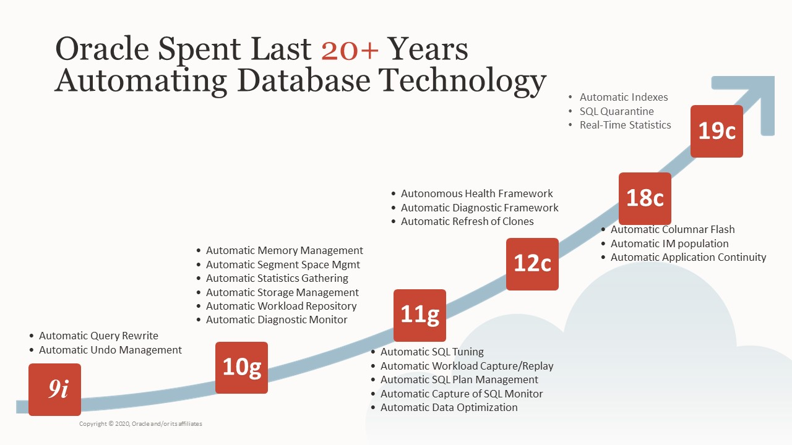
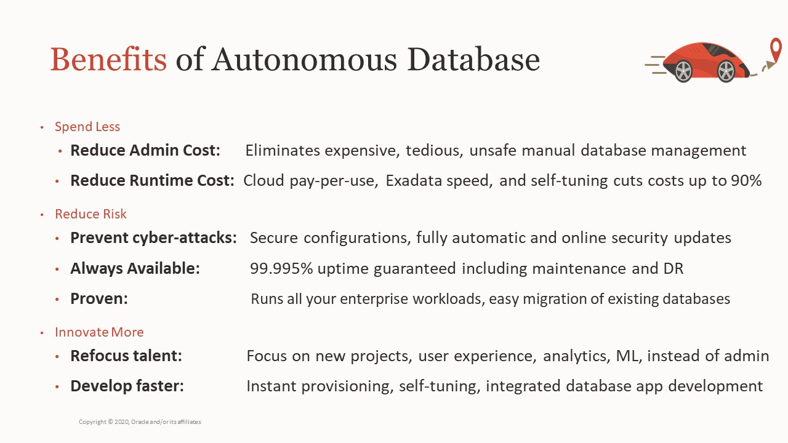
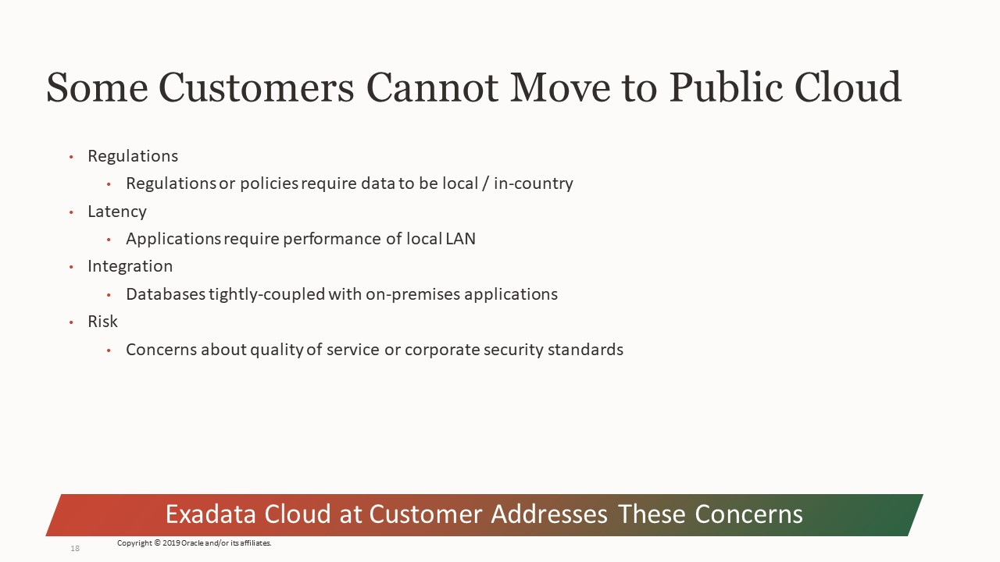
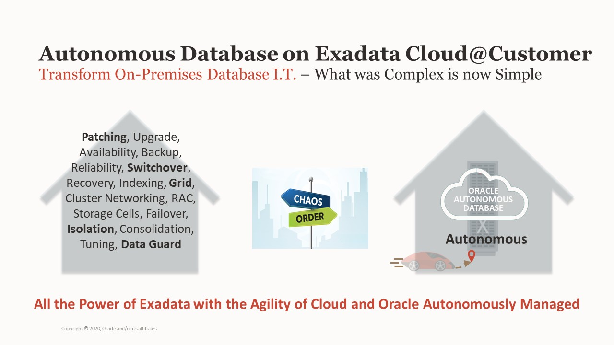

# Slide 1

Think of OSC is the showcase in a car dealership where potential car buyer will go and test drive before they buy. OSC offer similar service such as:
1. Demo - take the customer for a ride on a brand new car to show different features.
2. Workshop - teach the customer how to drive before handing the key to allow customer to test drive themselves.
3. PoC (Proof of Concept) - hand the key to the customer for them to test drive themselves.

Oracle Sales can submit activity request at https://osc.oraclecorp.com/. Customer can view https://www.oracle.com/osc/ page for more details.

# Slide 2

I am required to let you read the Safe harbor statement for a few seconds.

# Slide 3

First thing first, let me show you how easy it is to create a DB using the cloud tooling as it will still take a few min to create a DB but it is still till a lot quicker than the old way and it is mostly hand free or manual free with little human intervention.
We will talk more after I started the DB creation job.

# Slide 4

It is that simple. This is made possible the cloud automation. let me show you now.
Stop presentation and start the DB creation demo.

Come back and click
Customer can consolidate up to 200 database into a single half rack ExaCC.

We have internal AI and heuristic driven tool to tell you exactly how many and which database will fit. All you have to do is to provide us the AWR miner report from your running database.

The tool is Budgetary Architecture Services (Internal) at https://bartool.oraclecorp.com/.
Also, you only pay what you used, for example you can shutdown all database for dev and test at night and start them up during office hour. Further more you can scale the database on demand and without down time for your production database. We will talk about more on these topics later.

# Slide 5

# Slide 6

Exadata is our best database platform 
   Runs all workloads
   Best scalability and database performance with smart Oracle DB algorithms
   Best MAA DB platform, fully integrated with best practices, advantages include fully redundant, lower brownout, inherent data protection, HA quality of service for toughest issues 
   Cloud automation for life cycle

# Slide 7

That's a quite a tall order for a new product until you realized that we have been on this journey for over 20 years.
Starting in Oracle Database 9i we began to introduced and matured many sophisticated automation capabilities  from memory management to workload monitoring and  tuning, all of which are used in the autonomous database.

# Slide 8

But it's not just the database management that Oracle has been automating
We have also spent the last decade working on the database infrastructure with our engineered systems, which provide the best platform for the oracle database as they are
the only pre-configured, pre-tested and optimized platforms for the database.

# Slide 9

# Slide 10

# Slide 11

# Slide 12

# Slide 13

# Slide 14

The demand for infrastructure resources - compute, storage, and network - are often not static in nature. Users sometimes access websites more often at certain times of the day, month, or year. We (OSC) used to host many performance activity for customer to test drive on-prem HW acquisition. For example, a typical customer buying HW for on-prem usually need to buy sufficiently large HW to handle the peak workload even though they may only need it a couple months in a year. As a matter of fact, customer typically want to find a brake point using our center, such as if they estimated that their peak load is say 100K (TPM -Transaction Per minute), they will test 200K TPM so that they will find the break point, e.g. 180K TPM. This way customer will have the confident they need to purchase the system knowing that they will be fine as long as they don't hit the break point e.g. 180 TPM or as soon as they hit 150K TPM, then they need to start to think of buy additional resource. With the cloud, they just need to buy what they need as an average and scale up the resource as needed.

Cloud computing, with its perceived infinite scale to the consumer, allows us to take advantage of these patterns and keep costs down.

Dynamic scaling enable businesses with dynamic resource demands to only pay what they use and when they need it. Various seasonal events (like Christmas, Black Friday) and other engagement triggers (like when HBO's Chernobyl spiked an interest in nuclear-related products) cause spikes of customer activity. These volatile ebbs and flows of workload require flexible resource management to handle the operation consistently. 

Modern business operations live on consistent performance and instant service availability. 
Cloud scalability and cloud elasticity handle these two business aspects in equal measure. 
Cloud scalability is an effective solution for businesses whose workload requirements are increasing slowly and predictably. 
Cloud elasticity is a cost-effective solution for the business with dynamic and unpredictable resource demands. 
These features make both scalability and elasticity a viable instrument for the company to hold its ground,  grow steadily, and gain a competitive advantage.

# Slide 15

# Slide 16

Public map at https://www.oracle.com/cloud/architecture-and-regions.html
Internal map with planed at https://iaas.us.oracle.com/regions
Download PPT at https://iaas.us.oracle.com/_api/files/6651/proxy
Send https://cloudharmony.com/speedtest-for-oracle to chat for audients participation to see latency between them and OCI region that should tell them which region to use for their ExaCC.
Note: the speed test is based on browser location, e.g. their home, or VPN will be the proxy of the browser to OCI.
* Each square on the map represent a region, each region frequently consist of multiple data centers we call them availability domains (AD) that  are isolated from each other, fault tolerant, and very unlikely to fail simultaneously. ADs are close enough with low latency and high bandwidth network for building replicated systems in multiple availability domains. This will ensure both high-availability and disaster recovery. 
* Your Exadata/ExaCC will be connected to one of the region. It is recommend to select the region that is closest to your data center in terms of network hops that is frequently correlated to physical distance.
* The map also show Microsoft Azure because we have many customer use multi cloud. Recently the video conference service that we are using zoom was able to added OCI oracle cloud as one of their cloud service provider easily and quickly, because they started with multi-cloud architecture using Azure and AWS so adding Oracle OCI is a very simple. Also many customer run MS app and use our Exadata in OCI.
* 16 OCI regions currently, 36 by end of 2020
* Commercial and Government regions
* Oracle-managed backbone
* 34 FastConnect providers and growing
* Oracle + Azure interconnect
* 6,000+ engineers

# Slide 17

# Slide 18

Check with account team to see what one(s) of the above 4 is their major motivation for C@C instead of public cloud.

# Slide 19

# Slide 20

   Residency laws that require data to be stored within a corporate entity or a political territory, and not in a Public Cloud data center
   Agility, simplicity, elasticity, and subscription based benefits of a database cloud

# Slide 21

# Slide 22

# Slide 23

# Slide 24

# Slide 25

Here is another way to look at the difference between the Exadata deployment model.
From the left to right, the cloud automation assume/do more for you. Back to the car analogy:
1. For On-prem deployment is like DIY your car.
2. ExaCC is similar to buy are car buy drive to your destination.
3. ADB-CC is computer autonomous driving to take you to the destination.

# Slide 26

Autonomous Database Services deliver a number of key strategic advantages for an organization. 

In line with traditional cloud base values, the business can move away from complex long term forecasting and multi-month project startup times, to an instant self-service database capability that removes the classic barrier between I.T. and Line of Business, enabling innovation at the speed of thought, rather then the speed of I.T. 

Autonomous databases will solve the workforce dilemma, removing the risk associated with workforce retirement while simultaneously delivering a sea change in operational efficiency thru software automation of one of the most complex areas in running a business, data management.

Autonomous databases are delivered with a multi-layered security architecture that protects your data from hackers trying to steal it.  From hardened Network design, to always encrypted data in motion and at rest, to software automation that automatically keeps the hardware's firmware, operating systems, database software up to date with patches for all know security vulnerabilities.   This is a top concern for global regulators and we've seen companies getting hacked, heavy fines imposed, corporate reputations damaged.  Autonomous can eliminate this concern. 

Ultimately, Autonomous database will reduce business costs and risk by moving to a pay-per-use business model for database applications, reducing the number of people needed specifically for database administration, reducing downtime due to operational errors avoided thru the use of A.I. and less human involvement.  

# Slide 27

# Slide 28

Best is to ask a participant to share their screen and work them through.

# Slide 29

Best is to ask a participant to share their screen and work them through.

# Slide 30

Best is to ask a participant to share their screen and work them through.

# Slide 31

